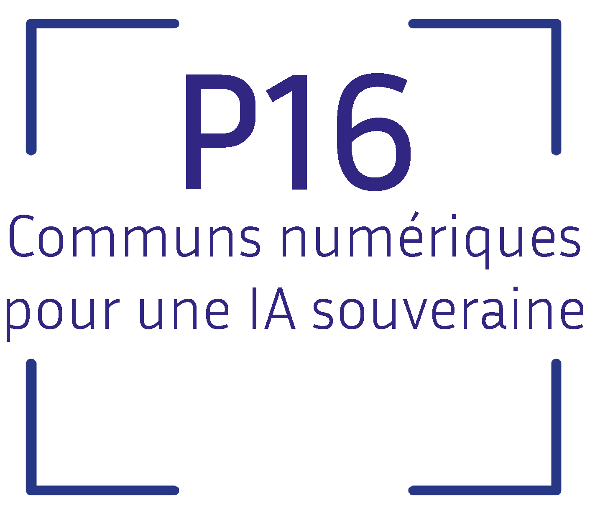

.. -*- mode: rst -*-

|GitHubActions| |Codecov| |ReadTheDocs| |License| |PythonVersion| |PyPi| |Conda| |Release| |Commits|

.. |GitHubActions| image:: https://github.com/scikit-learn-contrib/MAPIE/actions/workflows/test.yml/badge.svg
    :target: https://github.com/scikit-learn-contrib/MAPIE/actions

.. |Codecov| image:: https://codecov.io/gh/scikit-learn-contrib/MAPIE/branch/master/graph/badge.svg?token=F2S6KYH4V1
   :target: https://codecov.io/gh/scikit-learn-contrib/MAPIE

.. |ReadTheDocs| image:: https://readthedocs.org/projects/mapie/badge/?version=stable
    :target: https://mapie.readthedocs.io/en/stable/?badge=stable
    :alt: Documentation Status

.. |License| image:: https://img.shields.io/github/license/scikit-learn-contrib/MAPIE
    :target: https://github.com/scikit-learn-contrib/MAPIE/blob/master/LICENSE

.. |PythonVersion| image:: https://img.shields.io/pypi/pyversions/mapie
    :target: https://pypi.org/project/mapie/

.. |PyPi| image:: https://img.shields.io/pypi/v/mapie
    :target: https://pypi.org/project/mapie/

.. |Conda| image:: https://img.shields.io/conda/vn/conda-forge/mapie
    :target: https://anaconda.org/conda-forge/mapie

.. |Release| image:: https://img.shields.io/github/v/release/scikit-learn-contrib/mapie
    :target: https://github.com/scikit-learn-contrib/MAPIE/releases

.. |Commits| image:: https://img.shields.io/github/commits-since/scikit-learn-contrib/mapie/latest/master
    :target: https://github.com/scikit-learn-contrib/MAPIE/commits/master

.. image:: https://github.com/scikit-learn-contrib/MAPIE/raw/master/doc/images/mapie_logo_nobg_cut.png
    :width: 400
    :align: center

MAPIE - Model Agnostic Prediction Interval Estimator
====================================================

 🎉 MAPIE v1 is live!  🎉 You're seeing the documentation of this new version, which introduces major changes to the API. Extensive release notes are available `here <https://mapie.readthedocs.io/en/stable/v1_release_notes.html>`_. You can switch to the documentation of previous versions using the button on the bottom right of ReadTheDoc pages.

 🚀 MAPIE Roadmap 2026 🚀 New features are coming, starting with the application of **risk control** to emerging use cases such as **LLM-as-Judge** and **image segmentation**. In addition, **exchangeability tests** will be introduced to help users verify when MAPIE can be legitimately applied. Finally, **conformal prediction methods** will be revisited with a stronger focus on **adaptability**. More details are available `here <https://github.com/scikit-learn-contrib/MAPIE/discussions/822>`_.

**MAPIE** is an open-source Python library for quantifying uncertainties and controlling the risks of machine learning models.

.. image:: https://raw.githubusercontent.com/scikit-learn-contrib/MAPIE/refs/heads/master/doc/images/educational_visual.png
    :width: 500
    :align: center

MAPIE allows you to:

- **Compute prediction intervals or prediction sets** for regression [3,4,8], classification [5-7], and time series [9], by estimating your model uncertainty on a conformalization dataset.
- **Control risks** of more complex tasks such as multi-label classification, semantic segmentation in computer vision, providing probabilistic guarantees on metrics like recall and precision [10-12].
- Easily use **any model (scikit-learn, TensorFlow, PyTorch)** thanks to scikit-learn-compatible wrapper if needed. MAPIE is part of the scikit-learn-contrib ecosystem.

MAPIE relies notably on the fields of Conformal Prediction and Distribution-Free Inference. It implements **peer-reviewed** algorithms that are  **model and use case agnostic** and possesses **theoretical guarantees** under minimal assumptions on the data and the model.

🛠 Requirements & installation
=================================

MAPIE runs on:

- Python >=3.9
- NumPy >=1.23
- scikit-learn >=1.4

MAPIE can be installed in different ways:

.. code:: sh

    $ pip install mapie  # installation via `pip`
    $ conda install -c conda-forge mapie  # or via `conda`
    $ pip install git+https://github.com/scikit-learn-contrib/MAPIE  # or directly from the github repository

⚡ Quickstart and documentation
=======================================

Below are two simple examples from `our documentation <https://mapie.readthedocs.io/en/latest/>`_ that show how MAPIE is used in a regression setting and a classification setting:

- `Uncertainty quantification for a regression task <https://mapie.readthedocs.io/en/latest/examples_regression/1-quickstart/plot_toy_model.html>`_

- `Uncertainty quantification for a classification task <https://mapie.readthedocs.io/en/latest/examples_classification/1-quickstart/plot_quickstart_classification.html>`_

📝 Contributing
===============

You are welcome to propose and contribute new ideas.
We encourage you to `open an issue <https://github.com/scikit-learn-contrib/MAPIE/issues>`_ so that we can align on the work to be done.
It is generally a good idea to have a quick discussion before opening a pull request that is potentially out-of-scope.
For more information on the contribution process, read our `contribution guidelines <https://github.com/scikit-learn-contrib/MAPIE/blob/master/CONTRIBUTING.rst>`_.

🤝  Affiliations
================

MAPIE has been developed through a collaboration between Capgemini Invent, Quantmetry, Michelin, ENS Paris-Saclay,
and with the financial support from Région Ile de France and Confiance.ai.

|Capgemini Invent| |Inria| |Projet P16| |Michelin| |ENS| |Confiance.ai| |IledeFrance|

.. |Capgemini Invent| image:: https://www.capgemini.com/wp-content/themes/capgemini2020/assets/images/capgemini-invent.svg
    :height: 35px
    :width: 140px
    :target: https://www.capgemini.com/about-us/who-we-are/our-brands/capgemini-invent/

.. |Inria| image:: https://www.inria.fr/themes/custom/inria/logo/logo.svg
    :height: 35px
    :width: 140px
    :target: https://www.inria.fr/

.. |Michelin| image:: https://agngnconpm.cloudimg.io/v7/https://dgaddcosprod.blob.core.windows.net/corporate-production/attachments/cls05tqdd9e0o0tkdghwi9m7n-clooe1x0c3k3x0tlu4cxi6dpn-bibendum-salut.full.png
    :height: 50px
    :width: 45px
    :target: https://www.michelin.com/en/

.. |ENS| image:: https://ens-paris-saclay.fr/sites/default/files/ENSPS_UPSAY_logo_couleur_2.png
    :height: 35px
    :width: 140px
    :target: https://ens-paris-saclay.fr/en

.. |Confiance.ai| image:: https://pbs.twimg.com/profile_images/1443838558549258264/EvWlv1Vq_400x400.jpg
    :height: 45px
    :width: 45px
    :target: https://www.confiance.ai/

.. |IledeFrance| image:: https://www.iledefrance.fr/sites/default/files/logo/2024-02/logoGagnerok.svg
    :height: 35px
    :width: 140px
    :target: https://www.iledefrance.fr/

🔍  References
==============

[1] Vovk, Vladimir, Alexander Gammerman, and Glenn Shafer. Algorithmic Learning in a Random World. Springer Nature, 2022.

[2] Angelopoulos, Anastasios N., and Stephen Bates. "Conformal prediction: A gentle introduction." Foundations and Trends® in Machine Learning 16.4 (2023): 494-591.

[3] Rina Foygel Barber, Emmanuel J. Candès, Aaditya Ramdas, and Ryan J. Tibshirani. "Predictive inference with the jackknife+." Ann. Statist., 49(1):486–507, (2021).

[4] Kim, Byol, Chen Xu, and Rina Barber. "Predictive inference is free with the jackknife+-after-bootstrap." Advances in Neural Information Processing Systems 33 (2020): 4138-4149.

[5] Sadinle, Mauricio, Jing Lei, and Larry Wasserman. "Least ambiguous set-valued classifiers with bounded error levels." Journal of the American Statistical Association 114.525 (2019): 223-234.

[6] Romano, Yaniv, Matteo Sesia, and Emmanuel Candes. "Classification with valid and adaptive coverage." Advances in Neural Information Processing Systems 33 (2020): 3581-3591.

[7] Angelopoulos, Anastasios, et al. "Uncertainty sets for image classifiers using conformal prediction." International Conference on Learning Representations (2021).

[8] Romano, Yaniv, Evan Patterson, and Emmanuel Candes. "Conformalized quantile regression." Advances in neural information processing systems 32 (2019).

[9] Xu, Chen, and Yao Xie. "Conformal prediction interval for dynamic time-series." International Conference on Machine Learning. PMLR, (2021).

[10] Bates, Stephen, et al. "Distribution-free, risk-controlling prediction sets." Journal of the ACM (JACM) 68.6 (2021): 1-34.

[11] Angelopoulos, Anastasios N., Stephen, Bates, Adam, Fisch, Lihua, Lei, and Tal, Schuster. "Conformal Risk Control." (2022).

[12] Angelopoulos, Anastasios N., Stephen, Bates, Emmanuel J. Candès, et al. "Learn Then Test: Calibrating Predictive Algorithms to Achieve Risk Control." (2022).

Image credits:
*Portrait: Cemrecan Yurtman / Zebra Horse Hybrid: hogrmahmood*

📚 License & citation
======================

MAPIE is free and open-source software licensed under the `BSD-3-Clause license <https://github.com/scikit-learn-contrib/MAPIE/blob/master/LICENSE>`_.

If you use MAPIE in your research, please cite the main paper:

Cordier, Thibault, et al. "Flexible and systematic uncertainty estimation with conformal prediction via the mapie library." *Conformal and Probabilistic Prediction with Applications.* PMLR, 2023.

Or equivalently the BibTex entry:

.. code:: latex

    @inproceedings{Cordier_Flexible_and_Systematic_2023,
    author = {Cordier, Thibault and Blot, Vincent and Lacombe, Louis and Morzadec, Thomas and Capitaine, Arnaud and Brunel, Nicolas},
    booktitle = {Conformal and Probabilistic Prediction with Applications},
    title = {{Flexible and Systematic Uncertainty Estimation with Conformal Prediction via the MAPIE library}},
    year = {2023}
    }

You can also have a look at the ICML workshop manuscript:

Taquet, Vianney, et al. "MAPIE: an open-source library for distribution-free uncertainty quantification." *arXiv preprint arXiv:2207.12274* (2022).

.. code:: latex

    @article{taquet2022mapie,
    title={MAPIE: an open-source library for distribution-free uncertainty quantification},
    author={Taquet, Vianney and Blot, Vincent and Morzadec, Thomas and Lacombe, Louis and Brunel, Nicolas},
    journal={arXiv preprint arXiv:2207.12274},
    year={2022}
    }