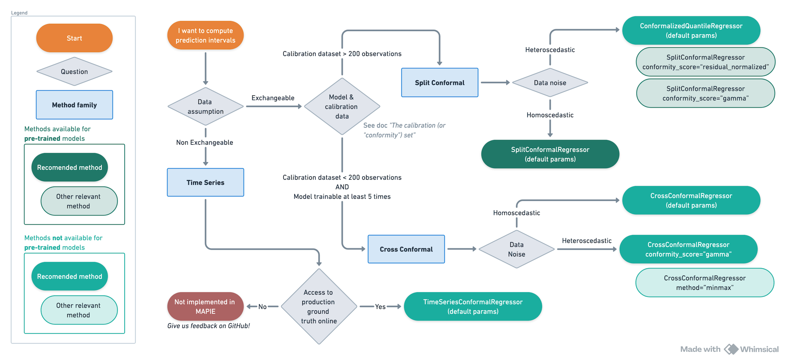

############################################
Choosing the right algorithm
############################################

Following are simple decision trees to help you you getting started quickly with MAPIE.

Reality is of course a bit more complex, so feel free to browse the documentation for nuanced explanations.

1. Regression
==================================

2. Classification
=====================

.. image:: images/decision_tree_classification.png
    :align: center
