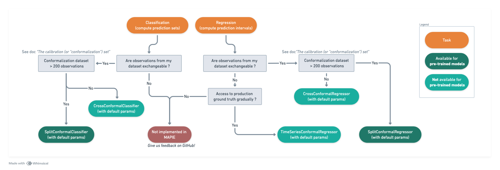

############################################
Choosing the right algorithm
############################################

Following is a simple decision tree to help you getting started quickly with MAPIE. Reality is of course a bit more complex, so feel free to browse the documentation for nuanced explanations.

MAPIE can **measure prediction uncertainty** in the form of computing prediction sets (for classification) or intervals (for regression, including time series), using conformal prediction methods. Many methods make the hypothesis that data is `exchangeable <https://en.wikipedia.org/wiki/Exchangeable_random_variables>`_, so it is a first criteria to consider when choosing a method. Another important criteria is the size of the conformalization dataset. For small size datasets, cross conformal methods are necessary to use the data as efficiently as possible. For larger datasets, split conformal methods are recommended as they are simpler (do not require model retraining). While it depends on the use case, [1] states that having 1000 samples is sufficient for most purposes.

MAPIE also implements risk control methods to **control prediction errors**. In the case of binary classification, any metric (or set of metrics) can be controlled, such as precision, accuracy, or custom functions. The prediction parameters to tune (e.g., a threshold on predicted probability) can be multi-dimensional for complex use cases (e.g., two thresholds to allow abstention).
For multilabel classification and image segmentation tasks, only the precision and recall metrics can be controlled.

[1] Angelopoulos, A. N., & Bates, S. (2021). A gentle introduction to conformal prediction and distribution-free uncertainty quantification. arXiv preprint arXiv:2107.07511.
