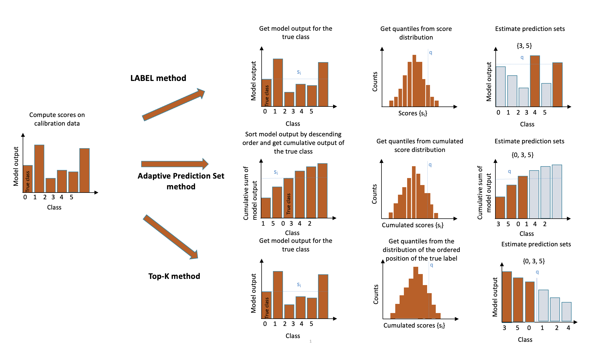

# Classification — Theory

Four methods for multi-class uncertainty quantification have been implemented in MAPIE: **LAC** (Least Ambiguous set-valued Classifier) [^1], **APS** (Adaptive Prediction Sets) [^2] [^3], **Top-K** [^3], and **RAPS** [^3].

{ width="600" }

Illustration of the three methods implemented in MAPIE.

## Mathematical Setting

For a classification problem in a standard i.i.d. case, our training data $(X, Y) = \{(x_1, y_1), \ldots, (x_n, y_n)\}$ has an unknown distribution $P_{X, Y}$.

For any risk level $\alpha \in (0, 1)$, the methods allow constructing a prediction set $\hat{C}_{n, \alpha}(X_{n+1})$ with a **marginal coverage guarantee**:

$$
P \{Y_{n+1} \in \hat{C}_{n, \alpha}(X_{n+1}) \} \geq 1 - \alpha
$$

For a typical $\alpha = 10\%$, we construct prediction sets that contain the true observations for at least 90% of new test data points.

!!! info
    The guarantee applies only to **marginal coverage**, not conditional coverage $P \{Y_{n+1} \in \hat{C}_{n, \alpha}(X_{n+1}) \mid X_{n+1} = x_{n+1}\}$, which depends on the location of the test point.

The [CIFAR-10 prediction-set notebook](https://github.com/scikit-learn-contrib/MAPIE/blob/master/notebooks/classification/Cifar10.ipynb)
applies these methods to an image classifier and compares their marginal and
class-conditional coverage.

The LAC, Top-K, APS, and RAPS methods are described in
[Conformity Scores](conformity-scores.md#classification-scores).

---

## Split- and Cross-Conformal Strategies

MAPIE includes both split- and cross-conformal strategies for LAC and APS, but **only split-conformal for Top-K and RAPS**.

The cross-conformal implementation follows Algorithm 2 of [^2]:

1. Split training into $K$ disjoint subsets.
2. Fit $K$ classification functions $\hat{\mu}_{-S_k}$.
3. Compute out-of-fold conformity scores.
4. For new test points, compare conformity scores to decide label inclusion.

For APS (see eq. 11 of [^2]):

$$
C_{n, \alpha}(X_{n+1}) = \Big\{ y \in \mathcal{Y} : \sum_{i=1}^n \mathbf{1} \Big[ E(X_i, Y_i, U_i; \hat{\pi}^{k(i)}) < E(X_{n+1}, y, U_{n+1}; \hat{\pi}^{k(i)}) \Big] < (1-\alpha)(n+1) \Big\}
$$

---

## References

[^1]: Sadinle, Mauricio, Jing Lei, & Larry Wasserman. "Least Ambiguous Set-Valued Classifiers With Bounded Error Levels." *JASA*, 114:525, 223-234, 2019.
[^2]: Romano, Yaniv, Matteo Sesia and Emmanuel J. Candès. "Classification with Valid and Adaptive Coverage." *NeurIPS* 2020 (spotlight).
[^3]: Angelopoulos, Anastasios N., Stephen Bates, Michael Jordan and Jitendra Malik. "Uncertainty Sets for Image Classifiers using Conformal Prediction." *ICLR* 2021.
