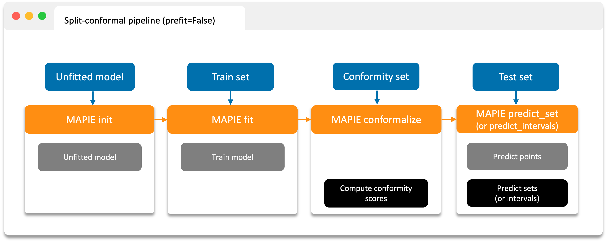
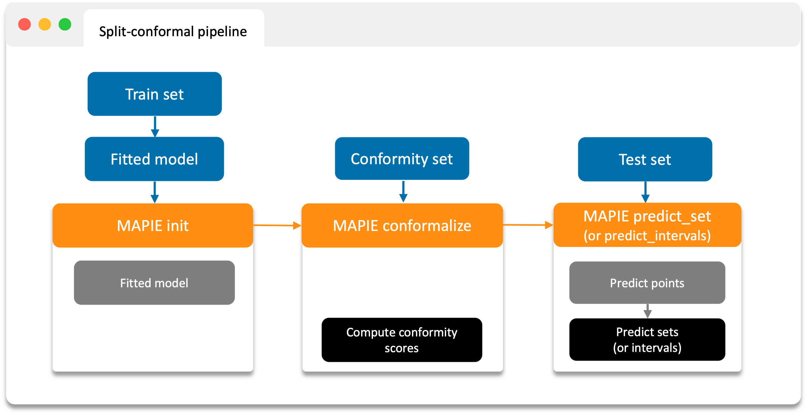
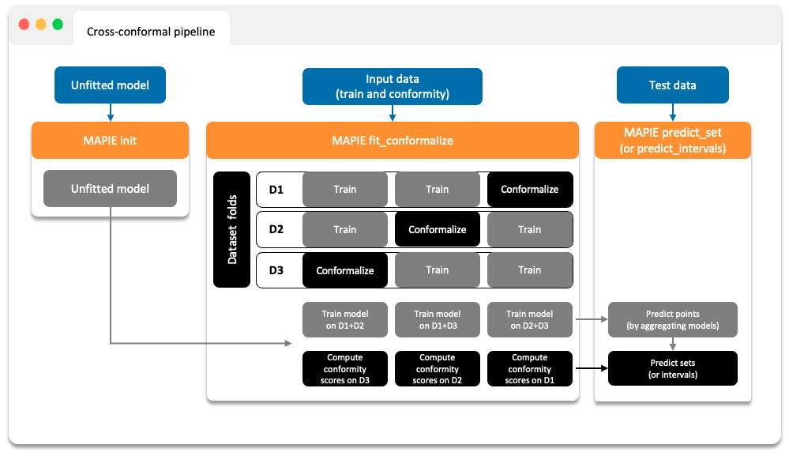

# Split and Cross Conformalization

Conformal prediction needs model errors from observations whose targets were
not used to fit that model. MAPIE obtains these errors—called **conformity
scores**—with either a split-conformal or cross-conformal workflow.

In both cases, keep the final test data separate. It is used only to evaluate
the prediction intervals or sets after every modeling and conformalization
choice has been made.

## The Three Data Roles

| Data | Purpose | Must not be used for |
|---|---|---|
| Training | Fit the base estimator and tune its hyperparameters | Final evaluation |
| Conformalization | Compute conformity scores and their quantiles | Fitting or selecting the base model |
| Test | Evaluate point predictions and intervals or sets | Training or conformalization |

The [`train_conformalize_test_split`](../../api/utils.md#mapie.utils.train_conformalize_test_split)
utility creates these three subsets for a split-conformal workflow.

```python
from mapie.utils import train_conformalize_test_split

X_train, X_conf, X_test, y_train, y_conf, y_test = (
    train_conformalize_test_split(
        X,
        y,
        train_size=0.6,
        conformalize_size=0.2,
        test_size=0.2,
        random_state=42,
    )
)
```

!!! warning "Representative conformalization data"
    The theoretical guarantee concerns future observations drawn under the
    same exchangeability assumptions as the conformalization observations. A
    conveniently available but unrepresentative split can produce misleading
    intervals or sets.

## 1. Split Conformal Prediction

Split conformal prediction fits one model and computes conformity scores on a
separate held-out set. It is usually the best starting point when enough data
can be reserved for conformalization.

### Let MAPIE Fit the Model

Set `prefit=False`, call `fit` on training data, and then call `conformalize` on
the held-out conformalization data.

```python
from sklearn.linear_model import Ridge

from mapie.regression import SplitConformalRegressor

mapie_regressor = SplitConformalRegressor(
    estimator=Ridge(),
    confidence_level=0.9,
    prefit=False,
)
mapie_regressor.fit(X_train, y_train)
mapie_regressor.conformalize(X_conf, y_conf)
y_pred, y_intervals = mapie_regressor.predict_interval(X_test)
```

{ width="800" }

### Use an Already-Fitted Model

Set `prefit=True` and skip the MAPIE `fit` call. The supplied estimator must
already be fitted on data that is separate from `X_conf` and `y_conf`.

```python
from sklearn.linear_model import Ridge

from mapie.regression import SplitConformalRegressor

fitted_model = Ridge().fit(X_train, y_train)
mapie_regressor = SplitConformalRegressor(
    estimator=fitted_model,
    confidence_level=0.9,
    prefit=True,
)
mapie_regressor.conformalize(X_conf, y_conf)
y_pred, y_intervals = mapie_regressor.predict_interval(X_test)
```

{ width="800" }

The corresponding classification class is `SplitConformalClassifier`, whose
final method is `predict_set` rather than `predict_interval`.

## 2. Cross-Conformal Prediction

Cross-conformal prediction uses cross-validation to create out-of-fold
predictions. Each observation receives a prediction from a model that was not
trained on that observation, so the same development dataset can contribute to
both fitting and conformity-score estimation.

Use `fit_conformalize` because fitting and conformalization happen together:

```python
from sklearn.linear_model import Ridge
from sklearn.model_selection import train_test_split

from mapie.regression import CrossConformalRegressor

X_development, X_test, y_development, y_test = train_test_split(
    X,
    y,
    test_size=0.2,
    random_state=42,
)

mapie_regressor = CrossConformalRegressor(
    estimator=Ridge(),
    confidence_level=0.9,
    cv=5,
)
mapie_regressor.fit_conformalize(X_development, y_development)
y_pred, y_intervals = mapie_regressor.predict_interval(X_test)
```

{ width="600" }

Use `CrossConformalClassifier` and `predict_set` for classification. The exact
coverage result depends on the selected cross-conformal method; consult the
[regression theory](regression.md) or [classification theory](classification.md)
before treating it as equivalent to the split-conformal guarantee.

## Split and Cross-Conformal Trade-offs

| Consideration | Split conformal | Cross conformal |
|---|---|---|
| Models fitted | One | One per fold, plus any final estimator |
| Conformity-score data | Dedicated held-out set | Out-of-fold predictions across the development set |
| Computational cost | Lower | Higher |
| Data efficiency | Lower when data is scarce | Higher |
| Pre-trained estimator support | Yes, with `prefit=True` | No; models are fitted during `fit_conformalize` |
| Recommended first use | Enough representative holdout data | Holding out data would be too costly |

There is no fixed sample-size threshold that always determines the better
choice. With very small conformalization sets, attainable confidence levels are
limited and coverage estimates are variable. With expensive models,
cross-validation may be impractical even when it would use data more
efficiently.
