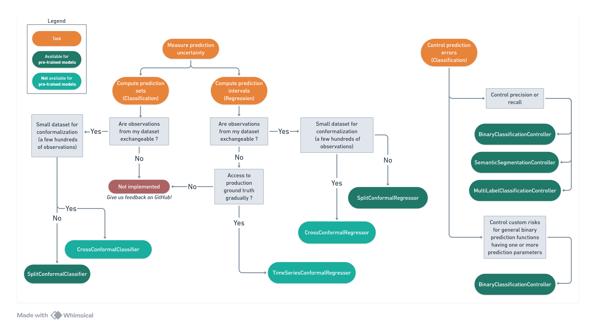

# Choosing the Right Algorithm

Following is a simple decision tree to help you get started quickly with MAPIE. Reality is of course a bit more complex, so feel free to browse the documentation for nuanced explanations.

<figure markdown>
  
  <figcaption>Decision tree for choosing the right MAPIE algorithm.</figcaption>
</figure>

---

## Key Criteria

### Measuring Prediction Uncertainty

MAPIE can **measure prediction uncertainty** in the form of computing prediction sets (for classification) or intervals (for regression, including time series), using conformal prediction methods.

Many methods make the hypothesis that data is [exchangeable](https://en.wikipedia.org/wiki/Exchangeable_random_variables), so it is a **first criteria** to consider when choosing a method.

!!! info "Dataset Size"
    Another important criteria is the **size of the conformalization dataset**:

    - For **small datasets**, cross conformal methods are necessary to use the data as efficiently as possible.
    - For **larger datasets** (1000+ samples[^1]), split conformal methods are recommended as they are simpler (do not require model retraining).

### Controlling Prediction Errors

MAPIE also implements **risk control methods** to **control prediction errors**:

- **Binary classification**: any metric (or set of metrics) can be controlled — precision, accuracy, or custom functions. The prediction parameters to tune (e.g., a threshold on predicted probability) can be multi-dimensional for complex use cases.
- **Multilabel classification & image segmentation**: only the precision and recall metrics can be controlled.

---

[^1]: Angelopoulos, A. N., & Bates, S. (2021). *A gentle introduction to conformal prediction and distribution-free uncertainty quantification.* arXiv preprint arXiv:2107.07511.
