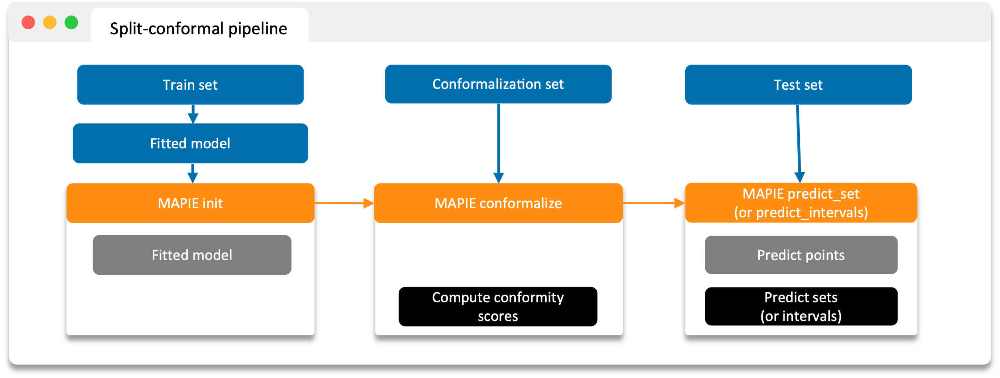
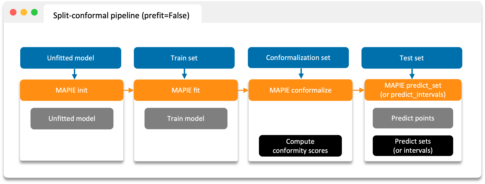
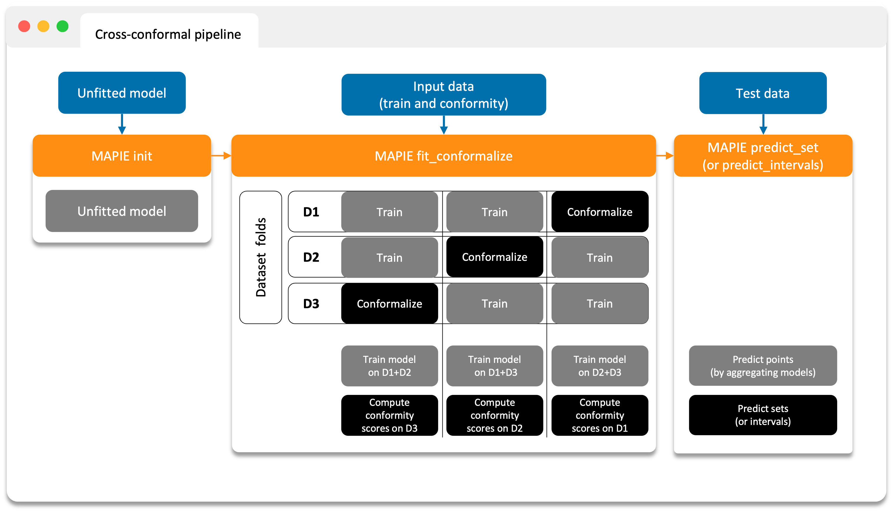

# The Conformalization ("Calibration") Set

**MAPIE** is based on two types of techniques for measuring uncertainty in regression and classification:

- the **split-conformal** predictions,
- the **cross-conformal** predictions.

In all cases, the training/conformalization process can be broken down as follows:

1. **Train** a model using the training set (or full dataset if cross-conformal).
2. **Estimate conformity scores** using the conformalization set (or full dataset if cross-conformal).
3. **Predict** target on test data to obtain prediction intervals/sets based on these conformity scores.

---

## 1. Split Conformal Predictions

Compute conformity scores ("conformalization") on a conformalization set _not seen by the model during training_.

!!! tip "Data Splitting"
    Use [`train_conformalize_test_split`](../api/index.md) to obtain the different sets.

**MAPIE** then uses the conformity scores to estimate sets associated with the desired coverage on new data with strong theoretical guarantees.

### Split conformal with a pre-trained model

{ width="800" }

### Split conformal with an untrained model

{ width="800" }

---

## 2. Cross Conformal Predictions

- Conformity scores on the whole dataset obtained by **cross-validation**,
- Perturbed models generated during the cross-validation.

**MAPIE** then combines all these elements in a way that provides prediction intervals on new data with strong theoretical guarantees.

{ width="600" }
