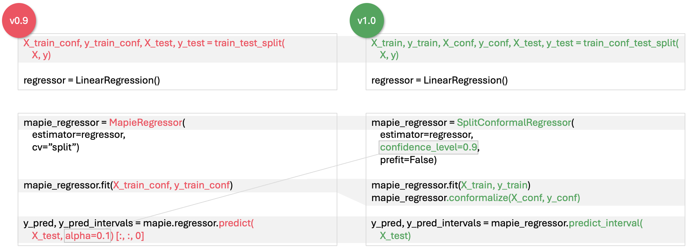

# MAPIE v1 Release Notes

!!! note
    These release notes are kept up to date with the latest version of MAPIE v1.

## Introduction

MAPIE v1's primary goal is to make the library **easier to use**, especially for users unfamiliar with conformal predictions. This release consists of an **API and documentation revamp**, enhancing MAPIE's clarity and accessibility.

Moreover, the new API structure paves the way for efficient development and internal refactoring in the future.

---

## API Changes Overview

The classification and regression APIs have been thoroughly revamped (except for time series). Other API changes (calibration, multi-label classification, time series, etc.) consist mostly of renaming to bring overall consistency and clarity.

### High-Level Class Mapping

| v0.x class | Corresponding v1 class(es) |
|---|---|
| `MapieRegressor` | `SplitConformalRegressor`, `CrossConformalRegressor`, `JackknifeAfterBootstrapRegressor` |
| `MapieClassifier` | `SplitConformalClassifier`, `CrossConformalClassifier` |
| `MapieQuantileRegressor` | `ConformalizedQuantileRegressor` |
| `MapieTimeSeriesRegressor` | `TimeSeriesRegressor` |
| `MapieMultiLabelClassifier` | `PrecisionRecallController` |
| `MapieCalibrator` | `TopLabelCalibrator` |

### Key Changes

- The v1 `.fit` method has been **split** into `.fit` and `.conformalize` for split conformal techniques, and replaced by `.fit_conformalize` for cross-conformal techniques.
- The `alpha` parameter has been replaced with **`confidence_level`** (`confidence_level = 1 - alpha`).

{ style="display: block; margin: 0 auto;" }

!!! warning "Functional Regressions"
    - The `MondrianCP` class is temporarily unavailable in MAPIE v1. Mondrian can still easily be implemented manually (tutorial provided).
    - In regression settings, the naive method no longer exists for cross conformal techniques.

---

## Python, scikit-learn and NumPy support

| Dependency | Required version |
|---|---|
| Python | ≥ 3.9 |
| NumPy | ≥ 1.23 |
| scikit-learn | ≥ 1.4 |

---

## API Changes in Detail

### Regression and Classification

#### Classes

MAPIE v1 breaks down `MapieRegressor` and `MapieClassifier` into **5 classes**, each dedicated to a particular conformal prediction technique.

The `cv` parameter is key to understand what new class to use:

**Regression:**

| v0.x `cv` parameter | Corresponding v1 class | Type |
|---|---|---|
| `split` | `SplitConformalRegressor(prefit=False)` | Split |
| `prefit` | `SplitConformalRegressor(prefit=True)` | Split |
| `None`, integer, or `BaseCrossValidator` | `CrossConformalRegressor` | Cross |
| `subsample.Subsample` | `JackknifeAfterBootstrapRegressor` | Cross |

**Classification:**

| v0.x `cv` parameter | Corresponding v1 class | Type |
|---|---|---|
| `split` | `SplitConformalClassifier(prefit=False)` | Split |
| `prefit` | `SplitConformalClassifier(prefit=True)` | Split |
| `None`, integer, or `BaseCrossValidator` | `CrossConformalClassifier` | Cross |

#### Workflow

The conformal prediction workflow has been changed for better clarity and control:

=== "v0.x Workflow"

    1. Data splitting + model training + calibration → `.fit(X, y)`
    2. Prediction → `.predict(X_test, y_test)`

=== "v1 Workflow"

    1. Data splitting → `train_conformalize_test_split()`
    2. Model training → `.fit(X_train, y_train)`
    3. Conformalization → `.conformalize(X_conf, y_conf)`
    4. Prediction → `.predict_interval()` / `.predict_set()`

!!! info "Conformalization"
    The *calibration* step has been named **conformalization**, to avoid confusion with probability calibration.

    For cross conformal techniques, steps 2 and 3 are performed simultaneously using `.fit_conformalize()`.

#### Parameters

##### `alpha` → `confidence_level`

Replaced with `confidence_level` (equivalent to `1 - alpha`). Now set at initialization.

##### `cv`

- **v0.x**: Used to indicate pretraining or cross-validation scheme.
- **v1**: Now only relevant to cross conformal techniques. For split conformal, use the new `prefit` parameter.

##### `conformity_score`

- **v0.x**: Only allowed subclass instances like `AbsoluteConformityScore()`.
- **v1**: Now also accepts **strings**, like `"absolute"`.

##### `method`

- **v0.x**: Used in `MapieRegressor`, relevant only to cross conformal techniques.
- **v1**: Used only in `CrossConformalRegressor` and `JackknifeAfterBootstrapRegressor`. Value `"naive"` removed.

##### `fit_params` and `sample_weight`

- **v0.x**: `sample_weight` was a keyword argument of `.fit()`.
- **v1**: All fit parameters are passed in the `fit_params` dictionary.

##### `predict_params`

- **v0.x**: Passed to both `.fit()` and `.predict()`.
- **v1**: Passed only to `.fit()` / `.fit_conformalize()`, automatically reused at prediction time.

---

### Other API Changes

#### Time Series

- `MapieTimeSeriesRegressor` → **`TimeSeriesRegressor`**
- Takes `confidence_level` instead of `alpha`

#### Risk Control

- `MapieMultiLabelClassifier` → **`PrecisionRecallController`**

#### Calibration

- `MapieCalibrator` → **`TopLabelCalibrator`**
- The `method` parameter (only accepting `"top-label"`) has been removed.

#### Mondrian

The `MondrianCP` class is temporarily unavailable in v1. A [manual implementation tutorial](../theory/mondrian.md) is available.

#### Metrics

Metrics are divided into three modules: `calibration`, `classification`, and `regression`.

```python
# v0.x
from mapie.metrics import classification_coverage_score

# v1
from mapie.metrics.classification import classification_coverage_score
```

#### Conformity Scores

Import from `mapie.conformity_scores.bounds` or simply `mapie.conformity_scores`. The deprecated `ConformityScore` class is replaced by `BaseRegressionScore`.
