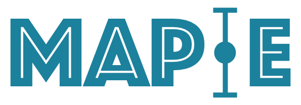
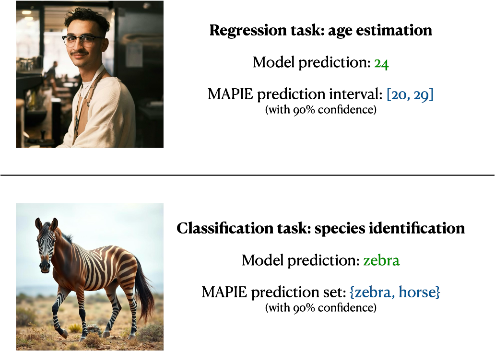
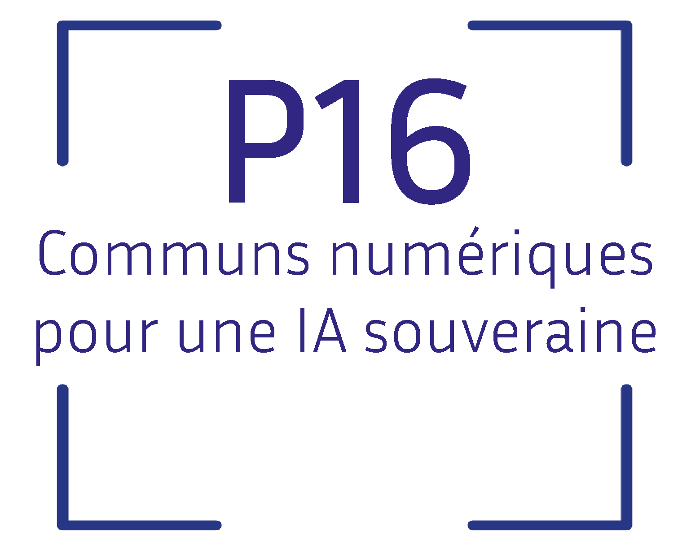

---
hide:
  - navigation
  - toc
---

<div class="hero" markdown>

{ width="400" }

# MAPIE — Model Agnostic Prediction Interval Estimator

**An open-source Python library for quantifying uncertainties and controlling the risks of machine learning models.**

[](https://github.com/scikit-learn-contrib/MAPIE/actions)
[](https://codecov.io/gh/scikit-learn-contrib/MAPIE)
[](https://github.com/scikit-learn-contrib/MAPIE/blob/master/LICENSE)
[](https://pypi.org/project/mapie/)
[](https://pypi.org/project/mapie/)
[](https://pypistats.org/packages/mapie)
[](https://anaconda.org/conda-forge/mapie)

[Get Started :material-rocket-launch:](content/getting-started/quick-start.md){ .md-button .md-button--primary }
[API Reference :material-book-open-variant:](api/index.md){ .md-button }

</div>

---

<div class="announcement" markdown>
🚀 MAPIE in 2026 🚀 New features have been implemented, starting with the application of **risk control** to emerging use cases such as **LLM-as-Judge** and **image segmentation**. In addition, **exchangeability tests** have been introduced to help users verify when MAPIE can be legitimately applied. Also, new **adaptive** conformal prediction methods have been added. Finally, the documentation has been updated with a new design!

🎉 MAPIE in 2025 🎉 MAPIE v1 is live! You're seeing the documentation of this new version, which introduces major changes to the API. Extensive release notes are available in the [documentation](https://mapie.readthedocs.io/en/stable/getting-started/v1-release-notes/). You can switch to the documentation of previous versions using the Read the Docs version menu.

</div>

---

{ width="500", style="display: block; margin: 0 auto;" }

<p style="text-align: center;"><small>Image credits: Cemrecan Yurtman
(portrait) and hogrmahmood (zebra-horse hybrid).</small></p>

## What can MAPIE do?

<div class="grid" markdown>

<div class="card" markdown>

### :material-chart-bell-curve-cumulative: Prediction Intervals & Sets

Compute **prediction intervals** (regression, time series) or **prediction sets** (classification) using state-of-the-art conformal prediction methods.

[Learn more →](content/conformal-prediction/regression.md)
<br>
[Browse examples →](generated/regression/index.md)

</div>

<div class="card" markdown>

### :material-shield-check: Risk Control

**Control prediction errors** for complex tasks: multi-label classification, semantic segmentation, with probabilistic guarantees on precision and recall.

[Learn more →](content/risk-control/theory.md)
<br>
[Browse examples →](generated/risk_control/index.md)

</div>

<div class="card" markdown>

### :material-puzzle: Model Agnostic

Use **any model** — scikit-learn, TensorFlow, PyTorch — thanks to scikit-learn-compatible wrappers. Part of the **scikit-learn-contrib** ecosystem.

[Get started →](content/getting-started/quick-start.md)

</div>

<div class="card" markdown>

### :material-school: Theoretically Grounded

Implements **peer-reviewed** algorithms with **theoretical guarantees** under minimal assumptions, based on Conformal Prediction and Distribution-Free Inference.

[Read the theory →](content/conformal-prediction/regression.md)

</div>

</div>

---

## :art: All Examples

Explore our gallery of hands-on examples covering all MAPIE use cases:

<div class="grid" markdown>

<div class="card" markdown>
### :material-chart-line: Regression
Prediction intervals for regression and time series.

[Browse examples →](generated/regression/index.md)
</div>

<div class="card" markdown>
### :material-shape: Classification
Prediction sets for single-label and multi-label classification.

[Browse examples →](generated/classification/index.md)
</div>

<div class="card" markdown>
### :material-shield-alert: Risk Control
Control risks for complex ML tasks with probabilistic guarantees.

[Browse examples →](generated/risk_control/index.md)
</div>

<div class="card" markdown>
### :material-target: Calibration
Calibrate and evaluate probabilistic predictions.

[Browse examples →](generated/calibration/index.md)
</div>

<div class="card" markdown>
### :material-swap-horizontal: Exchangeability Testing
Test distribution shifts and monitor exchangeability assumptions.

[Browse examples →](generated/exchangeability_testing/index.md)
</div>

</div>

---

## :zap: Quick Install

```bash
pip install mapie
```

See the [Quick Start](content/getting-started/quick-start.md) for other installation
methods, requirements, and a first example.

---

## :memo: Citation

If you use MAPIE in your research, please cite the main paper:

> Cordier, Thibault, et al. "Flexible and systematic uncertainty estimation
> with conformal prediction via the MAPIE library." *Conformal and
> Probabilistic Prediction with Applications.* PMLR, 2023.

```bibtex
@inproceedings{Cordier_Flexible_and_Systematic_2023,
    author = {Cordier, Thibault and Blot, Vincent and Lacombe, Louis and Morzadec, Thomas and Capitaine, Arnaud and Brunel, Nicolas},
    booktitle = {Conformal and Probabilistic Prediction with Applications},
    title = {{Flexible and Systematic Uncertainty Estimation with Conformal Prediction via the MAPIE library}},
    year = {2023}
}
```

You can also cite the ICML workshop manuscript:

> Taquet, Vianney, et al. "MAPIE: an open-source library for distribution-free
> uncertainty quantification." *arXiv preprint arXiv:2207.12274* (2022).

```bibtex
@article{taquet2022mapie,
    title = {MAPIE: an open-source library for distribution-free uncertainty quantification},
    author = {Taquet, Vianney and Blot, Vincent and Morzadec, Thomas and Lacombe, Louis and Brunel, Nicolas},
    journal = {arXiv preprint arXiv:2207.12274},
    year = {2022}
}
```

---

## :books: References

1. Vovk, Vladimir, Alexander Gammerman, and Glenn Shafer. *Algorithmic
   Learning in a Random World.* Springer Nature, 2022.
2. Angelopoulos, Anastasios N., and Stephen Bates. "Conformal prediction: A
   gentle introduction." *Foundations and Trends® in Machine Learning* 16.4
   (2023): 494–591.
3. Barber, Rina Foygel, Emmanuel J. Candès, Aaditya Ramdas, and Ryan J.
   Tibshirani. "Predictive inference with the jackknife+." *Annals of
   Statistics* 49.1 (2021): 486–507.
4. Kim, Byol, Chen Xu, and Rina Barber. "Predictive inference is free with the
   jackknife+-after-bootstrap." *Advances in Neural Information Processing
   Systems* 33 (2020): 4138–4149.
5. Sadinle, Mauricio, Jing Lei, and Larry Wasserman. "Least ambiguous
   set-valued classifiers with bounded error levels." *Journal of the American
   Statistical Association* 114.525 (2019): 223–234.
6. Romano, Yaniv, Matteo Sesia, and Emmanuel Candès. "Classification with valid
   and adaptive coverage." *Advances in Neural Information Processing Systems*
   33 (2020): 3581–3591.
7. Angelopoulos, Anastasios N., et al. "Uncertainty sets for image classifiers
   using conformal prediction." *International Conference on Learning
   Representations* (2021).
8. Romano, Yaniv, Evan Patterson, and Emmanuel Candès. "Conformalized quantile
   regression." *Advances in Neural Information Processing Systems* 32 (2019).
9. Xu, Chen, and Yao Xie. "Conformal prediction interval for dynamic
   time-series." *International Conference on Machine Learning.* PMLR, 2021.
10. Bates, Stephen, et al. "Distribution-free, risk-controlling prediction
    sets." *Journal of the ACM* 68.6 (2021): 1–34.
11. Angelopoulos, Anastasios N., Stephen Bates, Adam Fisch, Lihua Lei, and Tal
    Schuster. "Conformal Risk Control." (2022).
12. Angelopoulos, Anastasios N., Stephen Bates, Emmanuel J. Candès, et al.
    "Learn Then Test: Calibrating Predictive Algorithms to Achieve Risk
    Control." (2022).

---

## :handshake: Affiliations

MAPIE has been developed through a collaboration between Capgemini Invent,
Quantmetry, Michelin, ENS Paris-Saclay, and with the financial support from
Région Île-de-France and Confiance.ai.

<div class="affiliations" markdown>

[{ height="35px" }](https://www.capgemini.com/about-us/who-we-are/our-brands/capgemini-invent/)
[{ height="35px" }](https://www.inria.fr/)
[{ height="45px" }](https://p16.inria.fr/fr/)
[{ height="50px" }](https://www.michelin.com/en/)
[{ height="35px" }](https://ens-paris-saclay.fr/en)
[{ height="45px" }](https://www.confiance.ai/)
[{ height="35px" }](https://www.iledefrance.fr/)

</div>

---

<div style="text-align: center; color: var(--md-default-fg-color--light); font-size: 0.85rem; margin-top: 2rem;">
  Made with 💜 by the MAPIE team · BSD-3-Clause License
</div>
