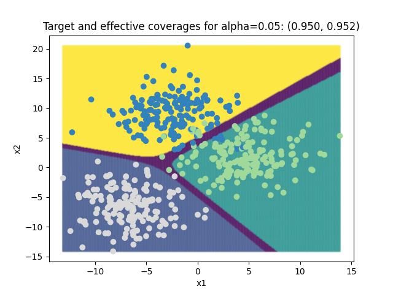

######################
Quick Start with MAPIE
######################

This package allows you to easily estimate uncertainties in both regression and classification settings.
In regression settings, **MAPIE** provides prediction intervals on single-output data.
In classification settings, **MAPIE** provides prediction sets on multi-class data.
In any case, **MAPIE** is compatible with any scikit-learn-compatible estimator.

1. Download and install the module
==================================

Install via ``pip``:

.. code:: python

    pip install mapie

or via `conda`:

.. code:: sh

    $ conda install -c conda-forge mapie

To install directly from the github repository :

.. code:: python

    pip install git+https://github.com/scikit-learn-contrib/MAPIE

2. Regression
=====================

Let us start with a basic regression problem.
Here, we generate one-dimensional noisy data that we fit with a linear model.

..
    Comment to developers: the following piece of code is heavily inspired by `examples/regression/1-quickstart/plot_toy_model.py`.
    When updating it, please replicate the changes to this other file.

.. testcode::

    import numpy as np
    from sklearn.datasets import make_regression
    from sklearn.model_selection import train_test_split

    X, y = make_regression(n_samples=500, n_features=1, noise=20)

    X_train, X_temp, y_train, y_temp = train_test_split(X, y)
    X_test, X_conformalize, y_test, y_conformalize = train_test_split(X_temp, y_temp)

    #  We follow a sequential ``fit``, ``conformalize``, and ``predict`` process.
    #  We set the confidence level to estimate prediction intervals at approximately one and two
    #  standard deviation from the mean.

    from mapie_v1.regression import SplitConformalRegressor

    mapie_regressor = SplitConformalRegressor(confidence_level=[0.95, 0.68], prefit=False)
    mapie_regressor.fit(X_train, y_train)
    mapie_regressor.conformalize(X_conformalize, y_conformalize)

    y_pred, y_pred_intervals = mapie_regressor.predict_interval(X_test)

    #  MAPIE's ``predict`` method returns point predictions as a ``np.ndarray`` of shape ``(n_samples)``.
    #  The ``predict_set`` method returns prediction intervals as a ``np.ndarray`` of shape ``(n_samples, 2, 2)``
    #  giving the lower and upper bounds of the intervals for each confidence level.

    # You can compute the coverage of your prediction intervals.

    from mapie.metrics.regression import regression_coverage_score

    coverage_scores = regression_coverage_score(y_test, y_pred_intervals)

    #  The estimated prediction intervals can then be plotted as follows.

    from matplotlib import pyplot as plt

    confidence_level = [0.95, 0.68]

    plt.xlabel("x")
    plt.ylabel("y")
    plt.scatter(X, y, alpha=0.3)
    plt.plot(X_test, y_pred, color="C1")
    order = np.argsort(X_test[:, 0])
    plt.plot(X_test[order], y_pred_intervals[order, 0], color="C1", ls="--")
    plt.plot(X_test[order], y_pred_intervals[order, 1], color="C1", ls="--")
    plt.fill_between(
        X_test[order].ravel(),
        y_pred_intervals[order][:, 0, 0].ravel(),
        y_pred_intervals[order][:, 1, 0].ravel(),
        alpha=0.2
    )
    plt.title(
        f"Effective coverage for "
        f"confidence_level={confidence_level[0]:.2f}: {coverage_scores[0]:.3f}\n"
        f"Effective coverage for "
        f"confidence_level={confidence_level[1]:.2f}: {coverage_scores[1]:.3f}"
    )
    plt.show()

.. image:: images/quickstart_1.png
    :width: 400
    :align: center

The title of the plot compares the target coverages with the effective coverages.
The target coverage, or the confidence level, is the fraction of true labels lying in the
prediction intervals that we aim to obtain for a given dataset.
It is given by the ``confidence_level`` parameter defined in ``SplitConformalRegressor``, here equal to ``0.95`` and ``0.68``.
The effective coverage is the actual fraction of true labels lying in the prediction intervals.

3. Run _MapieClassifier
=======================

Similarly, it's possible to do the same for a basic classification problem.

.. code:: python

    import numpy as np
    from sklearn.linear_model import LogisticRegression
    from sklearn.datasets import make_blobs
    from sklearn.model_selection import train_test_split

    classifier = LogisticRegression()
    X, y = make_blobs(n_samples=500, n_features=2, centers=3)
    X_train, X_test, y_train, y_test = train_test_split(X, y, test_size=0.5)

.. code:: python

    from mapie.classification import _MapieClassifier

    mapie_classifier = _MapieClassifier(estimator=classifier, method='score', cv=5)
    mapie_classifier = mapie_classifier.fit(X_train, y_train)

    alpha = [0.05, 0.32]
    y_pred, y_pis = mapie_classifier.predict(X_test, alpha=alpha)

.. code:: python

    from mapie.metrics import classification_coverage_score_v2

    coverage_scores = classification_coverage_score_v2(y_test, y_pis)

.. code:: python

    from matplotlib import pyplot as plt

    x_min, x_max = np.min(X[:, 0]), np.max(X[:, 0])
    y_min, y_max = np.min(X[:, 1]), np.max(X[:, 1])
    step = 0.1

    xx, yy = np.meshgrid(np.arange(x_min, x_max, step), np.arange(y_min, y_max, step))
    X_test_mesh = np.stack([xx.ravel(), yy.ravel()], axis=1)

    y_pis = mapie_classifier.predict(X_test_mesh, alpha=alpha)[1][:,:,0]

    plt.scatter(
        X_test_mesh[:, 0], X_test_mesh[:, 1],
        c=np.ravel_multi_index(y_pis.T, (2,2,2)),
        marker='.', s=10, alpha=0.2
    )
    plt.scatter(X[:, 0], X[:, 1], c=y, cmap='tab20c')
    plt.xlabel("x1")
    plt.ylabel("x2")
    plt.title(
        f"Target and effective coverages for "
        f"alpha={alpha[0]:.2f}: ({1-alpha[0]:.3f}, {coverage_scores[0]:.3f})"
    )
    plt.show()

