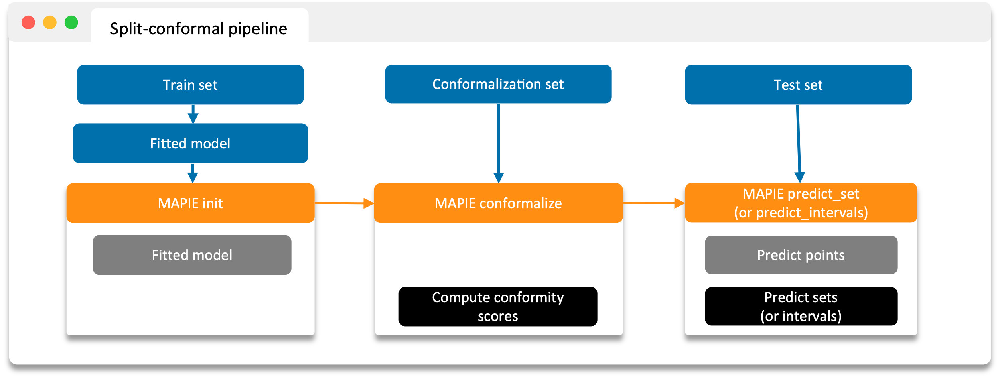

################################
Split/Cross-Conformal Prediction
################################

**MAPIE** is basically based on two types of techniques:

- the split-conformal predictions,
- the cross-conformal predictions.

In all cases, the training/calibration process can be broken down as follows:

- Identify a basic model (or pre-trained model).
- Wrap it with the MAPIE class.
- Fit new model to calibration data (or full data if cross-validation) to estimate conformity scores.
- Predict target on test data to obtain prediction intervals/sets based on conformity scores.

1. Split conformal predictions
==============================

- Construction of a conformity score.
- Calibration of the conformity score on a calibration set not seen by the model during training.

**MAPIE** then uses the calibrated conformity scores to estimate sets associated with the desired coverage on new data with strong theoretical guarantees.

.. image:: images/cp_split.png
    :width: 600
    :align: center

Prefit mode of split conformal predictions
------------------------------------------

2. Cross conformal predictions
==============================

- Conformity scores on the whole training set obtained by cross-validation,
- Perturbed models generated during the cross-validation.

**MAPIE** then combines all these elements in a way that provides prediction intervals on new data with strong theoretical guarantees.

.. image:: images/cp_cross.png
    :width: 600
    :align: center
