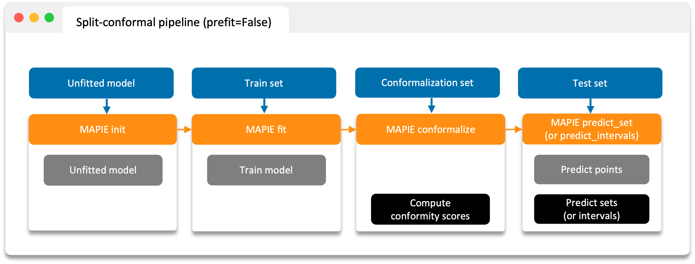

################################################################
The conformalization (or "calibration") set
################################################################

**MAPIE** is based on two types of techniques for measuring uncertainty in regression and classification:

- the split-conformal predictions,
- the cross-conformal predictions.

In all cases, the training/conformalization process can be broken down as follows:

- Train a model using the training set (or full dataset if cross-conformal).
- Estimate conformity scores using the conformalization set (or full dataset if cross-conformal).
- Predict target on test data to obtain prediction intervals/sets based on these conformity scores.

1. Split conformal predictions
==============================

- Compute conformity scores ("conformalization") on a conformalization set not seen by the model during training.
  (Use :func:`~mapie.utils.train_conformalize_test_split` to obtain the different sets.)

**MAPIE** then uses the conformity scores to estimate sets associated with the desired coverage on new data with strong theoretical guarantees.

Split conformal predictions with a pre-trained model
------------------------------------------------------------------------------------

.. image:: images/cp_prefit.png
    :width: 800
    :align: center

Split conformal predictions with an untrained model
------------------------------------------------------------------------------------

2. Cross conformal predictions
==============================

- Conformity scores on the whole dataset obtained by cross-validation,
- Perturbed models generated during the cross-validation.

**MAPIE** then combines all these elements in a way that provides prediction intervals on new data with strong theoretical guarantees.

.. image:: images/cp_cross.png
    :width: 600
    :align: center
