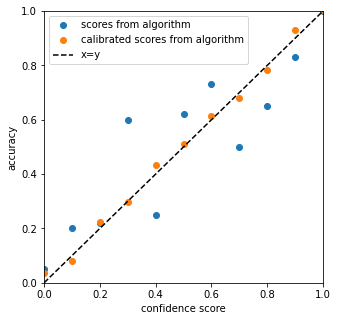

.. title:: Theoretical Description : contents

.. _theoretical_description_calibration:

=======================
Theoretical Description
=======================

One method for multi-class calibration has been implemented in MAPIE so far :
Top-Label Calibration [1].

The goal of binary calibration is to transform a score (typically given by an ML model) that is not a probability into a
probability. The algorithms that are used for calibration can be interpreted as estimators of the confidence level. Hence,
they need independent and dependent variables to be fitted.

The figure below illustrates what we would expect as a result of a calibration, with the scores predicted being closer to the
true probability compared to the original output.

Firstly, we introduce binary calibration, we denote the :math:`(h(X), y)` pair as the score and ground truth for the object. Hence, :math:`y`
values are in :math:`{0, 1}`. The model is calibrated if for every output :math:`q \in [0, 1]`, we have:

.. math:: 
    Pr(Y = 1 \mid h(X) = q) = q

where :math:`h()` is the score predictor.

To apply calibration directly to a multi-class context, Gupta et al. propose a framework, multiclass-to-binary, in order to reduce
a multi-class calibration to multiple binary calibrations (M2B).

1. Top-Label
------------

Top-Label calibration is a calibration technique introduced by Gupta et al. to calibrate the model according to the highest score and
the corresponding class (see [1] Section 2). This framework offers to apply binary calibration techniques to multi-class calibration.

More intuitively, top-label calibration simply performs a binary calibration (such as Platt scaling or isotonic regression) on the
highest score and the corresponding class, whereas confidence calibration only calibrates on the highest score (see [1] Section 2).

Let :math:`c` be the classifier and :math:`h` be the maximum score from the classifier. The couple :math:`(c, h)` is calibrated
according to Top-Label calibration if:

.. math:: 
    Pr(Y = c(X) \mid h(X), c(X)) = h(X)

2. Metrics for calibration
--------------------------

**Expected calibration error**

The main metric to check if the calibration is correct is the Expected Calibration Error (ECE). It is based on two
components, accuracy and confidence per bin. The number of bins is a hyperparamater :math:`M`, and we refer to a specific bin by
:math:`B_m`.

.. math::
    \text{acc}(B_m) &= \frac{1}{\left| B_m \right|} \sum_{i \in B_m} {y}_i \\
    \text{conf}(B_m) &= \frac{1}{\left| B_m \right|} \sum_{i \in B_m} \hat{f}(x)_i

The ECE is the combination of these two metrics combined.

.. math::
    \text{ECE} = \sum_{m=1}^M \frac{\left| B_m \right|}{n} \left| acc(B_m) - conf(B_m) \right|

In simple terms, once all the different bins from the confidence scores have been created, we check the mean accuracy of each bin.
The absolute mean difference between the two is the ECE. Hence, the lower the ECE, the better the calibration was performed. 

**Top-Label ECE**

In the top-label calibration, we only calculate the ECE for the top-label class. Hence, per top-label class, we condition the calculation
of the accuracy and confidence based on the top label and take the average ECE for each top-label.

3. Statistical tests for calibration
------------------------------------

**Kolmogorov-Smirnov test**

Kolmogorov-Smirnov test was derived in [2, 3, 4]. The idea is to consider the cumulative differences between sorted scores :math:`s_i`
and their corresponding labels :math:`y_i` and to compare its properties to that of a standard Brownian motion. Let us consider the
cumulative differences on sorted scores: 

.. math::
    C_k = \frac{1}{N}\sum_{i=1}^k (s_i - y_i)

We also introduce a typical normalization scale :math:`\sigma`:

.. math::
    \sigma = \frac{1}{N}\sqrt{\sum_{i=1}^N s_i(1 - s_i)}

The Kolmogorov-Smirnov statistic is then defined as : 

.. math::
   G = \max|C_k|/\sigma

It can be shown [2] that, under the null hypothesis of well-calibrated scores, this quantity asymptotically (i.e. when N goes to infinity)
converges to the maximum absolute value of a standard Brownian motion over the unit interval :math:`[0, 1]`. [3, 4] also provide closed-form 
formulas for the cumulative distribution function (CDF) of the maximum absolute value of such a standard Brownian motion.
So we state the p-value associated to the statistical test of well calibration as:

.. math::
   p = 1 - CDF(G)

**Kuiper test**

Kuiper test was derived in [2, 3, 4] and is very similar to Kolmogorov-Smirnov. This time, the statistic is defined as:

.. math::
   H = (\max_k|C_k| - \min_k|C_k|)/\sigma

It can be shown [2] that, under the null hypothesis of well-calibrated scores, this quantity asymptotically (i.e. when N goes to infinity)
converges to the range of a standard Brownian motion over the unit interval :math:`[0, 1]`. [3, 4] also provide closed-form 
formulas for the cumulative distribution function (CDF) of the range of such a standard Brownian motion.
So we state the p-value associated to the statistical test of well calibration as:

.. math::
   p = 1 - CDF(H)

**Spiegelhalter test**

Spiegelhalter test was derived in [6]. It is based on a decomposition of the Brier score: 

.. math::
   B = \frac{1}{N}\sum_{i=1}^N(y_i - s_i)^2

where scores are denoted :math:`s_i` and their corresponding labels :math:`y_i`. This can be decomposed in two terms:

.. math::
   B = \frac{1}{N}\sum_{i=1}^N(y_i - s_i)(1 - 2s_i) + \frac{1}{N}\sum_{i=1}^N s_i(1 - s_i)

It can be shown that the first term has an expected value of zero under the null hypothesis of well calibration. So we interpret
the second term as the Brier score expected value :math:`E(B)` under the null hypothesis. As for the variance of the Brier score, it can be
computed as:

.. math::
   Var(B) = \frac{1}{N^2}\sum_{i=1}^N(1 - 2s_i)^2 s_i(1 - s_i)

So we can build a Z-score as follows: 

.. math::
   Z = \frac{B - E(B)}{\sqrt{Var(B)}} = \frac{\sum_{i=1}^N(y_i - s_i)(1 - 2s_i)}{\sqrt{\sum_{i=1}^N(1 - 2s_i)^2 s_i(1 - s_i)}}

This statistic follows a normal distribution of cumulative distribution CDF so that we state the associated p-value:

.. math::
   p = 1 - CDF(Z)

3. References
-------------

[1] Gupta, Chirag, and Aaditya K. Ramdas.
"Top-label calibration and multiclass-to-binary reductions."
arXiv preprint arXiv:2107.08353 (2021).

[2] Arrieta-Ibarra I, Gujral P, Tannen J, Tygert M, Xu C.
Metrics of calibration for probabilistic predictions.
The Journal of Machine Learning Research.
2022 Jan 1;23(1):15886-940.

[3] Tygert M.
Calibration of P-values for calibration and for deviation
of a subpopulation from the full population.
arXiv preprint arXiv:2202.00100.
2022 Jan 31.

[4] D. A. Darling. A. J. F. Siegert.
The First Passage Problem for a Continuous Markov Process.
Ann. Math. Statist. 24 (4) 624 - 639, December,
1953.

[5] William Feller.
The Asymptotic Distribution of the Range of Sums of
Independent Random Variables.
Ann. Math. Statist. 22 (3) 427 - 432
September, 1951.

[6] Spiegelhalter DJ.
Probabilistic prediction in patient management and clinical trials.
Statistics in medicine.
1986 Sep;5(5):421-33.