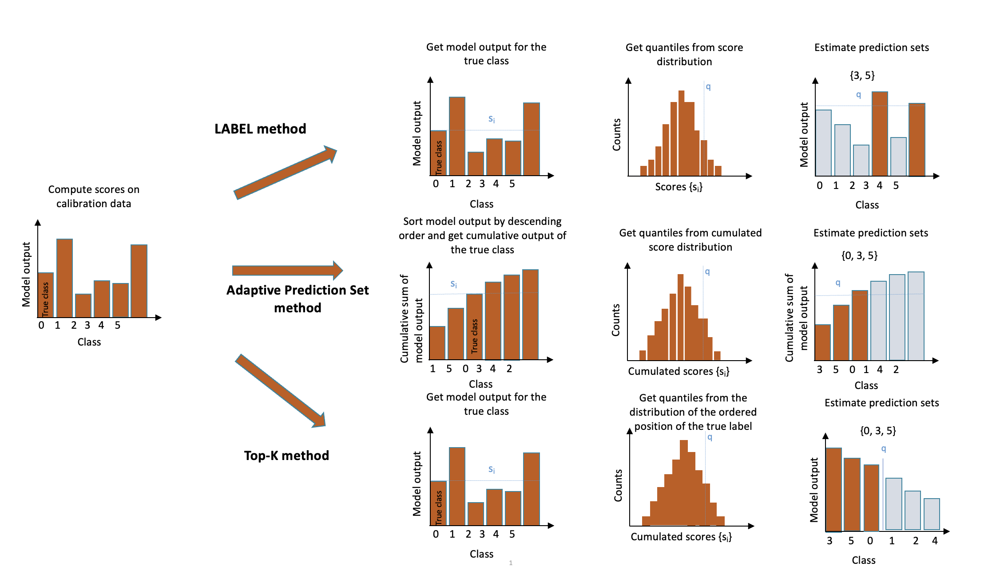

.. title:: Theoretical Description : contents

.. _theoretical_description_classification:

=======================
Theoretical Description
=======================

Three methods for multi-class uncertainty-quantification have been implemented in MAPIE so far :
LAC (that stands for Least Ambiguous set-valued Classifier) [1], Adaptive Prediction Sets [2, 3] and Top-K [3].
The difference between these methods is the way the conformity scores are computed. 
The figure below illustrates the three methods implemented in MAPIE:

For a classification problem in a standard independent and identically distributed (i.i.d) case,
our training data :math:`(X, Y) = \{(x_1, y_1), \ldots, (x_n, y_n)\}`` has an unknown distribution :math:`P_{X, Y}`. 

For any risk level :math:`\alpha` between 0 and 1, the methods implemented in MAPIE allow the user to construct a prediction
set :math:`\hat{C}_{n, \alpha}(X_{n+1})` for a new observation :math:`\left( X_{n+1},Y_{n+1} \right)` with a guarantee
on the marginal coverage such that : 

.. math::
    P \{Y_{n+1} \in \hat{C}_{n, \alpha}(X_{n+1}) \} \geq 1 - \alpha

In words, for a typical risk level :math:`\alpha` of :math:`10 \%`, we want to construct prediction sets that contain the true observations
for at least :math:`90 \%` of the new test data points.
Note that the guarantee is possible only on the marginal coverage, and not on the conditional coverage
:math:`P \{Y_{n+1} \in \hat{C}_{n, \alpha}(X_{n+1}) | X_{n+1} = x_{n+1} \}` which depends on the location of the new test point in the distribution. 

1. LAC
------

In the LAC method, the conformity score is defined as as one minus the score of the true label. For each point :math:`i` of the calibration set : 

.. math:: 
    s_i(X_i, Y_i) = 1 - \hat{\mu}(X_i)_{Y_i}

Once the conformity scores :math:`{s_1, ..., s_n}` are estimated for all calibration points, we compute the :math:`(n+1)*(1-\alpha)/n` quantile
:math:`\hat{q}` as follows : 

.. math:: 
    \hat{q} = Quantile \left(s_1, ..., s_n ; \frac{\lceil(n+1)(1-\alpha)\rceil}{n}\right) \\

Finally, we construct a prediction set by including all labels with a score higher than the estimated quantile :

.. math:: 
    \hat{C}(X_{test}) = \{y : \hat{\mu}(X_{test})_y \geq 1 - \hat{q}\}

This simple approach allows us to construct prediction sets which have a theoretical guarantee on the marginal coverage.
However, although this method generally results in small prediction sets, it tends to produce empty ones when the model is uncertain,
for example at the border between two classes.

2. Top-K
--------

Introduced in [3], the specificity of the Top-K method is that it will give the same prediction set size for all observations.
The conformity score is the rank of the true label, with scores ranked from higher to lower.
The prediction sets are built by taking the :math:`\hat{q}^{th}` higher scores. The procedure is described in the following equations : 

.. math:: 
   s_i(X_i, Y_i) = j \quad \text{where} \quad Y_i = \pi_j \quad \text{and} \quad \hat{\mu}(X_i)_{\pi_1} > ... > \hat{\mu}(X_i)_{\pi_j} > ... > \hat{\mu}(X_i)_{\pi_n}

.. math:: 
    \hat{q} = \left \lceil Quantile \left(s_1, ..., s_n ; \frac{\lceil(n+1)(1-\alpha)\rceil}{n}\right) \right\rceil

.. math:: 
   \hat{C}(X_{test}) = \{\pi_1, ..., \pi_{\hat{q}}\} 

As the other methods, this procedure allows the user to build prediction sets with guarantee on the marginal coverage. 

3. Adaptive Prediction Sets (APS)
---------------------------------

The so-called Adaptive Prediction Set (APS) method overcomes the problem encountered by the LAC method through the construction of
prediction sets which are by definition non-empty.
The conformity scores are computed by summing the ranked scores of each label, from the higher to the lower until reaching the true
label of the observation :

.. math:: 
   s_i(X_i, Y_i) = \sum^k_{j=1} \hat{\mu}(X_i)_{\pi_j} \quad \text{where} \quad Y_i = \pi_k 

The quantile :math:`\hat{q}` is then computed the same way as the LAC method.
For the construction of the prediction sets for a new test point, the same procedure of ranked summing is applied until reaching the quantile,
as described in the following equation : 

.. math:: 
   \hat{C}(X_{test}) = \{\pi_1, ..., \pi_k\} \quad \text{where} \quad k = \text{inf}\{k : \sum^k_{j=1} \hat{\mu}(X_{test})_{\pi_j} \geq \hat{q}\}

By default, the label whose cumulative score is above the quantile is included in the prediction set.
However, its incorporation can also be chosen randomly based on the difference between its cumulative score and the quantile so the effective
coverage remains close to the target (marginal) coverage. We refer the reader to [2, 3] for more details about this aspect.

4. Regularized Adaptive Prediction Sets (RAPS)
----------------------------------------------

The RAPS method which stands for Regularized Adaptive Prediction Sets, is an improvement made by Angelopoulos et al. in 
[3]. This regularization is able to overcome the very large prediction sets given by the APS method. The conformity scores are
computed by summing the regularized ranked scores of each label, from the higher to the lower until reaching the true label of the observation :

.. math:: 
   s_i(X_i, Y_i) = \sum^k_{j=1} \hat{\mu}(X_i)_{\pi_j} + \lambda (k-k_{reg})^+ \quad \text{where} \quad Y_i = \pi_k

Where:

- :math:`\pi_i` the is the label associated to the  :math:`i^{th}` ranked score.
- :math:`(z)^+` denotes the positive part of :math:`z`
- :math:`k_{reg}` is the optimal set size (in the sense that if all prediction sets have :math:`k_{reg}` elements, then one achieves the desired coverage)
- :math:`\lambda` is a regularization parameter whose calculation we will explain next.

The optimizations of :math:`k_{reg}` and :math:`\lambda` requires an extra data-splitting (by default, 20% of the calibration data). To choose :math:`k_{reg}`,
we simply run the Top-K method over this new split. For the choice of :math:`\lambda`, we follow the guidelines of [3] and try to find the value of 
lambda such that it minimizes the size of the prediction sets. A simple grid search if done on different values of :math:`\lambda` (to be consistent 
with Angelopoulos et al., we choose :math:`\lambda \in \{0.001, 0.01, 0.1, 0.2, 0.5 \}`).

For the construction of the prediction set for a new test point, the following procedure is applied:

.. math::
   \hat{C}(X_{test}) = \{\pi_1, ..., \pi_k\} \quad \text{where} \quad k = \text{inf}\{k : \sum^k_{j=1} \hat{\mu}(X_{test})_{\pi_j} + \lambda(k-k_{reg})^+ \geq \hat{q}\}

Intuitively, the goal of the method is to penalize the prediction sets whose size are greater than the optimal prediction set size. The level of this 
regularization is controlled by the parameter :math:`\lambda`.

Despite that RAPS method has relatively small set size, its coverage tends to be higher than the one required (especially for high values of
:math:`\alpha`, which means low level of confidence). Hence, to achieve exact coverage, one can implement a randomization concerning the inclusion
of the last label in the prediction set. This randomization is done as follows:

- First : define the :math:`V` parameter:
.. math::
        V_i = (s_i(X_i, Y_i) - \hat{q}_{1-\alpha}) / \left(\hat{\mu}(X_i)_{\pi_k} + \lambda \mathbb{1} (k > k_{reg})\right)
- Compare each :math:`V_i` to :math:`U \sim` Unif(0, 1)
- If :math:`V_i \leq U`, the last included label is removed, else we keep the prediction set as it is.

5. Split- and cross-conformal methods
-------------------------------------

It should be noted that MAPIE includes split- and cross-conformal strategies for the LAC and APS methods,
but only the split-conformal one for Top-K.
The implementation of the cross-conformal method follows algorithm 2 of [2].
In short, conformity scores are calculated for all training instances in a cross-validation fashion from their corresponding out-of-fold models.
By analogy with the CV+ method for regression, estimating the prediction sets is performed in four main steps:

- We split the training set into *K* disjoint subsets :math:`S_1, S_2, ..., S_K` of equal size. 
  
- *K* regression functions :math:`\hat{\mu}_{-S_k}` are fitted on the training set with the 
  corresponding :math:`k^{th}` fold removed.

- The corresponding *out-of-fold* conformity score is computed for each :math:`i^{th}` point 

- Compare the conformity scores of training instances with the scores of each label for each new test point in order to
  decide whether or not the label should be included in the prediction set. 
  For the APS method, the prediction set is constructed as follows (see equation 11 of [3]) : 

.. math:: 
    C_{n, \alpha}(X_{n+1}) = 
    \Big\{ y \in \mathcal{Y} : \sum_{i=1}^n {\rm 1} \Big[ E(X_i, Y_i, U_i; \hat{\pi}^{k(i)}) < E(X_{n+1}, y, U_{n+1}; \hat{\pi}^{k(i)}) \Big] < (1-\alpha)(n+1) \Big\}

where : 

- :math:`E(X_i, Y_i, U_i; \hat{\pi}^{k(i)})` is the conformity score of training instance :math:`i`

- :math:`E(X_{n+1}, y, U_{n+1}; \hat{\pi}^{k(i)})` is the conformity score of label :math:`y` from a new test point.

.. The :class:`mapie.regression.MapieClassifier` class implements several conformal methods
.. for estimating predictions sets, i.e. a set of possibilities that include the true label
.. with a given confidence level.
.. The full-conformal methods being computationally intractable, we will focus on the split-
.. and cross-conformal methods. 

.. Before describing the methods, let's briefly present the mathematical setting.
.. For a classification problem in a standard independent and identically distributed
.. (i.i.d) case, our training data :math:`(X, Y) = \{(x_1, y_1), \ldots, (x_n, y_n)\}`
.. has an unknown distribution :math:`P_{X, Y}`. 

.. Given some target quantile :math:`\alpha` or associated target coverage level :math:`1-\alpha`,
.. we aim at constructing a set of possible labels :math:`\hat{T}_{n, \alpha} \in {1, ..., K}`
.. for a new feature vector :math:`X_{n+1}` such that 

.. .. math:: 
..     P \{Y_{n+1} \in \hat{T}_{n, \alpha}(X_{n+1}) \} \geq 1 - \alpha

.. 1. Split-conformal method
.. -------------------------

.. - In order to estimate prediction sets, one needs to "calibrate" so-called conformity scores
..   on a given calibration set. The alpha-quantile of these conformity scores is then estimated
..   and compared with the conformity scores of new test points output by the base model to assess
..   whether a label must be included in the prediction set

.. - The split-conformal methodology can be summarized in the scheme below : 
..     - The training set is first split into a training set and a calibration set
..     - The training set is used for training the model
..     - The calibration set is only used for getting distribution of conformity scores output by
..       the model trained only on the training set. 

.. 2. The "score" method
.. ---------------------

.. 3. The "cumulated score" method
.. -------------------------------

.. 4. The cross-conformal method
.. -----------------------------

.. TO BE CONTINUED

5. References
-------------

[1] Mauricio Sadinle, Jing Lei, & Larry Wasserman.
"Least Ambiguous Set-Valued Classifiers With Bounded Error Levels."
Journal of the American Statistical Association, 114:525, 223-234, 2019.

[2] Yaniv Romano, Matteo Sesia and Emmanuel J. Candès.
"Classification with Valid and Adaptive Coverage."
NeurIPS 202 (spotlight), 2020.

[3] Anastasios Nikolas Angelopoulos, Stephen Bates, Michael Jordan and Jitendra Malik.
"Uncertainty Sets for Image Classifiers using Conformal Prediction."
International Conference on Learning Representations 2021.
