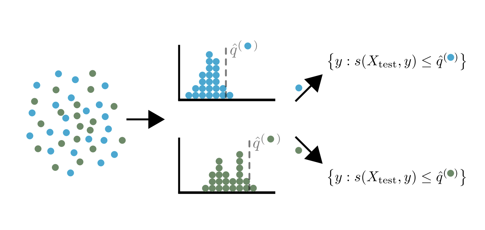

.. title:: Theoretical Description Mondrian : contents

.. _theoretical_description_mondrian:

#######################
Theoretical Description
#######################

Note: in theoretical parts of the documentation, we use the following terms employed in the scientific literature:

- `alpha` is equivalent to `1 - confidence_level`. It can be seen as a *risk level*
- *calibrate* and *calibration*, are equivalent to *conformalize* and *conformalization*.

—

Mondrian conformal prediction (MCP) [1] is a method that allows to build prediction sets with a group-conditional
coverage guarantee.  The coverage guarantee is given by:

.. math::
    P \{Y_{n+1} \in \hat{C}_{n, \alpha}(X_{n+1}) | G_{n+1} = g\} \geq 1 - \alpha

where :math:`G_{n+1}` is the group of the new test point :math:`X_{n+1}` and :math:`g`
is a group in the set of groups :math:`\mathcal{G}`.

MCP can be used with any split conformal predictor and can be particularly useful when one have a prior
knowledge about existing groups whether the information is directly included in the features of the data or not.
In a classification setting, the groups can be defined as the predicted classes of the data. Doing so,
one can ensure that, for each predicted class, the coverage guarantee is satisfied.

In order to achieve the group-conditional coverage guarantee, MCP simply classifies the data
according to the groups and then applies the split conformal predictor to each group separately.

The quantile of each group is defined as:

.. math::
   \widehat{q}^g =Quantile\left(s_1, ..., s_{n^g} ,\frac{\lceil (n^{(g)} + 1)(1-\alpha)\rceil}{n^{(g)}} \right)

Where :math:`s_1, ..., s_{n^g}` are the conformity scores of the training points in group :math:`g` and :math:`n^{(g)}`
is the number of training points in group :math:`g`.

The following figure (from [1]) explains the process of Mondrian conformal prediction:

References
----------

[1] Vladimir Vovk, David Lindsay, Ilia Nouretdinov, and Alex Gammerman.
Mondrian confidence machine.
Technical report, Royal Holloway University of London, 2003
