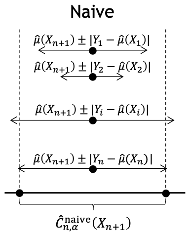
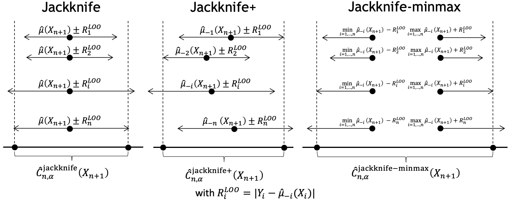

.. title:: Theoretical Description : contents

.. _theoretical_description_regression:

=======================
Theoretical Description
=======================

The :class:`mapie.regression.MapieRegressor` class uses various
resampling methods based on the jackknife strategy
recently introduced by Foygel-Barber et al. (2020) [1]. 
They allow the user to estimate robust prediction intervals with any kind of
machine learning model for regression purposes on single-output data. 
We give here a brief theoretical description of the methods included in the module.

Before describing the methods, let's briefly present the mathematical setting.
For a regression problem in a standard independent and identically distributed
(i.i.d) case, our training data :math:`(X, Y) = \{(x_1, y_1), \ldots, (x_n, y_n)\}`
has an unknown distribution :math:`P_{X, Y}`. We can assume that :math:`Y = \mu(X)+\epsilon`
where :math:`\mu` is the model function we want to determine and
:math:`\epsilon_i \sim P_{Y \vert X}` is the noise. 
Given some target quantile :math:`\alpha` or associated target coverage level :math:`1-\alpha`,
we aim at constructing a prediction interval :math:`\hat{C}_{n, \alpha}` for a new
feature vector :math:`X_{n+1}` such that 

.. math::
    P \{Y_{n+1} \in \hat{C}_{n, \alpha}(X_{n+1}) \} \geq 1 - \alpha

All the methods below are described with the absolute residual conformity score for simplicity
but other conformity scores are implemented in MAPIE (see :doc:`theoretical_description_conformity_scores`).

1. The "Naive" method
=====================

The so-called naive method computes the residuals of the training data to estimate the 
typical error obtained on a new test data point. 
The prediction interval is therefore given by the prediction obtained by the 
model trained on the entire training set :math:`\pm` the quantiles of the 
conformity scores of the same training set:
    
.. math:: \hat{\mu}(X_{n+1}) \pm ((1-\alpha) \textrm{quantile of} |Y_1-\hat{\mu}(X_1)|, ..., |Y_n-\hat{\mu}(X_n)|)

or

.. math:: \hat{C}_{n, \alpha}^{\rm naive}(X_{n+1}) = \hat{\mu}(X_{n+1}) \pm \hat{q}_{n, \alpha}^+{|Y_i-\hat{\mu}(X_i)|}

where :math:`\hat{q}_{n, \alpha}^+` is the :math:`(1-\alpha)` quantile of the distribution.

Since this method estimates the conformity scores only on the training set, it tends to be too 
optimistic and underestimates the width of prediction intervals because of a potential overfit. 
As a result, the probability that a new point lies in the interval given by the 
naive method would be lower than the target level :math:`(1-\alpha)`.

The figure below illustrates the naive method. 

2. The split method
=====================

The so-called split method computes the residuals of a calibration dataset to estimate the 
typical error obtained on a new test data point. 
The prediction interval is therefore given by the prediction obtained by the 
model trained on the training set :math:`\pm` the quantiles of the 
conformity scores of the calibration set:
    
.. math:: \hat{\mu}(X_{n+1}) \pm ((1-\alpha) \textrm{quantile of} |Y_1-\hat{\mu}(X_1)|, ..., |Y_n-\hat{\mu}(X_n)|)

or

.. math:: \hat{C}_{n, \alpha}^{\rm split}(X_{n+1}) = \hat{\mu}(X_{n+1}) \pm \hat{q}_{n, \alpha}^+{|Y_i-\hat{\mu}(X_i)|}

where :math:`\hat{q}_{n, \alpha}^+` is the :math:`(1-\alpha)` quantile of the distribution.

Since this method estimates the conformity scores only on a calibration set, one must have enough
observations to split its original dataset into train and calibration as mentioned in [5]. We can
notice that this method is very similar to the naive one, the only difference being that the conformity
scores are not computed on the calibration set. Moreover, this method will always give prediction intervals
with a constant width.
  

3. The jackknife method
=======================

The *standard* jackknife method is based on the construction of a set of 
*leave-one-out* models. 
Estimating the prediction intervals is carried out in three main steps:

- For each instance *i = 1, ..., n* of the training set, we fit the regression function
  :math:`\hat{\mu}_{-i}` on the entire training set with the :math:`i^{th}` point removed,
  resulting in *n* leave-one-out models.

- The corresponding leave-one-out conformity score is computed for each :math:`i^{th}` point
  :math:`|Y_i - \hat{\mu}_{-i}(X_i)|`.

- We fit the regression function :math:`\hat{\mu}` on the entire training set and we compute
  the prediction interval using the computed leave-one-out conformity scores:
  
.. math:: \hat{\mu}(X_{n+1}) \pm ((1-\alpha) \textrm{ quantile of } |Y_1-\hat{\mu}_{-1}(X_1)|, ..., |Y_n-\hat{\mu}_{-n}(X_n)|)

The resulting confidence interval can therefore be summarized as follows

.. math:: \hat{C}_{n, \alpha}^{\rm jackknife}(X_{n+1}) = [ \hat{q}_{n, \alpha}^-\{\hat{\mu}(X_{n+1}) - R_i^{\rm LOO} \}, \hat{q}_{n, \alpha}^+\{\hat{\mu}(X_{n+1}) + R_i^{\rm LOO} \}] 

where

.. math:: R_i^{\rm LOO} = |Y_i - \hat{\mu}_{-i}(X_i)|

is the *leave-one-out* conformity score.

This method avoids the overfitting problem but can lose its predictive 
cover when :math:`\hat{\mu}` becomes unstable, for example, when the 
sample size is close to the number of features
(as seen in the "Reproducing the simulations from Foygel-Barber et al. (2020)" example). 

4. The jackknife+ method
========================

Unlike the standard jackknife method which estimates a prediction interval centered 
around the prediction of the model trained on the entire dataset, the so-called jackknife+ 
method uses each leave-one-out prediction on the new test point to take the variability of the 
regression function into account.
The resulting confidence interval can therefore be summarized as follows

.. math:: \hat{C}_{n, \alpha}^{\rm jackknife+}(X_{n+1}) = [ \hat{q}_{n, \alpha}^-\{\hat{\mu}_{-i}(X_{n+1}) - R_i^{\rm LOO} \}, \hat{q}_{n, \alpha}^+\{\hat{\mu}_{-i}(X_{n+1}) + R_i^{\rm LOO} \}] 

As described in [1], this method guarantees a higher stability 
with a coverage level of :math:`1-2\alpha` for a target coverage level of :math:`1-\alpha`,
without any *a priori* assumption on the distribution of the data :math:`(X, Y)`
nor on the predictive model.

5. The jackknife-minmax method
==============================

The jackknife-minmax method offers a slightly more conservative alternative since it uses 
the minimal and maximal values of the leave-one-out predictions to compute the prediction intervals.
The estimated prediction intervals can be defined as follows

.. math:: 

    \hat{C}_{n, \alpha}^{\rm jackknife-mm}(X_{n+1}) = 
    [\min \hat{\mu}_{-i}(X_{n+1}) - \hat{q}_{n, \alpha}^+\{R_I^{\rm LOO} \}, 
    \max \hat{\mu}_{-i}(X_{n+1}) + \hat{q}_{n, \alpha}^+\{R_I^{\rm LOO} \}] 

As justified by [1], this method guarantees a coverage level of 
:math:`1-\alpha` for a target coverage level of :math:`1-\alpha`.

The figure below, adapted from Fig. 1 of [1], illustrates the three jackknife
methods and emphasizes their main differences.

However, the jackknife, jackknife+ and jackknife-minmax methods are computationally heavy since 
they require to run as many simulations as the number of training points, which is prohibitive 
for a typical data science use case. 

6. The CV+ method
=================

In order to reduce the computational time, one can adopt a cross-validation approach
instead of a leave-one-out approach, called the CV+ method.

By analogy with the jackknife+ method, estimating the prediction intervals with CV+
is performed in four main steps:

- We split the training set into *K* disjoint subsets :math:`S_1, S_2, ..., S_K` of equal size. 
  
- *K* regression functions :math:`\hat{\mu}_{-S_k}` are fitted on the training set with the 
  corresponding :math:`k^{th}` fold removed.

- The corresponding *out-of-fold* conformity score is computed for each :math:`i^{th}` point 
  :math:`|Y_i - \hat{\mu}_{-S_{k(i)}}(X_i)|` where *k(i)* is the fold containing *i*.

- Similar to the jackknife+, the regression functions :math:`\hat{\mu}_{-S_{k(i)}}(X_i)` 
  are used to estimate the prediction intervals. 

As for jackknife+, this method guarantees a coverage level higher than :math:`1-2\alpha` 
for a target coverage level of :math:`1-\alpha`, without any *a priori* assumption on 
the distribution of the data.
As noted by [1], the jackknife+ can be viewed as a special case of the CV+ 
in which :math:`K = n`. 
In practice, this method results in slightly wider prediction intervals and is therefore 
more conservative, but gives a reasonable compromise for large datasets when the Jacknife+ 
method is unfeasible.

7. The CV and CV-minmax methods
===============================

By analogy with the standard jackknife and jackknife-minmax methods, the CV and CV-minmax approaches
are also included in MAPIE. As for the CV+ method, they rely on out-of-fold regression models that
are used to compute the prediction intervals but using the equations given in the jackknife and
jackknife-minmax sections.  

The figure below, adapted from Fig. 1 of [1], illustrates the three CV
methods and emphasizes their main differences.

.. image:: images/jackknife_cv.png
   :width: 800

8. The jackknife+-after-bootstrap method
========================================

In order to reduce the computational time, and get more robust predictions, 
one can adopt a bootstrap approach instead of a leave-one-out approach, called 
the jackknife+-after-bootstrap method, offered by Kim and al. [2]. Intuitively,
this method uses ensemble methodology to calculate the :math:`i^{\text{th}}`
aggregated prediction and residual by only taking subsets in which the
:math:`i^{\text{th}}` observation is not used to fit the estimator.

By analogy with the CV+ method, estimating the prediction intervals with 
jackknife+-after-bootstrap is performed in four main steps:

- We resample the training set with replacement (bootstrap) :math:`K` times,
  and thus we get the (non-disjoint) bootstraps :math:`B_{1},..., B_{K}` of equal size.

- :math:`K` regressions functions :math:`\hat{\mu}_{B_{k}}` are then fitted on 
  the bootstraps :math:`(B_{k})`, and the predictions on the complementary sets 
  :math:`(B_k^c)` are computed.

- These predictions are aggregated according to a given aggregation function 
  :math:`{\rm agg}`, typically :math:`{\rm mean}` or :math:`{\rm median}`, and the conformity scores 
  :math:`|Y_j - {\rm agg}(\hat{\mu}(B_{K(j)}(X_j)))|` are computed for each :math:`X_j`
  (with :math:`K(j)` the boostraps not containing :math:`X_j`).

 
- The sets :math:`\{\rm agg(\hat{\mu}_{K(j)}(X_i)) + r_j\}` (where :math:`j` indexes  
  the training set) are used to estimate the prediction intervals.

As for jackknife+, this method guarantees a coverage level higher than 
:math:`1 - 2\alpha` for a target coverage level of :math:`1 - \alpha`, without 
any a priori assumption on the distribution of the data. 
In practice, this method results in wider prediction intervals, when the 
uncertainty is higher than :math:`CV+`, because the models' prediction spread 
is then higher.

9. The conformalized quantile regression (CQR) method
=====================================================

The conformalized quantile method allows for better interval widths with
heteroscedastic data. It uses quantile regressors with different quantile
values to estimate the prediction bounds and the residuals of these methods are
used to create the guaranteed coverage value.

.. math:: 

    \hat{C}_{n, \alpha}^{\rm CQR}(X_{n+1}) = 
    [\hat{q}_{\alpha_{lo}}(X_{n+1}) - Q_{1-\alpha}(E_{low}, \mathcal{I}_2),
    \hat{q}_{\alpha_{hi}}(X_{n+1}) + Q_{1-\alpha}(E_{high}, \mathcal{I}_2)]

Where :math:`Q_{1-\alpha}(E, \mathcal{I}_2) := (1-\alpha)(1+1/ |\mathcal{I}_2|)`-th
empirical quantile of :math:`{E_i : i \in \mathcal{I}_2}` and :math:`\mathcal{I}_2` is the
residuals of the estimator fitted on the calibration set. Note that in the symmetric method, 
:math:`E_{low}` and :math:`E_{high}` are equal.

As justified by [3], this method offers a theoretical guarantee of the target coverage 
level :math:`1-\alpha`.

Note that only the split method has been implemented and that it will run three separate 
regressions when using :class:`mapie.quantile_regression.MapieQuantileRegressor`.

10. The ensemble batch prediction intervals (EnbPI) method
==========================================================

The coverage guarantee offered by the various resampling methods based on the
jackknife strategy, and implemented in MAPIE, are only valid under the "exchangeability
hypothesis". It means that the probability law of data should not change up to
reordering.
This hypothesis is not relevant in many cases, notably for dynamical times series.
That is why a specific class is needed, namely
:class:`mapie.time_series_regression.MapieTimeSeriesRegressor`.

Its implementation looks like the jackknife+-after-bootstrap method. The
leave-one-out (LOO) estimators are approximated thanks to a few boostraps.
However, the confidence intervals are like those of the jackknife method.

.. math::
  \hat{C}_{n, \alpha}^{\rm EnbPI}(X_{n+1}) = [\hat{\mu}_{agg}(X_{n+1}) + \hat{q}_{n, \beta}\{ R_i^{\rm LOO} \}, \hat{\mu}_{agg}(X_{n+1}) + \hat{q}_{n, (1 - \alpha + \beta)}\{ R_i^{\rm LOO} \}]

where :math:`\hat{\mu}_{agg}(X_{n+1})` is the aggregation of the predictions of
the LOO estimators (mean or median), and
:math:`R_i^{\rm LOO} = |Y_i - \hat{\mu}_{-i}(X_{i})|` 
is the residual of the LOO estimator :math:`\hat{\mu}_{-i}` at :math:`X_{i}` [4].

The residuals are no longer considered in absolute values but in relative
values and the width of the confidence intervals are minimized, up to a given gap
between the quantiles' level, optimizing the parameter :math:`\beta`.

Moreover, the residuals are updated during the prediction, each time new observations 
are available. So that the deterioration of predictions, or the increase of
noise level, can be dynamically taken into account.

Finally, the coverage guarantee is no longer absolute but asymptotic up to two
hypotheses:

1. Errors are short-term independent and identically distributed (i.i.d)

2. Estimation quality: there exists a real sequence :math:`(\delta_T)_{T > 0}`
   that converges to zero such that

.. math::
    \frac{1}{T}\sum_1^T(\hat{\mu}_{-t}(x_t) - \mu(x_t))^2 < \delta_T^2

The coverage level depends on the size of the training set and on 
:math:`(\delta_T)_{T > 0}`.

Be careful: the bigger the training set, the better the covering guarantee
for the point following the training set. However, if the residuals are
updated gradually, but the model is not refitted, the bigger the training set
is, the slower the update of the residuals is effective. Therefore there is a
compromise to make on the number of training samples to fit the model and
update the prediction intervals.

Key takeaways
=============

- The jackknife+ method introduced by [1] allows the user to easily obtain theoretically guaranteed
  prediction intervals for any kind of sklearn-compatible Machine Learning regressor.

- Since the typical coverage levels estimated by jackknife+ follow very closely the target coverage levels,
  this method should be used when accurate and robust prediction intervals are required.

- For practical applications where :math:`n` is large and/or the computational time of each 
  *leave-one-out* simulation is high, it is advised to adopt the CV+ method, based on *out-of-fold* 
  simulations, or the jackknife+-after-bootstrap method, instead. 
  Indeed, the methods based on the jackknife resampling approach are very cumbersome because they 
  require to run a high number of simulations, equal to the number of training samples :math:`n`.

- Although the CV+ method results in prediction intervals that are slightly larger than for the 
  jackknife+ method, it offers a good compromise between computational time and accurate predictions.

- The jackknife+-after-bootstrap method results in the same computational efficiency, and
  offers a higher sensitivity to epistemic uncertainty.

- The jackknife-minmax and CV-minmax methods are more conservative since they result in higher
  theoretical and practical coverages due to the larger widths of the prediction intervals.
  It is therefore advised to use them when conservative estimates are needed.

- The conformalized quantile regression method allows for more adaptiveness on the prediction 
  intervals which becomes key when faced with heteroscedastic data.

- If the "exchangeability hypothesis" is not valid, typically for time series,
  use EnbPI, and update the residuals each time new observations are available.

The table below summarizes the key features of each method by focusing on the obtained coverages and the
computational cost. :math:`n`, :math:`n_{\rm test}`, and :math:`K` are the number of training samples,
test samples, and cross-validated folds, respectively.

.. csv-table:: Key features of MAPIE methods (adapted from [1])*.
   :file: images/comp-methods.csv
   :header-rows: 1

.. [*] Here, the training and evaluation costs correspond to the computational time of the MAPIE ``.fit()`` and ``.predict()`` methods.

References
==========

[1] Rina Foygel Barber, Emmanuel J. Candès, Aaditya Ramdas, and Ryan J. Tibshirani.
"Predictive inference with the jackknife+." Ann. Statist., 49(1):486–507, February 2021.

[2] Byol Kim, Chen Xu, and Rina Foygel Barber.
"Predictive Inference Is Free with the Jackknife+-after-Bootstrap."
34th Conference on Neural Information Processing Systems (NeurIPS 2020).

[3] Yaniv Romano, Evan Patterson, Emmanuel J. Candès.
"Conformalized Quantile Regression." Advances in neural information processing systems 32 (2019).

[4] Chen Xu and Yao Xie. 
"Conformal Prediction Interval for Dynamic Time-Series."
International Conference on Machine Learning (ICML, 2021).

[5] Jing Lei, Max G’Sell, Alessandro Rinaldo, Ryan J Tibshirani, and Larry Wasserman.
"Distribution-free predictive inference for regression". 
Journal of the American Statistical Association, 113(523):1094–1111, 2018.