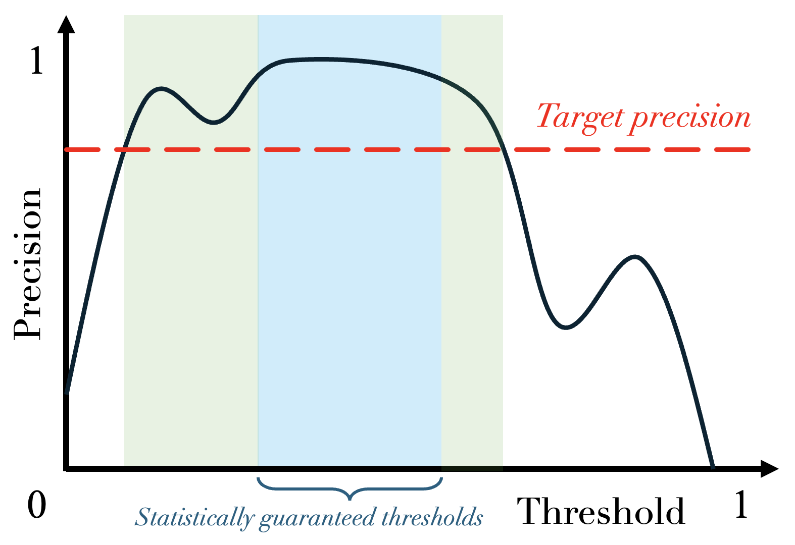

.. title:: Getting started with risk control in MAPIE : contents

.. _theoretical_description_risk_control:

############################################
Getting started with risk control in MAPIE
############################################

.. contents:: Table of contents
   :depth: 2
   :local:

Overview
========

This section provides an overview of risk control in MAPIE. For those unfamiliar with the concept of risk control, the next section provides an introduction to the topic.

Three methods of risk control have been implemented in MAPIE so far :
**Risk-Controlling Prediction Sets** (RCPS) [1], **Conformal Risk Control** (CRC) [2] and **Learn Then Test** (LTT) [3].

As of now, MAPIE supports risk control for two machine learning tasks: **binary classification**, as well as **multi-label classification** (in particular applications like image segmentation).
The table below details the available methods for each task:

.. |br| raw:: html

    
   
.. list-table:: Available risk control methods in MAPIE for each ML task
   :header-rows: 1

   * - Risk control |br| method
     - Type of |br| control
     - Assumption |br| on the data
     - Non-monotonic |br| risks
     - Binary |br| classification
     - Multi-label |br| classification
   * - RCPS
     - Probability
     - i.i.d.
     - ❌
     - ❌
     - ✅
   * - CRC
     - Expectation
     - Exchangeable
     - ❌
     - ❌
     - ✅
   * - LTT
     - Probability
     - i.i.d
     - ✅
     - ✅
     - ✅

In MAPIE for multi-label classification, CRC and RCPS are used for recall control, while LTT is used for precision control.

1. What is risk control?
========================

Before diving into risk control, let's take the simple example of a binary classification model, which separates the incoming data into two classes. Predicted probabilities above a given threshold (e.g., 0.5) correspond to predicting the "positive" class and probabilities below correspond to the "negative" class. Suppose we want to find a threshold that guarantees that our model achieves a certain level of precision. A naive, yet straightforward approach to do this is to evaluate how precision varies with different threshold values on a validation dataset. By plotting this relationship (see plot below), we can identify the range of thresholds that meet our desired precision requirement (green zone on the graph).

So far, so good. But here is the catch: while the chosen threshold effectively keeps precision above the desired level on the validation data, it offers no guarantee on the precision of the model when faced with new, unseen data. That is where risk control comes into play.

—

Risk control is the science of adjusting a model's parameter, typically denoted :math:`\lambda`, so that a given risk stays below a desired level with high probability on unseen data.
Note that here, the term *risk* is used to describe an undesirable outcome of the model (e.g., type I error): therefore, it is a value we want to minimize, and in our case, keep under a certain level. Also note that risk control can easily be applied to metrics we want to maximize (e.g., precision), simply by controlling the complement (e.g., 1-precision).

The strength of risk control lies in the statistical guarantees it provides on unseen data. Unlike the naive method presented earlier, it determines a value of :math:`\lambda` that ensures the risk is controlled *beyond* the validation data.

Applying risk control to the previous example would allow us to get a new — albeit narrower — range of thresholds (blue zone on the graph) that are **statistically guaranteed**.

This guarantee is critical in a wide range of use cases (especially in high-stakes applications), and can be applied to any risk or metric: in the example above, it was the precision that was controlled, but the same can be done with the recall, for example. Take medical diagnosis: here, the parameter :math:`\lambda` is the binarization threshold that determines whether a patient is classified as sick. We aim to minimize false negatives (i.e., cases where sick patients are incorrectly diagnosed as healthy), which corresponds to controlling the recall. In this setting, risk control allows us to find a :math:`\lambda` such that, on future patients, the model’s recall remains above, say, 95%, with high confidence.

—

To express risk control in mathematical terms, we denote by :math:`R` the risk we want to control, and introduce the following two parameters:

- :math:`\alpha`: the target level below which we want the risk to remain, as shown in the figure below;

- :math:`\delta`: the confidence level associated with the risk control.

In other words, the risk is said to be controlled if :math:`R \leq \alpha` with probability at least :math:`1 - \delta`, where the probability is over the randomness in the sampling of the dataset.

The three risk control methods implemented in MAPIE — RCPS, CRC and LTT — rely on different assumptions, and offer slightly different guarantees:

- **CRC** requires the data to be **exchangeable**, and gives a guarantee on the **expectation of the risk**: :math:`\mathbb{E}(R) \leq \alpha`;

- **RCPS** and **LTT** both impose stricter assumptions, requiring the data to be **independent and identically distributed** (i.i.d.), which implies exchangeability. The guarantee they provide is on the **probability that the risk does not exceed** :math:`\boldsymbol{\alpha}`: :math:`\mathbb{P}(R \leq \alpha) \geq 1 - \delta`.

The plot above gives a visual representation of the difference between the two types of guarantees:

- The risk is controlled in expectation (CRC) if the mean of its distribution over unseen data is below :math:`\alpha`;

- The risk is controlled in probability (RCPS/LTT) if at least :math:`1 - \delta` percent of its distribution over unseen data is below :math:`\alpha`.

Note that contrary to the other two methods, LTT allows to control any non-monotonic risk.

The following section provides a detailed overview of each method.

2. Theoretical description
==========================
Note that a notebook testing theoretical guarantees of risk control in binary classification using a random classifier and synthetic data is available here: `theoretical_validity_tests.ipynb <https://github.com/scikit-learn-contrib/MAPIE/tree/master/notebooks/risk_control/theoretical_validity_tests.ipynb>`__.

2.1 Risk-Controlling Prediction Sets
------------------------------------
2.1.1 General settings
^^^^^^^^^^^^^^^^^^^^^^

Let's first give the settings and the notations of the method:

- Let :math:`\mathcal{T}_{\hat{\lambda}}: X \longrightarrow Y'` be a set-valued function (a tolerance region) that maps a feature vector to a set-valued prediction. This function is built from the model which was previously fitted on the training data. It is indexed by a one-dimensional parameter :math:`\lambda` which is taking values in :math:`\Lambda \subset \mathbb{R} \cup \{ \pm \infty \}` such that:

.. math::
   \lambda_1 < \lambda_2 \Rightarrow \mathcal{T}_{\lambda_1}(x) \subset \mathcal{T}_{\lambda_2}(x)

- Let :math:`L: Y\times Y' \longrightarrow \mathbb{R}^+` be a loss function on a prediction set with the following nesting property:

.. math::
   S_1 \subset S_2 \Rightarrow L(y, S_1) \geq L(y, S_2)

- Let :math:`R` be the risk associated to a set-valued predictor:

.. math::
    R(\mathcal{T}_{\hat{\lambda}}) = \mathbb{E}[L(Y, \mathcal{T}_{\lambda}(X))]

The goal of the method is to compute an Upper Confidence Bound (UCB) :math:`\hat{R}^+(\lambda)` of :math:`R(\lambda)` and then to find
:math:`\hat{\lambda}` as follows:

.. math::
    \hat{\lambda} = \inf\{\lambda \in \Lambda: \hat{R}^+(\lambda ') < \alpha, \forall \lambda ' \geq \lambda \}

The figure below explains this procedure:

.. image:: images/r_hat_plus.png
   :width: 600
   :align: center

Following those settings, the RCPS method gives the following guarantee on the recall:

.. math::
    \mathbb{P}(R(\mathcal{T}_{\hat{\lambda}}) \leq \alpha ) \geq 1 - \delta

2.1.2 Bounds calculation
^^^^^^^^^^^^^^^^^^^^^^^^

In this section, we will consider only bounded losses (as for now, only the :math:`1-recall` loss is implemented).
We will show three different Upper Calibration Bounds (UCB) (Hoeffding, Bernstein, and Waudby-Smith–Ramdas) of :math:`R(\lambda)`
based on the empirical risk which is defined as follows:

.. math::
    \hat{R}(\lambda) = \frac{1}{n}\sum_{i=1}^n L(Y_i, T_{\lambda}(X_i))

2.1.2.1 Hoeffding Bound
"""""""""""""""""""""""

Suppose the loss is bounded above by one, then we have by the Hoeffding inequality that:

.. math::
    P((\hat{R}(\lambda)-R(\lambda) \leq -x)) = \exp\{-2nx^2\}

Which implies the following UCB:

.. math::
    \hat{R}_{Hoeffding}^+(\lambda) = \hat{R}(\lambda) + \sqrt{\frac{1}{2n}\log\frac{1}{\delta}}

2.1.2.2 Bernstein Bound
"""""""""""""""""""""""

Contrary to the Hoeffding bound, which can sometimes be too simple, the Bernstein UCB takes into account the variance
and gives a smaller prediction set size:

.. math::
    \hat{R}_{Bernstein}^+(\lambda) = \hat{R}(\lambda) + \hat{\sigma}(\lambda)\sqrt{\frac{2\log(2/\delta)}{n}} + \frac{7\log (2/\delta)}{3(n-1)}

Where:

.. math::
    \hat{\sigma}(\lambda) = \frac{1}{n-1}\sum_{i=1}^n(L(Y_i, T_{\lambda}(X_i)) - \hat{R}(\lambda))^2

2.1.2.3 Waudby-Smith–Ramdas
"""""""""""""""""""""""""""

This last UCB is the one recommended by the authors of [1] to use when using a bounded loss as this is the one that gives
the smallest prediction sets size while having the same risk guarantees. This UCB is defined as follows:

Let :math:`L_i (\lambda) = L(Y_i, T_{\lambda}(X_i))` and

.. math::
    \hat{\mu}_i (\lambda) = \frac{1/2 + \sum_{j=1}^i L_j (\lambda)}{1 + i},
    \hat{\sigma}_i^2 (\lambda) = \frac{1/4 + \sum_{j=1}^i (L_j (\lambda) - \hat{\mu}_i (\lambda))}{1 + i},
    \nu_i (\lambda) = \min \left\{ 1, \sqrt{\frac{2\log (1/\delta)}{n \hat{\sigma}_{i-1}^2 (\lambda)}}\right\}

Further let:

.. math::
    K_i(R, \lambda) = \prod_{j=1}^i\{1 - \nu_j(\lambda)(L_j (\lambda) - R)\}

Then:

.. math::
    \hat{R}_{WSR}^+(\lambda) = \inf \{ R \geq 0 : \max_{i=1,...n} K_i(R, \lambda) > \frac{1}{\delta}\}

2.2 Conformal Risk Control
--------------------------

The goal of this method is to control any monotone and bounded loss. The result of this method can be expressed as follows:

.. math::
    \mathbb{E}\left[L_{n+1}(\hat{\lambda})\right] \leq \alpha

Where :math:`L_{i}(\lambda) = l(C_{\lambda}(X_{i}), Y_{i})`

In the case of multi-label classification, :math:`C_{\lambda}(x) = \{ k : f(X)_k \geq 1 - \lambda \}`

To find the optimal value of :math:`\lambda`, the following algorithm is applied:

.. math::
    \hat{\lambda} = \inf \{ \lambda: \frac{n}{n + 1}\hat{R}_n (\lambda) + \frac{B}{n + 1} \leq \alpha \}

With :

.. math::
    \hat{R}_n (\lambda) = (L_{1}(\lambda) + ... + L_{n}(\lambda)) / n

2.3 Learn Then Test
-------------------

We are going to present the Learn Then Test framework that allows the user to control non-monotonic risk such as precision score.
This method has been introduced in article [3].
The settings here are the same as RCPS and CRC, we just need to introduce some new parameters:

- Let :math:`\Lambda` be a discretized set for our :math:`\lambda`, meaning that :math:`\Lambda = \{\lambda_1, ..., \lambda_n\}`.

- Let :math:`p_\lambda` be a valid p-value for the null hypothesis :math:`\mathbb{H}_j: R(\lambda_j)>\alpha`.

The goal of this method is to control any loss whether monotonic, bounded, or not, by performing risk control through multiple
hypothesis testing. We can express the goal of the procedure as follows:

.. math::
    \mathbb{P}(R(\mathcal{T}_{\lambda}) \leq \alpha ) \geq 1 - \delta

In order to find all the parameters :math:`\lambda` that satisfy the above condition, the Learn Then Test framework proposes to do the following:

- First across the collections of functions :math:`(T_\lambda)_{\lambda\in\Lambda}`, we estimate the risk on the calibration data
  :math:`\{(x_1, y_1), \dots, (x_n, y_n)\}`.

- For each :math:`\lambda_j` in a discrete set :math:`\Lambda = \{\lambda_1, \lambda_2,\dots, \lambda_n\}`, we associate the null hypothesis
  :math:`\mathcal{H}_j: R(\lambda_j) > \alpha`, as rejecting the hypothesis corresponds to selecting :math:`\lambda_j` as a point where the risk
  is controlled.

- For each null hypothesis, we compute a valid p-value using a concentration inequality :math:`p_{\lambda_j}`. Here we choose to compute the Hoeffding-Bentkus p-value
  introduced in the paper [3].

- Return :math:`\hat{\Lambda} =  \mathcal{A}(\{p_j\}_{j\in\{1,\dots,\lvert \Lambda \rvert})`, where :math:`\mathcal{A}`, is an algorithm
  that controls the family-wise error rate (FWER), for example, Bonferonni correction.

References
==========

[1] Lihua Lei Jitendra Malik Stephen Bates, Anastasios Angelopoulos,
and Michael I. Jordan. Distribution-free, risk-controlling prediction
sets. CoRR, abs/2101.02703, 2021. URL https://arxiv.org/abs/2101.02703

[2] Angelopoulos, Anastasios N., Stephen, Bates, Adam, Fisch, Lihua,
Lei, and Tal, Schuster. "Conformal Risk Control." (2022).

[3] Angelopoulos, A. N., Bates, S., Candès, E. J., Jordan,
M. I., & Lei, L. (2021). Learn then test:
"Calibrating predictive algorithms to achieve risk control".
