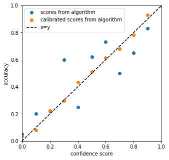

# Calibration — Theoretical Description

!!! note "Terminology"
    In theoretical parts of the documentation:

    - `alpha` is equivalent to `1 - confidence_level` — it can be seen as a *risk level*.
    - *calibrate* and *calibration* are equivalent to *conformalize* and *conformalization*.

---

One method for multi-class calibration has been implemented in MAPIE: **Top-Label Calibration** [^1].

## Goal

The goal of binary calibration is to **transform a score** (typically given by an ML model) that is not a probability **into a probability**. The algorithms used for calibration can be interpreted as estimators of the confidence level.

<figure markdown>
  { width="300" }
  <figcaption>Expected result: predicted scores closer to true probabilities after calibration.</figcaption>
</figure>

## Binary Calibration

We denote the \((h(X), y)\) pair as the score and ground truth. The model is calibrated if for every output \(q \in [0, 1]\):

\[
\Pr(Y = 1 \mid h(X) = q) = q
\]

where \(h()\) is the score predictor.

To apply calibration to a multi-class context, Gupta et al. propose a **multiclass-to-binary (M2B)** framework to reduce multi-class calibration to multiple binary calibrations.

---

## Top-Label Calibration

**Top-Label calibration** [^1] calibrates the model according to the **highest score and the corresponding class**. It applies binary calibration techniques (such as Platt scaling or isotonic regression) to multi-class calibration.

Let \(c\) be the classifier and \(h\) be the maximum score from the classifier. The couple \((c, h)\) is calibrated according to Top-Label calibration if:

\[
\Pr(Y = c(X) \mid h(X), c(X)) = h(X)
\]

---

## References

[^1]: Gupta, C., and Ramdas, A. K. "Top-label calibration and multiclass-to-binary reductions." *arXiv preprint arXiv:2107.08353* (2021).
