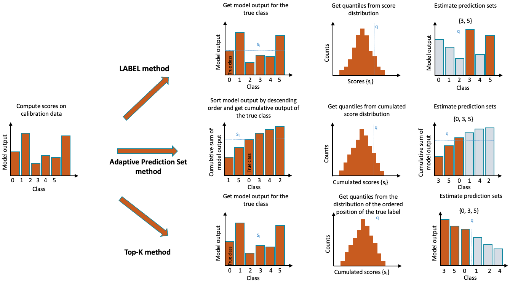

# Classification — Theoretical Description

!!! note "Terminology"
    In theoretical parts of the documentation:

    - `alpha` is equivalent to `1 - confidence_level` — it can be seen as a *risk level*.
    - *calibrate* and *calibration* are equivalent to *conformalize* and *conformalization*.

---

Three methods for multi-class uncertainty quantification have been implemented in MAPIE: **LAC** (Least Ambiguous set-valued Classifier) [^1], **APS** (Adaptive Prediction Sets) [^2] [^3], and **Top-K** [^3].

<figure markdown>
  { width="600" }
  <figcaption>Illustration of the three methods implemented in MAPIE.</figcaption>
</figure>

## Mathematical Setting

For a classification problem in a standard i.i.d. case, our training data \((X, Y) = \{(x_1, y_1), \ldots, (x_n, y_n)\}\) has an unknown distribution \(P_{X, Y}\).

For any risk level \(\alpha \in (0, 1)\), the methods allow constructing a prediction set \(\hat{C}_{n, \alpha}(X_{n+1})\) with a **marginal coverage guarantee**:

\[
P \{Y_{n+1} \in \hat{C}_{n, \alpha}(X_{n+1}) \} \geq 1 - \alpha
\]

For a typical \(\alpha = 10\%\), we construct prediction sets that contain the true observations for at least 90% of new test data points.

!!! info
    The guarantee applies only to **marginal coverage**, not conditional coverage \(P \{Y_{n+1} \in \hat{C}_{n, \alpha}(X_{n+1}) | X_{n+1} = x_{n+1} \}\) which depends on the location of the test point.

---

## 1. LAC

In the LAC method, the conformity score is **one minus the score of the true label**:

\[
s_i(X_i, Y_i) = 1 - \hat{\mu}(X_i)_{Y_i}
\]

The quantile \(\hat{q}\) is computed as:

\[
\hat{q} = \text{Quantile}\left(s_1, \ldots, s_n ; \frac{\lceil(n+1)(1-\alpha)\rceil}{n}\right)
\]

The prediction set includes all labels with score higher than the threshold:

\[
\hat{C}(X_{\text{test}}) = \{y : \hat{\mu}(X_{\text{test}})_y \geq 1 - \hat{q}\}
\]

!!! warning
    Although LAC generally results in small prediction sets, it tends to produce **empty sets** when the model is uncertain (e.g., at the border between two classes).

---

## 2. Top-K

Introduced in [^3], the **Top-K** method gives the **same prediction set size** for all observations. The conformity score is the rank of the true label:

\[
s_i(X_i, Y_i) = j \quad \text{where} \quad Y_i = \pi_j \quad \text{and} \quad \hat{\mu}(X_i)_{\pi_1} > \cdots > \hat{\mu}(X_i)_{\pi_n}
\]

\[
\hat{q} = \left\lceil \text{Quantile}\left(s_1, \ldots, s_n ; \frac{\lceil(n+1)(1-\alpha)\rceil}{n}\right) \right\rceil
\]

\[
\hat{C}(X_{\text{test}}) = \{\pi_1, \ldots, \pi_{\hat{q}}\}
\]

---

## 3. Adaptive Prediction Sets (APS)

The APS method overcomes LAC's empty set problem by constructing **non-empty** prediction sets. Conformity scores are computed by **summing ranked scores** until reaching the true label:

\[
s_i(X_i, Y_i) = \sum^k_{j=1} \hat{\mu}(X_i)_{\pi_j} \quad \text{where} \quad Y_i = \pi_k
\]

Prediction sets are built similarly:

\[
\hat{C}(X_{\text{test}}) = \{\pi_1, \ldots, \pi_k\} \quad \text{where} \quad k = \inf\left\{k : \sum^k_{j=1} \hat{\mu}(X_{\text{test}})_{\pi_j} \geq \hat{q}\right\}
\]

By default, the label whose cumulative score exceeds the quantile is included. Its incorporation can also be randomized for tighter effective coverage [^2] [^3].

---

## 4. Regularized Adaptive Prediction Sets (RAPS)

RAPS [^3] improves APS by **regularizing** to avoid very large prediction sets:

\[
s_i(X_i, Y_i) = \sum^k_{j=1} \hat{\mu}(X_i)_{\pi_j} + \lambda (k - k_{\text{reg}})^+ \quad \text{where} \quad Y_i = \pi_k
\]

Where:

- \((z)^+\) denotes the positive part of \(z\)
- \(k_{\text{reg}}\) is the optimal set size (determined by the Top-K method on a held-out split)
- \(\lambda\) is a regularization parameter (grid search over \(\{0.001, 0.01, 0.1, 0.2, 0.5\}\))

Prediction set construction:

\[
\hat{C}(X_{\text{test}}) = \{\pi_1, \ldots, \pi_k\} \quad \text{where} \quad k = \inf\left\{k : \sum^k_{j=1} \hat{\mu}(X_{\text{test}})_{\pi_j} + \lambda(k - k_{\text{reg}})^+ \geq \hat{q}\right\}
\]

### Exact Coverage via Randomization

To achieve exact coverage, randomization on the last label can be applied:

1. Define \(V_i = \frac{s_i(X_i, Y_i) - \hat{q}_{1-\alpha}}{\hat{\mu}(X_i)_{\pi_k} + \lambda \mathbb{1}(k > k_{\text{reg}})}\)
2. Compare each \(V_i\) to \(U \sim \text{Unif}(0, 1)\)
3. If \(V_i \leq U\), the last included label is removed.

---

## 5. Split- and Cross-Conformal Strategies

MAPIE includes both split- and cross-conformal strategies for LAC and APS, but **only split-conformal for Top-K**.

The cross-conformal implementation follows Algorithm 2 of [^2]:

1. Split training into \(K\) disjoint subsets.
2. Fit \(K\) classification functions \(\hat{\mu}_{-S_k}\).
3. Compute out-of-fold conformity scores.
4. For new test points, compare conformity scores to decide label inclusion.

For APS (see eq. 11 of [^2]):

\[
C_{n, \alpha}(X_{n+1}) = \Big\{ y \in \mathcal{Y} : \sum_{i=1}^n \mathbf{1} \Big[ E(X_i, Y_i, U_i; \hat{\pi}^{k(i)}) < E(X_{n+1}, y, U_{n+1}; \hat{\pi}^{k(i)}) \Big] < (1-\alpha)(n+1) \Big\}
\]

---

## References

[^1]: Sadinle, Mauricio, Jing Lei, & Larry Wasserman. "Least Ambiguous Set-Valued Classifiers With Bounded Error Levels." *JASA*, 114:525, 223-234, 2019.
[^2]: Romano, Yaniv, Matteo Sesia and Emmanuel J. Candès. "Classification with Valid and Adaptive Coverage." *NeurIPS* 2020 (spotlight).
[^3]: Angelopoulos, Anastasios N., Stephen Bates, Michael Jordan and Jitendra Malik. "Uncertainty Sets for Image Classifiers using Conformal Prediction." *ICLR* 2021.
