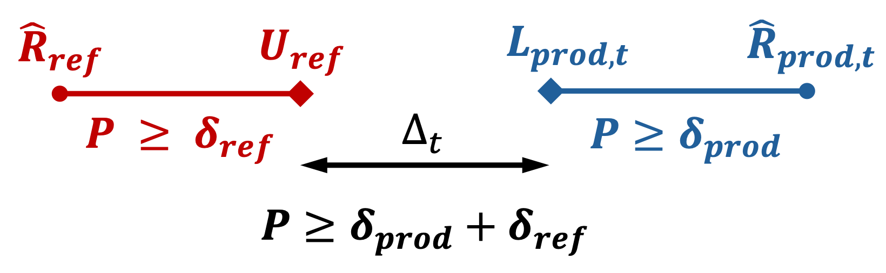

# Exchangeability Tests

## Why Exchangeability Matters for Conformal Prediction

Conformal prediction methods assume that pairs of features and labels $(X_i, Y_i)$ are drawn in an exchangeable way. This enables these methods to provide **empirical coverage guarantees**: you can be confident that your prediction intervals cover the true value at a specified rate, regardless of your model's specific structure. This is powerful because it doesn't require strong assumptions about how the data was generated.
Exchangeability testing helps us verify this crucial assumption, which underpins the reliability guarantees of conformal prediction.

## What is Exchangeability?

Imagine you have a deck of cards: if the deck is "fair," shuffling it doesn't change anything fundamental about what you should expect. Similarly, exchangeability means that the order in which we collect our data doesn't matter. Thus the underlying patterns remain the same whether we see examples in one order or another.

Exchangeability is a formal way of expressing the idea that "order doesn't matter." More precisely, random variables are said to be **exchangeable** if for any finite subset, any reordering (permutation) of that subset preserves the joint distribution.

In mathematical terms, for any permutation $\sigma$ of indices:

$$P(X_1, \ldots, X_n) = P(X_{\sigma(1)}, \ldots, X_{\sigma(n)})$$

This simply means: if you pick any $n$ observations from different positions in your sequence and measure them, you get the same statistical properties no matter which positions you picked. This assumption allows conformal prediction methods to provide formal guarantees about prediction coverage.

## Operations That Preserve Exchangeability

If your data is exchangeable, several natural operations keep it that way:

- **Shuffling the data**: Reordering observations doesn't destroy exchangeability—if the original data respected this property, any reordering will too.
- **Applying symmetric transformations**: If you transform the data in a way that treats all observations equally (like standardization), exchangeability is preserved.
- **Adding independent information**: Appending new random variables that are independent of your existing data maintains exchangeability.

**Fitting a machine learning model does NOT automatically preserve exchangeability.** A model can break exchangeability through systematic bias (performing worse on certain subgroups), overfitting patterns, or data leakage. This is why conformal prediction is powerful: it doesn't assume your model preserves exchangeability. Instead, it constructs prediction sets based on residuals or scores, requiring only that the *residuals* (not the predictions) remain exchangeable.

## Impossibility of Complete Detection

In practice, **no single test can detect all possible violations of exchangeability**. As discussed in [Ramdas et al. (2021)](https://arxiv.org/pdf/2102.00630), the breadth of alternatives to exchangeability fundamentally prevents any single method from being uniformly powerful (i.e., able to detect all alternatives with equal effectiveness). Any test must make a trade-off: it will be good at detecting some types of violations but weaker at others.

Thus, it is often useful to use **several complementary tests** rather than relying on a single one. Since different tests are sensitive to different departures from exchangeability, combining them can provide broader and more reliable detection.

## Introduction to Martingales

Under the exchangeability hypothesis, most statistics we implemented in Mapie **naturally form martingales**.

### Intuitive definition of martingales

A **martingale** is a mathematical object that captures the idea of a "fair game." Imagine a betting game where you have some current wealth $M_n$. Under a martingale property:

$$\mathbb{E}[M_{n+1} \mid \text{all past information}] = M_n$$

This means: knowing everything that happened before, your expected wealth tomorrow equals your wealth today. You're not expected to gain or lose—it's completely fair.

### Sequential Testing Without Error Inflation

Here's why this matters in practice: martingale properties allow to conduct **multiple tests sequentially without inflating error rates**. Normally, running many tests, the probability of finding something wrong by chance increases dramatically. But because martingales maintain certain fairness properties, they sidestep this multiple-testing problem.

This enables online sttings where data arrives continuously, while keeping testing without losing statistical validity ; even when conducting tests without stopping.

## Offline Tests: Permutation Tests

### The Basic Idea: All Orderings Are Equal

Permutation tests rest on an elegant principle: **if your data is truly exchangeable, then every possible reordering of it is equally likely**. This directly allows us to construct a reference distribution for comparison by generating permutations. Recall that if data is exchangeable, the actual observation order isn't special, it's just one of many possible orderings.

As developed in [Fischer & Ramdas (2025)](https://doi.org/10.1093/jrsssb/qkaf014), this principle forms the foundation of permutation testing.

### How Permutation Tests Work

The algorithm is straightforward:

1. **Calculate your test statistic** on the observed data—for example, whether residuals show a trend over time. The statistic must be order-dependent; for instance, the global mean is invariant across permutations and thus cannot detect violations.
2. **Reshuffle the data many times** (B times), keeping labels and features connected but randomizing their order
3. **Recalculate the statistic** for each reshuffled version
4. **Compare**: if the observed statistic is unusually extreme compared to the shuffled versions, you have evidence against exchangeability

Formally:
$$\text{p-value} = \frac{\#\{\text{shuffles with statistic} \geq \text{observed statistic}\}}{B+1}$$

### When to Stop Shuffling: Early Stopping Rules

Enumerating all possible shuffles becomes computationally infeasible for large datasets (there are $n!$ permutations of $n$ observations). Rather than fixing the number of permutations in advance, **sequential stopping rules** allow you to terminate early when the evidence is strong enough.

The idea is to maintain a "wealth" or cumulative evidence measure as you generate permutations. If the wealth becomes very small (indicating strong evidence for exchangeability) or very large (indicating strong evidence against exchangeability), you can stop without computing all $B$ permutations. For example, if a stopping threshold of 0.05 is set, you can stop either when wealth falls below 0.05 or exceeds 20 (i.e., 1/0.05). This approach dramatically reduces computation while maintaining statistical validity.

## Online Tests: Conformal P-Values and Alternative Approaches

In many scenarios, dataset is not fixed : observations arrive continuously. You want to detect exchangeability violations as soon as they occur, ideally in real time. This is where **online tests** come in.

The challenge: how do you maintain valid statistical guarantees when you're running tests continuously, accumulating evidence over time? This is where conformal p-values and martingales become essential.

### Conformal P-Values: A Sequential Solution

A **conformal p-value** extends the permutation test idea to the online setting. For each new observation that arrives, you compute:

$$p_n = \frac{\#\{i \leq n : s_i \geq s_n\}}{n}$$

where $s_i$ represents how "conforming" observation $i$ is (how well it fits the pattern established by previous data). These p-values are transformed into e-values using a betting function. These e-values then form a multiplicative martingale. This means you can accumulate them over time without inflating your error rate.

### Two Practical Approaches: Jumper vs. Plug-in

When using conformal p-values online, you face a choice in how to **convert p-values into e-values** (i.e., in the betting martingale).

- **Jumper approach**: Use a robust, fixed betting construction (a mixture of simple betting experts). It is typically more stable and less sensitive to tuning.

- **Plug-in approach** [Fedorova et al. (2012)](https://icml.cc/2012/papers/808.pdf): Estimate the betting function from past p-values (for example via density estimation, as in our implementation) and update it over time. It is often more adaptive, but more sensitive to estimation error and implementation choices.

In practice, practitioners often choose based on whether they prioritize stability (Jumper) or adaptivity (Plug-in).

### The Burn-in Period: Starting with a Reliable Baseline

When starting online tests, you generally need a minimum number of observations before obtaining a reasonably reliable estimate of the data distribution. The **burn-in period** specifies how many initial observations you ignore before relying on the test decisions. Typical choices range from 50 to 500 observations, depending on your data volume and the expected behavior.

## Performance Tests

While permutation tests and online tests help assess exchangeability of data or conformity scores, **performance tests** address a complementary question: *Are the empirical coverage guarantees announced by conformal prediction actually respected by the model on new data?*

As formalized in Section 2.1 of [Podkopaev & Ramdas (2021)](http://arxiv.org/abs/2110.06177), the goal is to monitor whether the deployed model's target risk remains below an **acceptable level** defined from source (meaning reference) performance (up to a tolerance), and to raise an alert only when there is evidence of a **harmful** increase in risk.

### General Principle

In practice, this approach starts by selecting a risk metric that reflects business objectives (e.g., coverage loss, classification error, or a domain-specific cost function). On reference (calibration/validation) data, compute a baseline empirical risk $\hat{R}_{\mathrm{ref}}$ together with an **upper confidence bound** on the reference risk, denoted $U_{\mathrm{ref}}$. Then, in production, compute the empirical risk on newly labeled data and iteratively update a **lower confidence bound** on the production risk, denoted $L_{\mathrm{prod},t}$, as new observations arrive.

At each update, compare the production risk bound with the acceptable level derived from the reference phase (possibly with a tolerance). An alert is raised only when there is statistically significant evidence that production risk has increased beyond that acceptable level.

### Statistical Framing

[Podkopaev & Ramdas (2021)](http://arxiv.org/abs/2110.06177) provides non-asymptotic bounds to control the gap between the two empirical risks, even for finite sample sizes. The idea is to control the probability of observing a gap that is too large between reference and production:

$$
P\left( |\hat{R}_{\mathrm{prod}} - \hat{R}_{\mathrm{ref}}| \geq \epsilon \right) \leq \delta
$$

where $\epsilon$ is the tolerated gap and $\delta$ is the target confidence level (the exact form depends on the chosen bound and the considered loss).

In practice, this overall level is split across two bounds: $U_{\mathrm{ref}}$ the upper confidence bound for ${\mathrm{ref}$ with confidence level $\delta_{\mathrm{ref}}$ and $L_{\mathrm{prod},t}$ the lowerconfidence bound for ${\mathrm{prod}$ with confidence level $\delta_{\mathrm{prod}}$, with $\delta_{\mathrm{ref}} + \delta_{\mathrm{prod}} = \delta$.

With this notation, define the bound gap as $\Delta_t = L_{\mathrm{prod},t} - U_{\mathrm{ref}}$, i.e., the difference between the production lower bound and the reference upper bound. The inequality above then states that the probability of observing a gap larger than $\epsilon$ is controlled by $\delta$.

<figure markdown>
  { width="600" }
  <figcaption>Illustration of risk monitoring confidence control.</figcaption>
</figure>

Therefore, when this bound-based gap becomes too large, it constitutes an alert for harmful drift and/or violation of the exchangeability assumption.

### Interpretation

- **No alert** ($\Delta_t = L_{\mathrm{prod},t} - U_{\mathrm{ref}} \leq \epsilon$): the production lower bound remains compatible with the reference upper bound, meaning no strong signal of harmful drift or exchangeability violation.
- **Alert triggered** ($\Delta_t > \epsilon$): the production lower bound exceeds the reference upper bound by more than the tolerated gap, meaning suspicion of harmful drift, non-exchangeability, or regime change.

This bound-based approach controls the false-alert probability at level $1 - \delta$.
