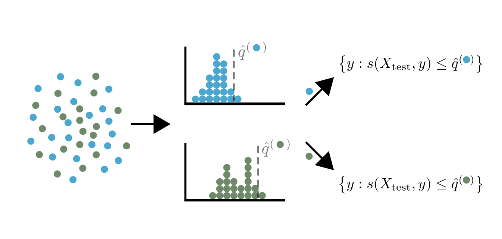

# Mondrian Conformal Prediction — Theoretical Description

!!! note "Terminology"
    In theoretical parts of the documentation:

    - `alpha` is equivalent to `1 - confidence_level` — it can be seen as a *risk level*.
    - *calibrate* and *calibration* are equivalent to *conformalize* and *conformalization*.

---

**Mondrian Conformal Prediction (MCP)** [^1] is a method that builds prediction sets with a **group-conditional coverage guarantee**:

\[
P \{Y_{n+1} \in \hat{C}_{n, \alpha}(X_{n+1}) \mid G_{n+1} = g\} \geq 1 - \alpha
\]

where \(G_{n+1}\) is the group of the new test point.

## When to Use Mondrian

MCP can be used with **any split conformal predictor** and is particularly useful when you have **prior knowledge about existing groups** — whether the group information is in the features or not.

!!! example "Classification Example"
    In a classification setting, groups can be defined as the **predicted classes**. This ensures the coverage guarantee is satisfied **for each predicted class**.

## How It Works

MCP simply:

1. **Stratifies** the data by group
2. **Applies split conformal prediction** to each group separately

The quantile for each group:

\[
\hat{q}^g = \text{Quantile}\left(s_1, \ldots, s_{n^g}, \frac{\lceil(n^{(g)} + 1)(1-\alpha)\rceil}{n^{(g)}}\right)
\]

where \(s_1, \ldots, s_{n^g}\) are the conformity scores of training points in group \(g\).

<figure markdown>
  { width="600" }
  <figcaption>Illustration of Mondrian conformal prediction (from [^1]).</figcaption>
</figure>

---

## References

[^1]: Vladimir Vovk, David Lindsay, Ilia Nouretdinov, and Alex Gammerman. "Mondrian confidence machine." Technical report, Royal Holloway University of London, 2003.
