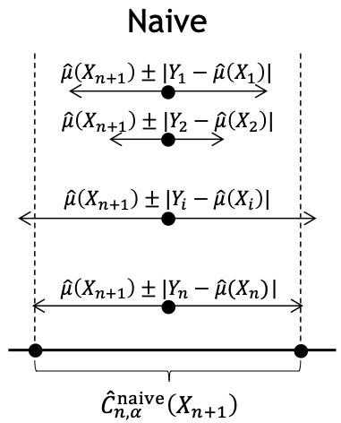
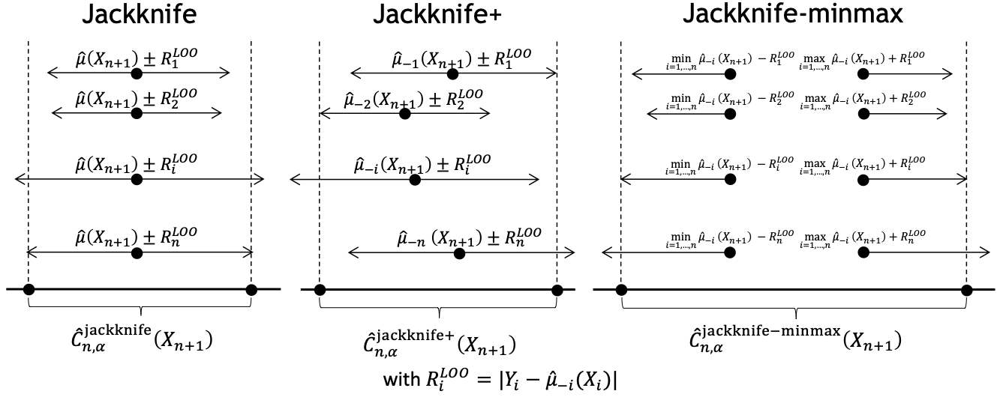
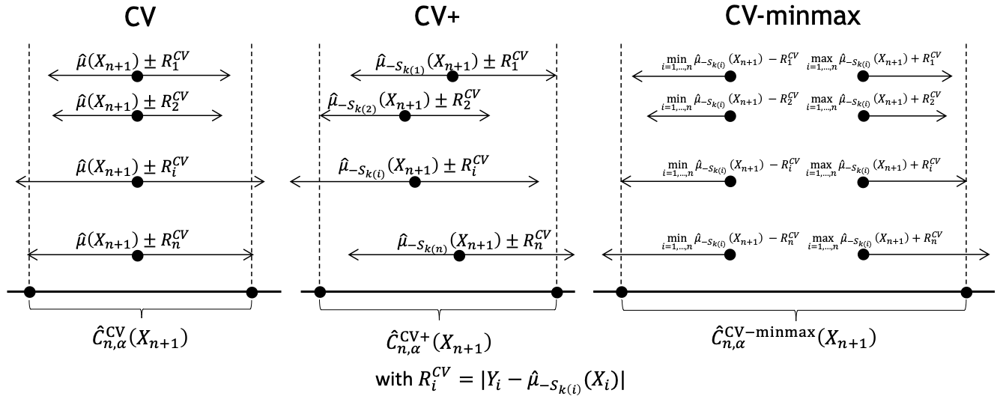
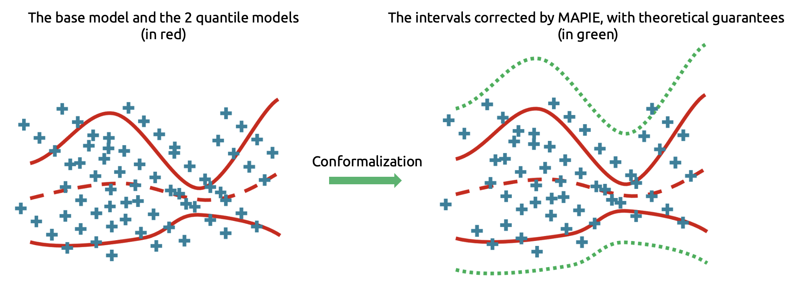

# Regression — Theoretical Description

!!! note "Terminology"
    In theoretical parts of the documentation:

    - `alpha` is equivalent to `1 - confidence_level` — it can be seen as a *risk level*.
    - *calibrate* and *calibration* are equivalent to *conformalize* and *conformalization*.

---

The methods in `mapie.regression` use various resampling methods based on the **jackknife strategy** recently introduced by Foygel-Barber et al. (2020) [^1]. They allow the user to estimate robust prediction intervals with any kind of machine learning model for regression purposes on single-output data.

## Mathematical Setting

For a regression problem in a standard i.i.d. case, our training data \((X, Y) = \{(x_1, y_1), \ldots, (x_n, y_n)\}\) has an unknown distribution \(P_{X, Y}\). We assume that \(Y = \mu(X) + \epsilon\) where \(\mu\) is the model function and \(\epsilon_i \sim P_{Y \mid X}\) is the noise.

Given some target quantile \(\alpha\), we aim at constructing a prediction interval \(\hat{C}_{n, \alpha}\) such that:

\[
P \{Y_{n+1} \in \hat{C}_{n, \alpha}(X_{n+1}) \} \geq 1 - \alpha
\]

All methods below are described with the **absolute residual conformity score** for simplicity, but other scores are available (see [Conformity Scores](conformity-scores.md)).

---

## 1. The "Naive" Method

The naive method computes the residuals of the training data to estimate the typical error on a new test data point:

\[
\hat{C}_{n, \alpha}^{\text{naive}}(X_{n+1}) = \hat{\mu}(X_{n+1}) \pm \hat{q}_{n, \alpha}^+\{|Y_i - \hat{\mu}(X_i)|\}
\]

where \(\hat{q}_{n, \alpha}^+\) is the \((1-\alpha)\) quantile of the distribution.

!!! warning
    Since this method estimates conformity scores on the **training set**, it tends to be too optimistic and underestimates the width of prediction intervals due to potential overfitting.

<figure markdown>
  { width="200" }
  <figcaption>Illustration of the naive method.</figcaption>
</figure>

---

## 2. The Split Method

The split method computes residuals on a **calibration dataset** separate from the training set:

\[
\hat{C}_{n, \alpha}^{\text{split}}(X_{n+1}) = \hat{\mu}(X_{n+1}) \pm \hat{q}_{n, \alpha}^+\{|Y_i - \hat{\mu}(X_i)|\}
\]

!!! info
    This method is very similar to the naive one — the only difference is that conformity scores are computed on the **calibration set** rather than the training set. One must have enough observations to split the dataset.

---

## 3. The Jackknife Method

The *standard* jackknife method is based on *leave-one-out* models:

1. For each instance \(i = 1, \ldots, n\), fit \(\hat{\mu}_{-i}\) on the training set with the \(i\)-th point removed.
2. Compute the leave-one-out conformity score: \(|Y_i - \hat{\mu}_{-i}(X_i)|\).
3. Fit \(\hat{\mu}\) on the entire training set and compute the prediction interval:

\[
\hat{C}_{n, \alpha}^{\text{jackknife}}(X_{n+1}) = \left[ \hat{q}_{n, \alpha}^-\{\hat{\mu}(X_{n+1}) - R_i^{\text{LOO}} \}, \hat{q}_{n, \alpha}^+\{\hat{\mu}(X_{n+1}) + R_i^{\text{LOO}} \}\right]
\]

where \(R_i^{\text{LOO}} = |Y_i - \hat{\mu}_{-i}(X_i)|\).

!!! warning
    This method avoids overfitting but can lose its predictive coverage when \(\hat{\mu}\) becomes unstable (e.g., when the sample size is close to the number of features).

---

## 4. The Jackknife+ Method

Unlike the standard jackknife, the **jackknife+** uses each leave-one-out prediction on the new test point to account for variability:

\[
\hat{C}_{n, \alpha}^{\text{jackknife+}}(X_{n+1}) = \left[ \hat{q}_{n, \alpha}^-\{\hat{\mu}_{-i}(X_{n+1}) - R_i^{\text{LOO}} \}, \hat{q}_{n, \alpha}^+\{\hat{\mu}_{-i}(X_{n+1}) + R_i^{\text{LOO}} \}\right]
\]

!!! success "Guarantee"
    This method guarantees a coverage level of \(1-2\alpha\) for a target of \(1-\alpha\), without any *a priori* assumption on the data distribution nor on the predictive model [^1].

---

## 5. The Jackknife-Minmax Method

A more conservative alternative using the **min and max** of leave-one-out predictions:

\[
\hat{C}_{n, \alpha}^{\text{jackknife-mm}}(X_{n+1}) = \left[\min \hat{\mu}_{-i}(X_{n+1}) - \hat{q}_{n, \alpha}^+\{R_I^{\text{LOO}} \}, \max \hat{\mu}_{-i}(X_{n+1}) + \hat{q}_{n, \alpha}^+\{R_I^{\text{LOO}} \}\right]
\]

!!! success "Guarantee"
    This method guarantees a coverage level of \(1-\alpha\).

<figure markdown>
  { width="800" }
  <figcaption>Comparison of the three jackknife methods (adapted from Fig. 1 of [^1]).</figcaption>
</figure>

!!! warning "Computational Cost"
    The jackknife methods require running as many simulations as training points, which can be prohibitive for large datasets.

---

## 6. The CV+ Method

To reduce computational time, one can use a **cross-validation** approach instead of leave-one-out:

1. Split the training set into \(K\) disjoint subsets of equal size.
2. Fit \(K\) regression functions \(\hat{\mu}_{-S_k}\).
3. Compute out-of-fold conformity scores for each point.
4. Use the regression functions to estimate prediction intervals.

!!! success "Guarantee"
    Like jackknife+, CV+ guarantees coverage ≥ \(1-2\alpha\). The jackknife+ can be viewed as a special case where \(K = n\).

---

## 7. The CV and CV-Minmax Methods

By analogy with the standard jackknife and jackknife-minmax, these rely on out-of-fold regression models.

<figure markdown>
  { width="800" }
  <figcaption>Comparison of the three CV methods.</figcaption>
</figure>

---

## 8. The Jackknife+-After-Bootstrap Method

Uses **bootstrap** instead of leave-one-out for reduced computational time and more robust predictions [^2]:

1. Resample the training set with replacement \(K\) times → bootstraps \(B_1, \ldots, B_K\).
2. Fit \(K\) regression functions on the bootstraps and compute predictions on complementary sets.
3. Aggregate predictions (mean or median) and compute conformity scores.
4. Use aggregated predictions to estimate prediction intervals.

!!! success "Guarantee"
    Coverage ≥ \(1-2\alpha\), same as jackknife+.

---

## 9. Conformalized Quantile Regression (CQR)

CQR allows for **better interval widths with heteroscedastic data** by using quantile regressors:

<figure markdown>
  { width="800" }
  <figcaption>Illustration of the CQR method.</figcaption>
</figure>

### Formulation

The prediction interval for a new sample \(X_{n+1}\):

\[
\hat{C}_{n, \alpha}^{\text{CQR}}(X_{n+1}) = \left[\hat{q}_{\alpha_{\text{lo}}}(X_{n+1}) - Q_{1-\alpha}(E_{\text{low}}, \mathcal{I}_2), \; \hat{q}_{\alpha_{\text{hi}}}(X_{n+1}) + Q_{1-\alpha}(E_{\text{high}}, \mathcal{I}_2)\right]
\]

Where:

- \(\hat{q}_{\alpha_{\text{lo}}}\) and \(\hat{q}_{\alpha_{\text{hi}}}\) are the predicted lower and upper quantiles.
- \(Q_{1-\alpha}\) is the empirical quantile of residuals from the calibration set.

!!! note "Symmetric variant"
    In the symmetric method, \(E_{\text{low}}\) and \(E_{\text{high}}\) are merged into \(E_{\text{all}}\), and the quantile is calculated on all absolute residuals.

---

## 10. EnbPI (Ensemble Batch Prediction Intervals)

For **time series** where the exchangeability hypothesis does not hold:

\[
\hat{C}_{n, \alpha}^{\text{EnbPI}}(X_{n+1}) = \left[\hat{\mu}_{agg}(X_{n+1}) + \hat{q}_{n, \beta}\{ R_i^{\text{LOO}} \}, \hat{\mu}_{agg}(X_{n+1}) + \hat{q}_{n, (1-\alpha+\beta)}\{ R_i^{\text{LOO}} \}\right]
\]

Key features:

- Residuals are **updated dynamically** during prediction when new observations are available.
- Coverage guarantee is **asymptotic** under two hypotheses:
    1. Errors are short-term i.i.d.
    2. Estimation quality converges.

!!! tip "Trade-off"
    The bigger the training set, the better the covering guarantee. But if the model is not refitted, larger training sets slow down the residual update.

---

## Key Takeaways

| Feature | Recommendation |
|---|---|
| Accurate & robust intervals | **Jackknife+** |
| Large datasets | **CV+** or **Jackknife+-after-bootstrap** |
| Conservative estimates | **Jackknife-minmax** / **CV-minmax** |
| Heteroscedastic data | **CQR** |
| Time series | **EnbPI** |

### Method Comparison

| Method | Theoretical coverage | Typical coverage | Training cost | Evaluation cost |
|---|---|---|---|---|
| **Naïve** | No guarantee | \(< 1-\alpha\) | 1 | \(n_{\text{test}}\) |
| **Split** | \(\geq 1-\alpha\) | \(\simeq 1-\alpha\) | 1 | \(n_{\text{test}}\) |
| **Jackknife** | No guarantee | \(\simeq 1-\alpha\) | \(n\) | \(n_{\text{test}}\) |
| **Jackknife+** | \(\geq 1-2\alpha\) | \(\simeq 1-\alpha\) | \(n\) | \(n \times n_{\text{test}}\) |
| **Jackknife-minmax** | \(\geq 1-\alpha\) | \(> 1-\alpha\) | \(n\) | \(n \times n_{\text{test}}\) |
| **CV** | No guarantee | \(\simeq 1-\alpha\) | \(K\) | \(n_{\text{test}}\) |
| **CV+** | \(\geq 1-2\alpha\) | \(\gtrsim 1-\alpha\) | \(K\) | \(K \times n_{\text{test}}\) |
| **CV-minmax** | \(\geq 1-\alpha\) | \(> 1-\alpha\) | \(K\) | \(K \times n_{\text{test}}\) |
| **Jackknife-aB+** | \(\geq 1-2\alpha\) | \(\gtrsim 1-\alpha\) | \(K\) | \(K \times n_{\text{test}}\) |
| **CQR** | \(\geq 1-\alpha\) | \(\gtrsim 1-\alpha\) | 3 | \(3 \times n_{\text{test}}\) |
| **EnbPI** | \(\geq 1-\alpha\) (asymptotic) | \(\gtrsim 1-\alpha\) | \(K\) | \(K \times n_{\text{test}}\) |

---

## References

[^1]: Rina Foygel Barber, Emmanuel J. Candès, Aaditya Ramdas, and Ryan J. Tibshirani. "Predictive inference with the jackknife+." *Ann. Statist.*, 49(1):486–507, (2021).
[^2]: Kim, Byol, Chen Xu, and Rina Barber. "Predictive inference is free with the jackknife+-after-bootstrap." *NeurIPS* 33 (2020): 4138-4149.
