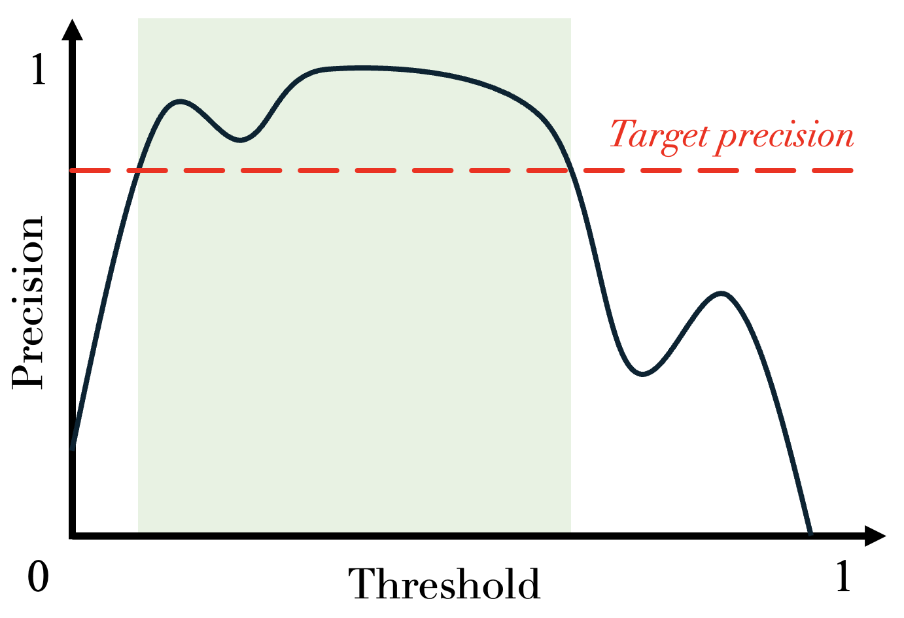
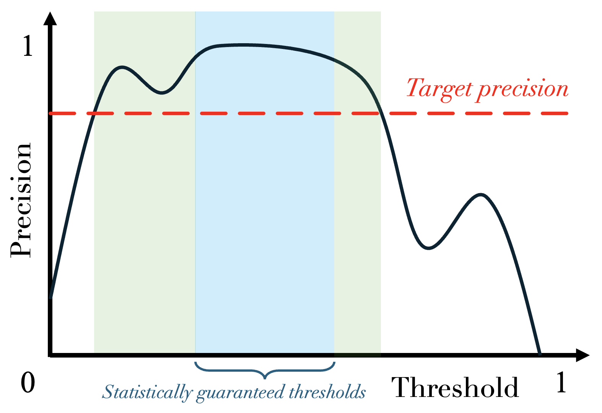
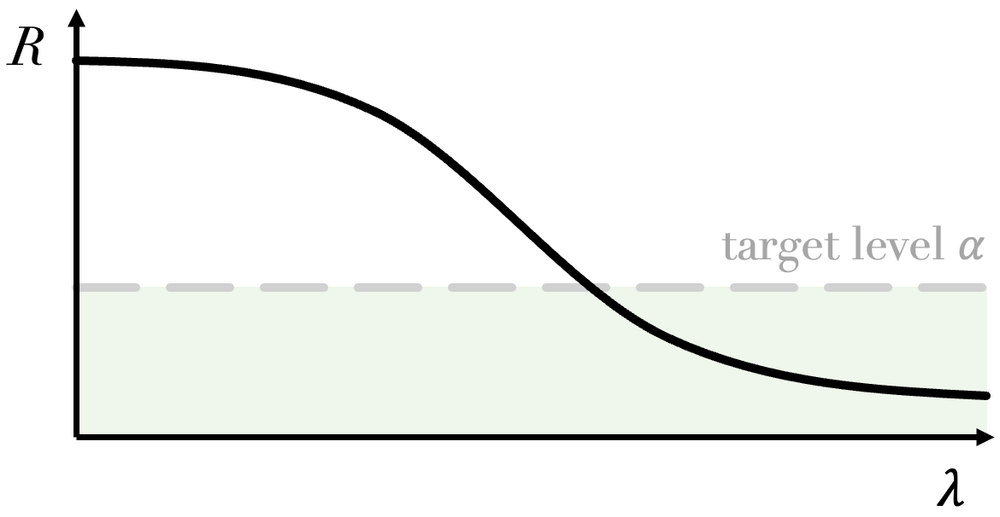
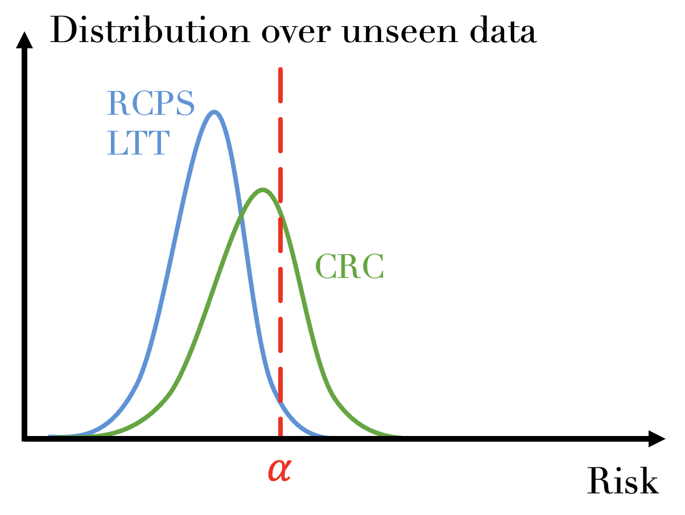
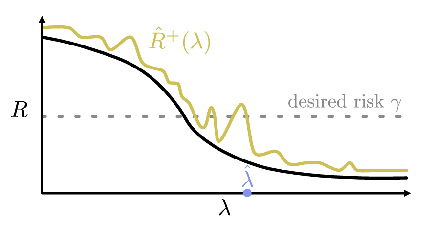

# Risk Control — Getting Started

!!! note "Terminology"
    In theoretical parts of the documentation:

    - `alpha` is equivalent to `1 - confidence_level` — it can be seen as a *risk level*.
    - *calibrate* and *calibration* are equivalent to *conformalize* and *conformalization*.

---

## Overview

Three methods of risk control have been implemented in MAPIE: **RCPS** (Risk-Controlling Prediction Sets) [^1], **CRC** (Conformal Risk Control) [^2], and **LTT** (Learn Then Test) [^3].

MAPIE supports risk control for **binary classification** and **multi-label classification** (including image segmentation).

| Risk Control Method | Type of Control | Assumption | Non-monotonic Risks | Binary Classification | Multi-label Classification |
|---|---|---|---|---|---|
| **RCPS** | Probability | i.i.d. | :material-close: | :material-close: | :material-check: |
| **CRC** | Expectation | Exchangeable | :material-close: | :material-close: | :material-check: |
| **LTT** | Probability | i.i.d. | :material-check: | :material-check: | :material-check: |

For multi-label classification: CRC and RCPS are used for **recall control**, while LTT is used for **precision control**.

---

## 1. What is Risk Control?

Consider a binary classification model that separates data into two classes using a threshold on predicted probabilities. Suppose we want to find a threshold that **guarantees a certain precision level**.

A naive approach: evaluate how precision varies with different thresholds on a validation dataset.

<figure markdown>
  { width="600" }
  <figcaption>Naive approach: no guarantees on unseen data.</figcaption>
</figure>

!!! danger "The Problem"
    While the chosen threshold works on validation data, it offers **no guarantee on new, unseen data**.

**Risk control** adjusts a model parameter \(\lambda\) so that a given risk stays below a desired level **with high probability on unseen data**.

<figure markdown>
  { width="600" }
  <figcaption>Risk control: statistically guaranteed thresholds.</figcaption>
</figure>

### Mathematical Formulation

- \(\alpha\): target level below which we want the risk to remain
- \(\delta\): confidence level associated with the risk control

<figure markdown>
  { width="600" }
</figure>

The three methods provide different guarantees:

- **CRC**: Requires **exchangeable** data → \(\mathbb{E}(R) \leq \alpha\)
- **RCPS** and **LTT**: Require **i.i.d.** data → \(\mathbb{P}(R \leq \alpha) \geq 1 - \delta\)

<figure markdown>
  { width="600" }
  <figcaption>Comparison of expectation vs. probability guarantees.</figcaption>
</figure>

---

## 2. Theoretical Description

### 2.1 Risk-Controlling Prediction Sets (RCPS)

#### General Settings

- \(\mathcal{T}_{\hat{\lambda}}: X \to Y'\) — a set-valued function indexed by \(\lambda\) with nesting:

\[
\lambda_1 < \lambda_2 \Rightarrow \mathcal{T}_{\lambda_1}(x) \subset \mathcal{T}_{\lambda_2}(x)
\]

- \(L: Y \times Y' \to \mathbb{R}^+\) — a loss function with:

\[
S_1 \subset S_2 \Rightarrow L(y, S_1) \geq L(y, S_2)
\]

The goal is to compute an **Upper Confidence Bound** \(\hat{R}^+(\lambda)\) and find:

\[
\hat{\lambda} = \inf\{\lambda \in \Lambda: \hat{R}^+(\lambda') < \alpha, \;\forall \lambda' \geq \lambda\}
\]

<figure markdown>
  { width="600" }
</figure>

!!! success "Guarantee"
    \(\mathbb{P}(R(\mathcal{T}_{\hat{\lambda}}) \leq \alpha) \geq 1 - \delta\)

#### Bounds

The empirical risk: \(\hat{R}(\lambda) = \frac{1}{n}\sum_{i=1}^n L(Y_i, T_{\lambda}(X_i))\)

**Hoeffding Bound:**

\[
\hat{R}_{\text{Hoeffding}}^+(\lambda) = \hat{R}(\lambda) + \sqrt{\frac{1}{2n}\log\frac{1}{\delta}}
\]

**Bernstein Bound:**

\[
\hat{R}_{\text{Bernstein}}^+(\lambda) = \hat{R}(\lambda) + \hat{\sigma}(\lambda)\sqrt{\frac{2\log(2/\delta)}{n}} + \frac{7\log(2/\delta)}{3(n-1)}
\]

**Waudby-Smith–Ramdas** (recommended for bounded losses):

\[
\hat{R}_{\text{WSR}}^+(\lambda) = \inf \left\{ R \geq 0 : \max_{i=1,\ldots,n} K_i(R, \lambda) > \frac{1}{\delta}\right\}
\]

---

### 2.2 Conformal Risk Control (CRC)

Controls any **monotone and bounded** loss:

\[
\mathbb{E}\left[L_{n+1}(\hat{\lambda})\right] \leq \alpha
\]

To find \(\hat{\lambda}\):

\[
\hat{\lambda} = \inf \left\{ \lambda: \frac{n}{n+1}\hat{R}_n(\lambda) + \frac{B}{n+1} \leq \alpha \right\}
\]

---

### 2.3 Learn Then Test (LTT)

Controls **any loss** (including non-monotonic) through multiple hypothesis testing:

For each \(\lambda_j\) in a discrete set \(\Lambda = \{\lambda_1, \ldots, \lambda_n\}\):

1. Estimate the risk on calibration data.
2. Associate hypothesis \(\mathcal{H}_j: R(\lambda_j) > \alpha\).
3. Compute p-value using Hoeffding-Bentkus.
4. Apply FWER control (e.g., Bonferroni correction).

Return \(\hat{\Lambda} = \mathcal{A}(\{p_j\})\) — the set of \(\lambda\) values that control the risk.

!!! success "Guarantee"
    \(\mathbb{P}(R(\mathcal{T}_{\lambda}) \leq \alpha) \geq 1 - \delta\) for all \(\lambda \in \hat{\Lambda}\).

---

## References

[^1]: Bates, S., Angelopoulos, A., Lei, L., Malik, J., & Jordan, M. "Distribution-free, risk-controlling prediction sets." *CoRR*, 2021.
[^2]: Angelopoulos, A. N., Bates, S., Fisch, A., Lei, L., & Schuster, T. "Conformal Risk Control." 2022.
[^3]: Angelopoulos, A. N., Bates, S., Candès, E. J., Jordan, M. I., & Lei, L. "Learn then test: Calibrating predictive algorithms to achieve risk control." 2021.
