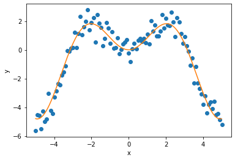
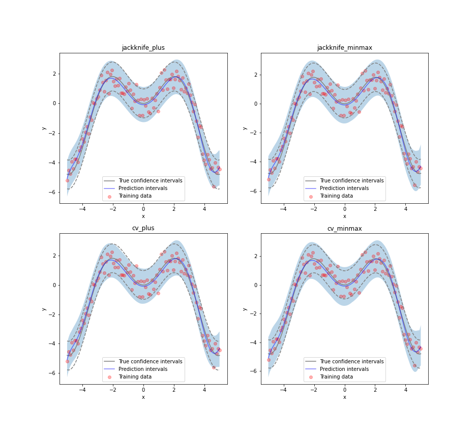
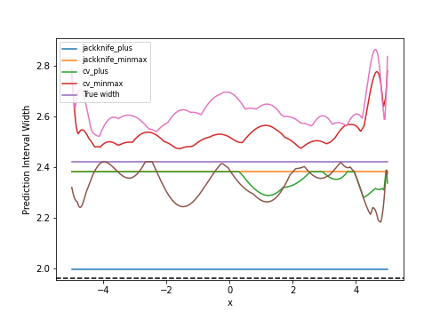
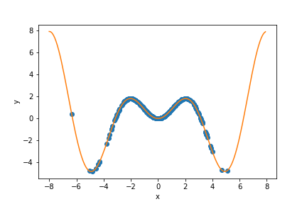
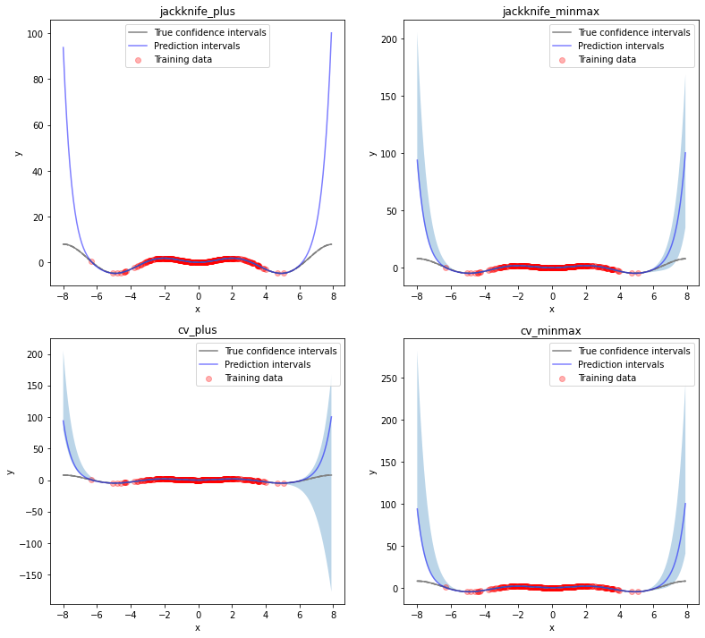
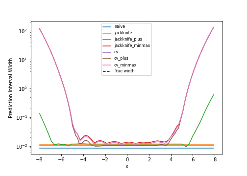
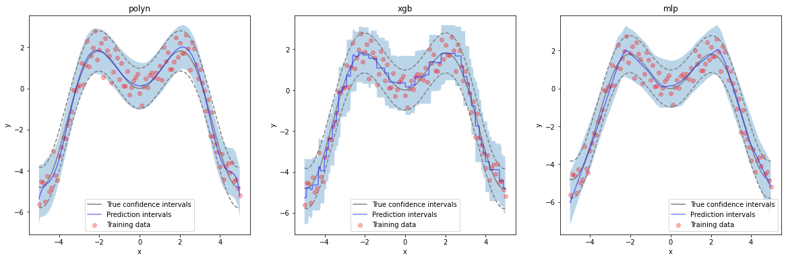
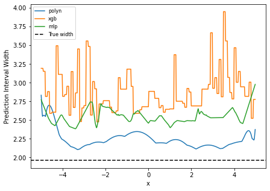

.. title:: Tutorial : contents

.. _tutorial:

========
Tutorial
========

In this tutorial, we compare the prediction intervals estimated by MAPIE on a 
simple, one-dimensional, ground truth function

.. math::

   f(x) = x \sin(x)

Throughout this tutorial, we will answer the following questions:

- How well do the MAPIE strategies capture the aleatoric uncertainty existing in the data?

- How do the prediction intervals estimated by the resampling strategies
  evolve for new *out-of-distribution* data? 

- How do the prediction intervals vary between regressor models?

Throughout this tutorial, we estimate the prediction intervals using 
a polynomial function, a boosting model, and a simple neural network. 

**For practical problems, we advise using the faster CV+ strategies. 
For conservative prediction interval estimates, you can alternatively 
use the CV-minmax strategies.**

1. Estimating the aleatoric uncertainty of homoscedastic noisy data
===================================================================

Let's start by defining the :math:`x \times \sin(x)` function and another simple function
that generates one-dimensional data with normal noise uniformely in a given interval.

.. code:: python

    def x_sinx(x):
        """One-dimensional x*sin(x) function."""
        return x*np.sin(x)

.. code:: python

    def get_1d_data_with_constant_noise(funct, min_x, max_x, n_samples, noise):
        """
        Generate 1D noisy data uniformely from the given function 
        and standard deviation for the noise.
        """
        np.random.seed(59)
        X_train = np.linspace(min_x, max_x, n_samples)
        np.random.shuffle(X_train)
        X_test = np.linspace(min_x, max_x, n_samples*5)
        y_train, y_mesh, y_test = funct(X_train), funct(X_test), funct(X_test)
        y_train += np.random.normal(0, noise, y_train.shape[0])
        y_test += np.random.normal(0, noise, y_test.shape[0])
        return X_train.reshape(-1, 1), y_train, X_test.reshape(-1, 1), y_test, y_mesh

We first generate noisy one-dimensional data uniformely on an interval. 
Here, the noise is considered as *homoscedastic*, since it remains constant 
over :math:`x`.

.. code:: python

    min_x, max_x, n_samples, noise = -5, 5, 100, 0.5
    X_train, y_train, X_test, y_test, y_mesh = get_1d_data_with_constant_noise(
        x_sinx, min_x, max_x, n_samples, noise
    )

Let's visualize our noisy function. 

.. code:: python

    plt.xlabel("x") ; plt.ylabel("y")
    plt.scatter(X_train, y_train, color="C0")
    plt.plot(X_test, y_mesh, color="C1")

As mentioned previously, we fit our training data with a simple
polynomial function. Here, we choose a degree equal to 10 so the function 
is able to perfectly fit :math:`x \times \sin(x)`.

.. code:: python

    degree_polyn = 10
    polyn_model = Pipeline(
        [
            ("poly", PolynomialFeatures(degree=degree_polyn)),
            ("linear", LinearRegression())
        ]
    )

We then estimate the prediction intervals for all the strategies very easily with a
`fit` and `predict` process. The prediction interval's lower and upper bounds
are then saved in a DataFrame. Here, we set an alpha value of 0.05
in order to obtain a 95% confidence for our prediction intervals.

.. code:: python

    from mapie.estimators import MapieRegressor
    STRATEGIES = {
        "naive": dict(method="naive"),
        "jackknife": dict(method="base", cv=-1),
        "jackknife_plus": dict(method="plus", cv=-1),
        "jackknife_minmax": dict(method="minmax", cv=-1),
        "cv": dict(method="base", cv=10),
        "cv_plus": dict(method="plus", cv=10),
        "cv_minmax": dict(method="minmax", cv=10),
    }
    y_preds = {}
    for strategy, params in STRATEGIES.items():
        mapie = MapieRegressor(polyn_model, alpha=0.05, ensemble=False, **params)
        mapie.fit(X_train, y_train)
        y_preds[strategy] = mapie.predict(X_test)[:, :, 0]

Let’s now compare the confidence intervals with the predicted intervals with obtained 
by the Jackknife+, Jackknife-minmax, CV+, and CV-minmax strategies.

.. code:: python

    def plot_1d_data(
        X_train,
        y_train, 
        X_test,
        y_test,
        y_sigma,
        y_pred, 
        y_pred_low, 
        y_pred_up,
        ax=None,
        title=None
    ):
        ax.set_xlabel("x") ; ax.set_ylabel("y")
        ax.fill_between(X_test, y_pred_low, y_pred_up, alpha=0.3)
        ax.scatter(X_train, y_train, color="red", alpha=0.3, label="Training data")
        ax.plot(X_test, y_test, color="gray", label="True confidence intervals")
        ax.plot(X_test, y_test - y_sigma, color="gray", ls="--")
        ax.plot(X_test, y_test + y_sigma, color="gray", ls="--")
        ax.plot(X_test, y_pred, color="blue", alpha=0.5, label="Prediction intervals")
        if title is not None:
            ax.set_title(title)
        ax.legend()

.. code:: python

    strategies = ["jackknife_plus", "jackknife_minmax" , "cv_plus", "cv_minmax"]
    n_figs = len(strategies)
    fig, axs = plt.subplots(2, 2, figsize=(13, 12))
    coords = [axs[0, 0], axs[0, 1], axs[1, 0], axs[1, 1]]
    for strategy, coord in zip(strategies, coords):
        plot_1d_data(
            X_train.ravel(),
            y_train.ravel(),
            X_test.ravel(),
            y_mesh.ravel(),
            1.96*noise,
            y_preds[strategy][:, 0].ravel(),
            y_preds[strategy][:, 1].ravel(),
            y_preds[strategy][:, 2].ravel(),
            ax=coord,
            title=strategy
        )

At first glance, the four strategies give similar results and the
prediction intervals are very close to the true confidence intervals.
Let’s confirm this by comparing the prediction interval widths over
:math:`x` between all strategies.

.. code:: python

    fig, ax = plt.subplots(1, 1, figsize=(7, 5))
    for strategy in STRATEGIES:
        ax.plot(X_test, y_preds[strategy][:, 2] - y_preds[strategy][:, 1])
    ax.axhline(1.96*2*noise, ls="--", color="k")
    ax.set_xlabel("x")
    ax.set_ylabel("Prediction Interval Width")
    ax.legend(strategies + ["True width"], fontsize=8)

As expected, the prediction intervals estimated by the Naive method
are slightly too narrow. The Jackknife, Jackknife+, CV, and CV+ give
similar widths that are very close to the true width. On the other hand,
the widths estimated by Jackknife-minmax and CV-minmax are slightly too
wide. Note that the widths given by the Naive, Jackknife, and CV strategies
are constant since the prediction intervals are estimated upon the
residuals of the training data only.

Let’s now compare the *effective* coverage, namely the fraction of test
points whose true values lie within the prediction intervals, given by
the different strategies. 

.. raw:: html

    <table border="1" class="dataframe">
    <thead>
        <tr style="text-align: right;">
        <th></th>
        <th>Coverage</th>
        <th>Mean width</th>
        </tr>
    </thead>
    <tbody>
        <tr>
        <th>naive</th>
        <td>0.94</td>
        <td>2.00</td>
        </tr>
        <tr>
        <th>jackknife</th>
        <td>0.97</td>
        <td>2.38</td>
        </tr>
        <tr>
        <th>jackknife_plus</th>
        <td>0.97</td>
        <td>2.36</td>
        </tr>
        <tr>
        <th>jackknife_minmax</th>
        <td>0.98</td>
        <td>2.53</td>
        </tr>
        <tr>
        <th>cv</th>
        <td>0.98</td>
        <td>2.42</td>
        </tr>
        <tr>
        <th>cv_plus</th>
        <td>0.97</td>
        <td>2.34</td>
        </tr>
        <tr>
        <th>cv_minmax</th>
        <td>0.98</td>
        <td>2.62</td>
        </tr>
    </tbody>
    </table>

All strategies except the Naive one give effective coverage close to the expected 
0.95 value (recall that alpha = 0.05), confirming the theoretical garantees.
    

2. Estimating the epistemic uncertainty of out-of-distribution data
===================================================================

Let’s now consider one-dimensional data without noise, but normally distributed.
The goal is to explore how the prediction intervals evolve for new data 
that lie outside the distribution of the training data in order to see how the strategies
can capture the *epistemic* uncertainty. 
For a comparison of the epistemic and aleatoric uncertainties, please have a look at this
`source <https://en.wikipedia.org/wiki/Uncertainty_quantification>`_.

Lets" start by generating and showing the data. 

.. code:: python

    def get_1d_data_with_normal_distrib(funct, mu, sigma, n_samples, noise):
        """
        Generate noisy 1D data with normal distribution from given function 
        and noise standard deviation.
        """
        np.random.seed(59)
        X_train = np.random.normal(mu, sigma, n_samples)
        X_test = np.arange(mu-4*sigma, mu+4*sigma, sig/20.)
        y_train, y_mesh, y_test = funct(X_train), funct(X_test), funct(X_test)
        y_train += np.random.normal(0, noise, y_train.shape[0])
        y_test += np.random.normal(0, noise, y_test.shape[0])
        return X_train.reshape(-1, 1), y_train, X_test.reshape(-1, 1), y_test, y_mesh

.. code:: python

    mu = 0 ; sigma = 2 ; n_samples = 300 ; noise = 0.
    X_train, y_train, X_test, y_test, y_mesh = get_1d_data_with_normal_distrib(
        x_sinx, mu, sigma, n_samples, noise
    )

.. code:: python

    plt.xlabel("x") ; plt.ylabel("y")
    plt.scatter(X_train, y_train, color="C0")
    plt.plot(X_test, y_test, color="C1")

As before, we estimate the prediction intervals using a polynomial
function of degree 10 and show the results for the Jackknife+ and CV+
strategies.

.. code:: python

    STRATEGIES = {
        "naive": dict(method="naive"),
        "jackknife": dict(method="base", cv=-1),
        "jackknife_plus": dict(method="plus", cv=-1),
        "jackknife_minmax": dict(method="minmax", cv=-1),
        "cv": dict(method="base", cv=10),
        "cv_plus": dict(method="plus", cv=10),
        "cv_minmax": dict(method="minmax", cv=10),
    }
    prediction_interval = {}
    for strategy, params in STRATEGIES.items():
        mapie = MapieRegressor(polyn_model, alpha=0.05, ensemble=False, **params)
        mapie.fit(X_train, y_train)
        y_preds[strategy] = mapie.predict(X_test)[:, :, 0]

.. code:: python

    strategies = ["jackknife_plus", "jackknife_minmax" , "cv_plus", "cv_minmax"]
    n_figs = len(strategy)
    fig, axs = plt.subplots(2, 2, figsize=(13, 12))
    coords = [axs[0, 0], axs[0, 1], axs[1, 0], axs[1, 1]]
    for strategy, coord in zip(strategies, coords): 
        plot_1d_data(
            X_train.ravel(),
            y_train.ravel(), 
            X_test.ravel(),
            y_mesh.ravel(),
            1.96*noise, 
            y_preds[strategy][:, 0].ravel(),
            y_preds[strategy][:, 1].ravel(),
            y_preds[strategy][:, 2].ravel(), 
            ax=coord,
            title=strategy
        )

At first glance, our polynomial function does not give accurate
predictions with respect to the true function when :math:`|x > 6|`. 
The prediction intervals estimated with the Jackknife+ do not seem to 
increase significantly, unlike the CV+ method whose prediction intervals
capture a high uncertainty when :math:`x > 6`.

Let's now compare the prediction interval widths between all strategies. 

.. code:: python

    fig, ax = plt.subplots(1, 1, figsize=(7, 5))
    ax.set_yscale("log")
    for strategy in STRATEGIES:
        ax.plot(X_test, y_preds[strategy][:, 2] - y_preds[strategy][:, 1])
    ax.axhline(1.96*2*noise, ls="--", color="k")
    ax.set_xlabel("x")
    ax.set_ylabel("Prediction Interval Width")
    ax.legend([*STRATEGIES] + ["True width"], fontsize=8)

The prediction interval widths start to increase exponentially
for :math:`|x| > 4` for the Jackknife-minmax, CV+, and CV-minmax
strategies. On the other hand, the prediction intervals estimated by
Jackknife+ remain roughly constant until :math:`|x| ~ 5` before
increasing.

.. raw:: html

    <table border="1" class="dataframe">
    <thead>
        <tr style="text-align: right;">
        <th></th>
        <th>Coverage</th>
        <th>Mean width</th>
        </tr>
    </thead>
    <tbody>
        <tr>
        <th>naive</th>
        <td>0.49</td>
        <td>0.01</td>
        </tr>
        <tr>
        <th>jackknife</th>
        <td>0.53</td>
        <td>0.01</td>
        </tr>
        <tr>
        <th>jackknife_plus</th>
        <td>0.53</td>
        <td>0.04</td>
        </tr>
        <tr>
        <th>jackknife_minmax</th>
        <td>0.86</td>
        <td>9.78</td>
        </tr>
        <tr>
        <th>cv</th>
        <td>0.52</td>
        <td>0.01</td>
        </tr>
        <tr>
        <th>cv_plus</th>
        <td>0.81</td>
        <td>9.80</td>
        </tr>
        <tr>
        <th>cv_minmax</th>
        <td>0.86</td>
        <td>9.80</td>
        </tr>
    </tbody>
    </table>   

In conclusion, the Jackknife-minmax, CV+, and CV-minmax strategies are more
conservative than the Jackknife+ strategy, and tend to result in more
reliable coverages for *out-of-distribution* data. It is therefore
advised to use the three former strategies for predictions with new
out-of-distribution data.
Note however that there are no theoretical guarantees on the coverage level 
for out-of-distribution data.

3. Estimating the uncertainty with different sklearn-compatible regressors
==========================================================================

MAPIE can be used with any kind of sklearn-compatible regressor. Here, we
illustrate this by comparing the prediction intervals estimated by the CV+ method using
different models:

- the same polynomial function as before.
 
- a XGBoost model using the Scikit-learn API.

- a simple neural network, a Multilayer Perceptron with three dense layers, using the KerasRegressor wrapper.

Once again, let’s use our noisy one-dimensional data obtained from a
uniform distribution.

.. code:: python

    min_x, max_x, n_samples, noise = -5, 5, 100, 0.5
    X_train, y_train, X_test, y_test, y_mesh = get_1d_data_with_constant_noise(
        x_sinx, min_x, max_x, n_samples, noise
    )

.. code:: python

    plt.xlabel("x") ; plt.ylabel("y")
    plt.plot(X_test, y_mesh, color="C1")
    plt.scatter(X_train, y_train)

.. image:: images/tuto_7.png
    :align: center

Let's then define the models. The boosing model considers 100 shallow trees with a max depth of 2 while
the Multilayer Perceptron has two hidden dense layers with 20 neurons each followed by a relu activation.

.. code:: python

    from tensorflow.keras import Sequential
    from tensorflow.keras.layers import Dense
    from scikeras.wrappers import KerasRegressor
    def mlp():
        """
        Two-layer MLP model
        """
        model = Sequential([
            Dense(units=20, input_shape=(1,), activation="relu"),
            Dense(units=20, activation="relu"),
            Dense(units=1)
        ])
        model.compile(loss="mean_squared_error", optimizer="adam")
        return model

.. code:: python

    polyn_model = Pipeline(
        [
            ("poly", PolynomialFeatures(degree=degree_polyn)),
            ("linear", LinearRegression(fit_intercept=False))
        ]
    )

    from xgboost import XGBRegressor
    xgb_model = XGBRegressor(
        max_depth=2,
        n_estimators=100,
        tree_method="hist",
        random_state=59,
        learning_rate=0.1,
        verbosity=0,
        nthread=-1
    )
    mlp_model = KerasRegressor(
        build_fn=mlp, 
        epochs=500, 
        verbose=0
    )

Let's now use MAPIE to estimate the prediction intervals using the CV+ method 
and compare their prediction interval.

.. code:: python

    from mapie.estimators import MapieRegressor
    models = [polyn_model, xgb_model, mlp_model]
    model_names = ["polyn", "xgb", "mlp"]
    prediction_interval = {}
    for name, model in zip(model_names, models):
        mapie = MapieRegressor(model, alpha=0.05, method="plus", cv=5, ensemble=True)
        mapie.fit(X_train, y_train)
        y_preds[name] = mapie.predict(X_test)[:, :, 0]

.. code:: python

    fig, axs = plt.subplots(1, 3, figsize=(20, 6))
    for name, ax in zip(model_names, axs):
        plot_1d_data(
            X_train.ravel(),
            y_train.ravel(),
            X_test.ravel(),
            y_mesh.ravel(),
            1.96*noise,
            y_preds[name][:, 0].ravel(),
            y_preds[name][:, 1].ravel(),
            y_preds[name][:, 2].ravel(),
            ax=ax,
            title=name
        )

.. code:: python

    fig, ax = plt.subplots(1, 1, figsize=(7, 5))
    for name in model_names:
        ax.plot(X_test, y_preds[name][:, 2] - y_preds[name][:, 1])
    ax.axhline(1.96*2*noise, ls="--", color="k")
    ax.set_xlabel("x")
    ax.set_ylabel("Prediction Interval Width")
    ax.legend(model_names + ["True width"], fontsize=8)

As expected with the CV+ method, the prediction intervals are a bit 
conservative since they are slightly wider than the true intervals.
However, the CV+ method on the three models gives very promising results 
since the prediction intervals closely follow the true intervals with :math:`x`. 