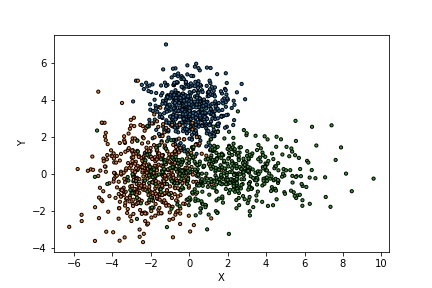
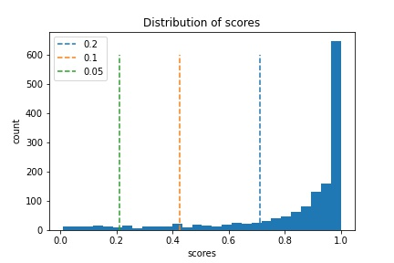
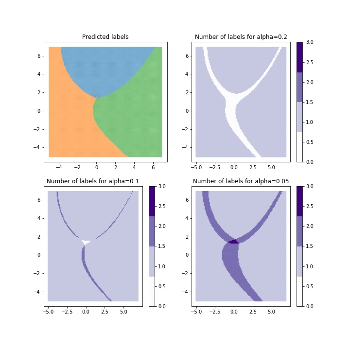

.. title:: Tutorial : contents

.. _tutorial_classification:

========
Tutorial
========

In this tutorial, we compare the prediction sets estimating by :class:`mapie.classification.MapieClassifier`.

Throughout this tutorial, we will answer the following questions:

- How does the number of classes in the prediction sets vary according to the significance level alpha values and the conformity scores ?

1. Conformal Prediction method using the softmax score of the true label
========================================================================
We will use MAPIE to estimate a prediction set of several classes such that the probability that the true label of a new test point is included in the prediction set is always higher than the target confidence level : :math:`1 - \alpha`.
We start by using the softmax score output by the base classifier as the conformity score on a toy two-dimensional dataset. We estimate the prediction sets as follows :

* First we generate a dataset with train and test and the Model is fitted in the training set.
* We set the conformal score :math:`Si = f(X_{i})_{yi}` the softmax output of the true class for each sample in the training set.
* Then we define :math:`q` as being the :math:`(n + 1) (\alpha) / n` previous quantile of :math:`S_{1}, ..., S_{n}` (this is essentially the quantile :math:`\alpha`, but with a small correction). 
* Finally, for a new test data point (where :math:`X_{n + 1}` is known but :math:`Y_{n + 1}` is not), create a prediction set :math:`T(X_{n+1}) = {y: f(X_{n+1})_{y} > q}` which includes all the classes with a sufficiently high softmax output.

We use a two-dimensional dataset with three labels. The distribution of the data is a bivariate normal with diagonal covariance matrices for each label. 

.. code-block:: python

    import numpy as np
    centers = [(0, 3.5), (-2, 0), (2, 0)]
    covs = [np.eye(2), np.eye(2)*2, np.diag([5, 1])]
    x_min, x_max, y_min, y_max, step = -6, 8, -6, 8, 0.1
    n_samples = 500
    n_classes = 3
    alpha = [0.2, 0.1, 0.05]
    np.random.seed(42)
    X_train = np.vstack([
        np.random.multivariate_normal(center, cov, n_samples)
        for center, cov in zip(centers, covs)
    ])
    y_train = np.hstack([np.full(n_samples, i) for i in range(n_classes)])

    xx, yy = np.meshgrid(
        np.arange(x_min, x_max, step), np.arange(x_min, x_max, step)
    )
    X_test = np.stack([xx.ravel(), yy.ravel()], axis=1)

Let's see our training data

.. code-block:: python

   import matplotlib.pyplot as plt
   colors = {0: "#1f77b4", 1: "#ff7f0e", 2:  "#2ca02c", 3: "#d62728"}
   y_train_col = list(map(colors.get, y_train))
   fig = plt.figure()
   plt.scatter(
       X_train[:, 0],
       X_train[:, 1],
       color=y_train_col,
       marker='o',
       s=10,
       edgecolor='k'
   )
   plt.xlabel("X")
   plt.ylabel("Y")
   plt.show()

We fit our training data with a Gaussian Naive Base estimator. And then we apply :class:`mapie.classification.MapieClassifier` with the method ``score`` to the estimator indicating that it has already been fitted with `cv="prefit"`.
We then estimate the prediction sets with differents alpha values with a
``fit`` and ``predict`` process. 

.. code-block:: python

   from sklearn.naive_bayes import GaussianNB
   from mapie.classification import MapieClassifier
   from mapie.metrics import classification_coverage_score
   clf = GaussianNB().fit(X_train, y_train)
   y_pred = clf.predict(X_test)
   y_pred_proba = clf.predict_proba(X_test)
   y_pred_proba_max = np.max(y_pred_proba, axis=1)
   mapie = MapieClassifier(estimator=clf, cv="prefit")
   mapie.fit(X_train, y_train)
   y_pred_mapie, y_ps_mapie = nb_mapie.predict(X_test, alpha=alphas)

* y_pred_mapie: represents the prediction in the test set by the base estimator.
* y_ps_mapie: the prediction sets estimated by MAPIE.

.. code-block:: python

   def plot_scores(n, alphas, scores, quantiles):      
    colors = {0:'#1f77b4', 1:'#ff7f0e', 2:'#2ca02c'}
    fig = plt.figure()
    plt.hist(scores, bins='auto')
    i=0         
    for quantile in quantiles:
        plt.vlines(x = quantile, ymin=0, ymax=600, color = colors[i], linestyles = 'dashed',label=f'alpha = {alphas[i]}') 
        i=i+1
    plt.title("Distribution of scores")
    plt.legend()
    plt.xlabel("scores")
    plt.ylabel("count")
    plt.show()

   def plot_results(alphas, y_pred_mapie, y_ps_mapie):
       tab10 = plt.cm.get_cmap('Purples', 4)
       colors = {0: "#1f77b4", 1: "#ff7f0e", 2:  "#2ca02c", 3: "#d62728"}
       y_pred_col = list(map(colors.get, y_pred_mapie))
       fig, [[ax1, ax2], [ax3, ax4]] = plt.subplots(2, 2, figsize=(10, 10))
       axs = {0: ax1, 1: ax2, 2:  ax3, 3: ax4}
       axs[0].scatter(
           X_test[:, 0],
           X_test[:, 1],
           color=y_pred_col,
           marker='.',
           s=10,
           alpha=0.4
       )
       axs[0].set_title("Predicted labels")
       for i, alpha in enumerate(alphas):
           y_pi_sums = y_ps_mapie[:, :, i].sum(axis=1)
           num_labels = axs[i+1].scatter(
               X_test[:, 0],
               X_test[:, 1],
               c=y_pi_sums,
               marker='.',
               s=10,
               alpha=1,
               cmap=tab10,
               vmin=0,
               vmax=3
           )
           cbar = plt.colorbar(num_labels, ax=axs[i+1])
           coverage= classification_coverage_score(y_pred_mapie,y_ps_mapie[:,:,i])
           axs[i+1].set_title(f"Number of labels for alpha={alpha_}")
       plt.show()

Let's see the distribution of the scores with the calculated quantiles.

.. code-block:: python

   scores = mapie.scores_
   n = mapie.n_samples_val_
   quantiles = mapie.quantiles_ 
   plot_scores(n, alphas, scores, quantiles)

The estimated quantile depends on alpha and a high value of alpha can potentially lead to a high quantile which would not necessarily be reached by any class in uncertain areas.

We will now compare the differences between the prediction sets of the different values ​​of alpha.

.. code-block:: python

   plot_results(alphas, y_pred_mapie, y_ps_mapie)

When the class coverage is not large enough, the prediction sets can be empty
when the model is uncertain at the border between two class. The null region
disappears for larger class coverages but ambiguous classification regions
arise with several labels included in the prediction sets.