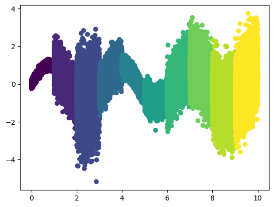
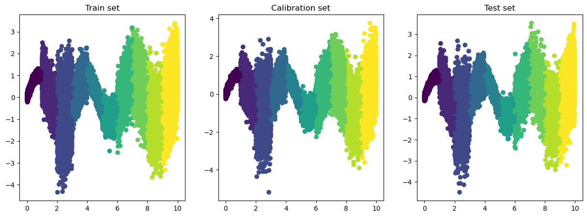
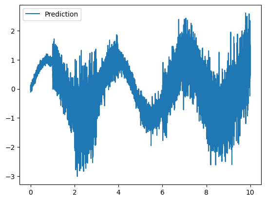
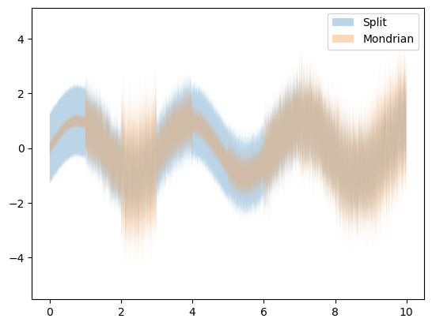
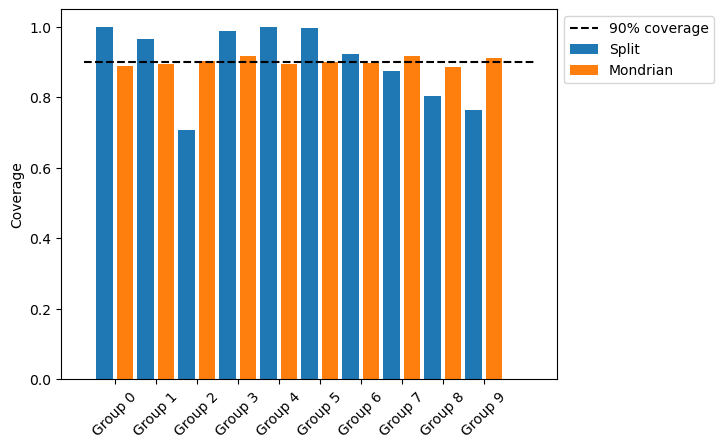

.. code:: ipython3

    import matplotlib.pyplot as plt
    import numpy as np
    from sklearn.base import clone
    from sklearn.model_selection import train_test_split
    from sklearn.ensemble import RandomForestRegressor
    
    from mapie.metrics import regression_coverage_score_v2
    from mapie.mondrian import MondrianCP
    from mapie.regression import MapieRegressor
    
    %load_ext autoreload
    %autoreload 2

.. code:: ipython3

    # Create 1D regression dataset with sinusoidual function between 0 and 10 
    n_points = 100000
    np.random.seed(0)
    X = np.linspace(0, 10, n_points).reshape(-1, 1)
    group_size = n_points // 10
    groups_list = []
    for i in range(10):
        groups_list.append(np.array([i] * group_size))
    groups = np.concatenate(groups_list)
    
    noise_0_1 = np.random.normal(0, 0.1, group_size)
    noise_1_2 = np.random.normal(0, 0.5, group_size)
    noise_2_3 = np.random.normal(0, 1, group_size)
    noise_3_4 = np.random.normal(0, .4, group_size)
    noise_4_5 = np.random.normal(0, .2, group_size)
    noise_5_6 = np.random.normal(0, .3, group_size)
    noise_6_7 = np.random.normal(0, .6, group_size)
    noise_7_8 = np.random.normal(0, .7, group_size)
    noise_8_9 = np.random.normal(0, .8, group_size)
    noise_9_10 = np.random.normal(0, .9, group_size)
    
    y = np.concatenate(
        [
            np.sin(X[groups == 0, 0] * 2) + noise_0_1,
            np.sin(X[groups == 1, 0] * 2) + noise_1_2,
            np.sin(X[groups == 2, 0] * 2) + noise_2_3,
            np.sin(X[groups == 3, 0] * 2) + noise_3_4,
            np.sin(X[groups == 4, 0] * 2) + noise_4_5,
            np.sin(X[groups == 5, 0] * 2) + noise_5_6,
            np.sin(X[groups == 6, 0] * 2) + noise_6_7,
            np.sin(X[groups == 7, 0] * 2) + noise_7_8,
            np.sin(X[groups == 8, 0] * 2) + noise_8_9,
            np.sin(X[groups == 9, 0] * 2) + noise_9_10,
        ], axis=0
    )
    

.. code:: ipython3

    plt.scatter(X, y, c=groups)
    plt.show()

.. code:: ipython3

    X_train_temp, X_test, y_train_temp, y_test = train_test_split(X, y, test_size=0.2, random_state=0)
    groups_train_temp, groups_test, _, _ = train_test_split(groups, y, test_size=0.2, random_state=0)
    X_cal, X_train, y_cal, y_train = train_test_split(X_train_temp, y_train_temp, test_size=0.5, random_state=0)
    groups_cal, groups_train, _, _ = train_test_split(groups_train_temp, y_train_temp, test_size=0.5, random_state=0)

.. code:: ipython3

    X_train.shape, y_train.shape, groups_train.shape

.. parsed-literal::

    ((40000, 1), (40000,), (40000,))

.. code:: ipython3

    f, ax = plt.subplots(1, 3, figsize=(15, 5))
    ax[0].scatter(X_train, y_train, c=groups_train)
    ax[0].set_title("Train set")
    ax[1].scatter(X_cal, y_cal, c=groups_cal)
    ax[1].set_title("Calibration set")
    ax[2].scatter(X_test, y_test, c=groups_test)
    ax[2].set_title("Test set")
    plt.show()

.. code:: ipython3

    print("Training set size: ", X_train.shape[0])
    print("Calibration set size: ", X_cal.shape[0])
    print("Test set size: ", X_test.shape[0])

.. parsed-literal::

    Training set size:  40000
    Calibration set size:  40000
    Test set size:  20000

.. code:: ipython3

    # Fit a random forest regressor
    
    rf = RandomForestRegressor(n_estimators=100)
    rf.fit(X_train, y_train)

.. raw:: html

    

<pre>RandomForestRegressor()</pre><b>In a Jupyter environment, please rerun this cell to show the HTML representation or trust the notebook.  On GitHub, the HTML representation is unable to render, please try loading this page with nbviewer.org.</b>

<input class="sk-toggleable__control sk-hidden--visually" id="sk-estimator-id-1" type="checkbox" checked><label for="sk-estimator-id-1" class="sk-toggleable__label fitted sk-toggleable__label-arrow fitted">&nbsp;&nbsp;RandomForestRegressor<a class="sk-estimator-doc-link fitted" rel="noreferrer" target="_blank" href="https://scikit-learn.org/1.5/modules/generated/sklearn.ensemble.RandomForestRegressor.html">?Documentation for RandomForestRegressor</a>iFitted</label>
<pre>RandomForestRegressor()</pre>
 

.. code:: ipython3

    # Plot the prediction of the random forest regressor as a line
    
    y_pred = rf.predict(X_test)
    # plt.scatter(X_test, y_test, label="True")
    
    #Sort the test set and the prediction to plot them as a line
    sort_idx = np.argsort(X_test[:, 0])
    plt.plot(X_test[sort_idx], y_pred[sort_idx], label="Prediction")
    
    plt.legend()

.. parsed-literal::

    <matplotlib.legend.Legend at 0x1380f0760>

.. code:: ipython3

    mapie_regressor = MapieRegressor(rf, cv="prefit")
    mondrian_regressor = MondrianCP(MapieRegressor(rf, cv="prefit"))

.. code:: ipython3

    mapie_regressor.fit(X_cal, y_cal)
    mondrian_regressor.fit(X_cal, y_cal, groups=groups_cal)

.. raw:: html

    

<pre>MondrianCP(mapie_estimator=MapieRegressor(cv=&#x27;prefit&#x27;,
                                              estimator=RandomForestRegressor()))</pre><b>In a Jupyter environment, please rerun this cell to show the HTML representation or trust the notebook.  On GitHub, the HTML representation is unable to render, please try loading this page with nbviewer.org.</b>

<input class="sk-toggleable__control sk-hidden--visually" id="sk-estimator-id-2" type="checkbox" ><label for="sk-estimator-id-2" class="sk-toggleable__label  sk-toggleable__label-arrow ">&nbsp;MondrianCPiNot fitted</label>
<pre>MondrianCP(mapie_estimator=MapieRegressor(cv=&#x27;prefit&#x27;,
                                              estimator=RandomForestRegressor()))</pre>
 

<input class="sk-toggleable__control sk-hidden--visually" id="sk-estimator-id-3" type="checkbox" ><label for="sk-estimator-id-3" class="sk-toggleable__label  sk-toggleable__label-arrow ">mapie_estimator: MapieRegressor</label>
<pre>MapieRegressor(cv=&#x27;prefit&#x27;, estimator=RandomForestRegressor())</pre>
 

<input class="sk-toggleable__control sk-hidden--visually" id="sk-estimator-id-4" type="checkbox" ><label for="sk-estimator-id-4" class="sk-toggleable__label  sk-toggleable__label-arrow ">estimator: RandomForestRegressor</label>
<pre>RandomForestRegressor()</pre>
 

<input class="sk-toggleable__control sk-hidden--visually" id="sk-estimator-id-5" type="checkbox" ><label for="sk-estimator-id-5" class="sk-toggleable__label  sk-toggleable__label-arrow ">&nbsp;RandomForestRegressor<a class="sk-estimator-doc-link " rel="noreferrer" target="_blank" href="https://scikit-learn.org/1.5/modules/generated/sklearn.ensemble.RandomForestRegressor.html">?Documentation for RandomForestRegressor</a></label>
<pre>RandomForestRegressor()</pre>
 

.. code:: ipython3

    _, y_pss_split = mapie_regressor.predict(X_test, alpha=.1)
    _, y_pss_mondrian = mondrian_regressor.predict(X_test, groups=groups_test, alpha=.1)

.. code:: ipython3

    rf = RandomForestRegressor(
        n_estimators=100
    )
    rf.fit(X_train, y_train)
    mondrian_regressor = MondrianCP(
        MapieRegressor(rf, cv="prefit")
    )
    mondrian_regressor.fit(
        X_cal, y_cal,
        groups=groups_cal
    )
    _, y_pss_mondrian = mondrian_regressor.predict(
        X_test, groups=groups_test, alpha=.1
    )

.. code:: ipython3

    # Plot the prediction of the random forest regressor as a line with the prediction intervals
    
    # plt.scatter(X_test, y_test, label="True")
    sort_idx = np.argsort(X_test[:, 0])
    # plt.plot(X_test[sort_idx], y_pred[sort_idx], label="Prediction")
    plt.fill_between(X_test[sort_idx].flatten(), y_pss_split[sort_idx, 0].flatten(), y_pss_split[sort_idx, 1].flatten(), alpha=0.3, label="Split")
    plt.fill_between(X_test[sort_idx].flatten(), y_pss_mondrian[sort_idx, 0].flatten(), y_pss_mondrian[sort_idx, 1].flatten(), alpha=0.3, label="Mondrian")
    plt.legend()
    plt.show()

.. code:: ipython3

    # plot coverage by groups with both methods
    coverages = {}
    for group in np.unique(groups_test):
        coverages[group] = {}
        coverages[group]["split"] = regression_coverage_score_v2(y_test[groups_test == group], y_pss_split[groups_test == group])
        coverages[group]["mondrian"] = regression_coverage_score_v2(y_test[groups_test == group], y_pss_mondrian[groups_test == group])

.. code:: ipython3

    # Plot the coverage by groups, plot both methods side by side
    plt.bar(np.arange(len(coverages)) * 2, [float(coverages[group]["split"]) for group in coverages], label="Split")
    plt.bar(np.arange(len(coverages)) * 2 + 1, [float(coverages[group]["mondrian"]) for group in coverages], label="Mondrian")
    plt.xticks(np.arange(len(coverages)) * 2 + .5, [f"Group {group}" for group in coverages], rotation=45)
    plt.hlines(0.9, -1, 21, label="90% coverage", color="black", linestyle="--")
    plt.ylabel("Coverage")
    
    #put legend outside of the plot
    plt.legend(loc='upper left', bbox_to_anchor=(1, 1))

.. parsed-literal::

    /var/folders/7d/cdjx7c6d3xx42wdw5bnrmmb80000gn/T/ipykernel_90633/2054907134.py:2: DeprecationWarning: Conversion of an array with ndim > 0 to a scalar is deprecated, and will error in future. Ensure you extract a single element from your array before performing this operation. (Deprecated NumPy 1.25.)
      plt.bar(np.arange(len(coverages)) * 2, [float(coverages[group]["split"]) for group in coverages], label="Split")
    /var/folders/7d/cdjx7c6d3xx42wdw5bnrmmb80000gn/T/ipykernel_90633/2054907134.py:3: DeprecationWarning: Conversion of an array with ndim > 0 to a scalar is deprecated, and will error in future. Ensure you extract a single element from your array before performing this operation. (Deprecated NumPy 1.25.)
      plt.bar(np.arange(len(coverages)) * 2 + 1, [float(coverages[group]["mondrian"]) for group in coverages], label="Mondrian")

.. parsed-literal::

    <matplotlib.legend.Legend at 0x13847b970>

