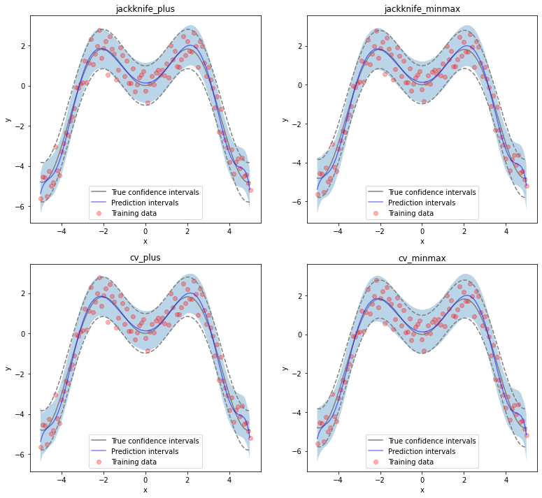
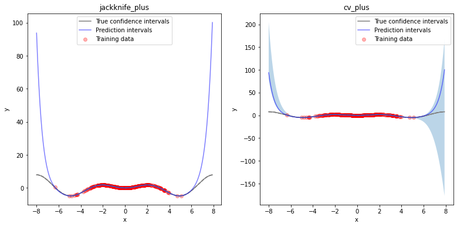

.. title:: Tutorial : contents

.. _user_guide:

========
Tutorial
========

In this tutorial, we compare the prediction intervals estimated by MAPIE on a 
simple, one-dimensional, function

.. math::

   f(x) = x \times sin(x)

Throughout this tutorial, we will answer the following questions:

- How well do the MAPIE methods capture the aleatoric uncertainty existing in the data?

- How do the prediction intervals estimated by the resampling methods
  evolve for new *out-of-distribution* data? 

- How do the prediction intervals vary between regressor models?

We will start by fitting asimple polynomial function to the considered one-dimensional
:math:`x \times sin(x)`. We will then compare the estimated prediction intervals using 
a polynomial function, a boosting model, and a simple neural network. 

1. Estimating the aleatoric uncertainty of homoscedastic noisy data
===================================================================

Let’s start by generating noisy one-dimensional data obtained through 
uniform distribution. 
Here, the noise is considered as *homoscedastic*, since it remains constant 
over :math:`x`.

.. code:: python

    def x_sinx(x):
        """One-dimensional x*sin(x) function."""
        return x*np.sin(x)

.. code:: python

    def generate_onedimensional_data(
        funct,
        distrib='normal',
        noise=True,
        n_samples=100,
        mu=0,
        sig=1,
        sigfactor=1,
        min_x=-5,
        max_x=5,
        step=0.1,
        sig_noise=1
    ):
        """
        Generate one-dimensional data with homo- or hetero-scedastic noise
        from an input function and some information on the noise.
        """
        np.random.seed(59)
        if distrib == 'normal':
            X_train = npr.normal(mu,sig,n_samples)
            X_test = np.arange(mu-sigfactor*sig, mu+sigfactor*sig, sig/20.)
        elif distrib == 'uniform':
            X_train = np.arange(min_x, max_x+step, step)
            X_test = np.arange(np.min(X_train), np.max(X_train), step/5.)
        y_train = funct(X_train)
        y_mesh = funct(X_test)
        y_test = funct(X_test)
        n_test = y_test.shape[0]
        if noise == True:
            n_samples = len(X_train)
            if isinstance(sig_noise, (int, float)):
                y_noise_train = npr.normal(0, sig_noise, n_samples)
                y_noise_test = npr.normal(0, sig_noise, n_test)
            elif isinstance(sig_noise, (list)):
                sig_noise_train = gauss_function(X_train, sig_noise[0], sig_noise[1], sig_noise[2])
                sig_noise_test = gauss_function(X_test, sig_noise[0], sig_noise[1], sig_noise[2])
                y_noise_train = np.array([npr.normal(0, noise, 1)[0] for noise in sig_noise_train])
                y_noise_test = np.array([npr.normal(0, noise, 1)[0] for noise in sig_noise_test])
            y_train += y_noise_train
            y_test += y_noise_test
        return X_train.reshape(-1, 1), y_train, X_test.reshape(-1, 1), y_test, y_mesh

.. code:: python

    sig_noise = 0.5
    X_train, y_train, X_test, y_test, y_mesh = generate_onedimensional_data(
        x_sinx, distrib='uniform', noise=True, n_samples=100, mu=0, sig=1, sigfactor=1, step=0.1, sig_noise=sig_noise
    )

Let's visualize our noisy function. 

.. code:: python

    plt.xlabel('x') ; plt.ylabel('y')
    plt.plot(X_test, y_mesh, color='C1')
    plt.scatter(X_train, y_train)

.. image:: VTA-03-pi-tuto-rtfd_files/VTA-03-pi-tuto-rtfd_9_1.png

As mentioned previously, we fit our training data with a simple
polynomial function. Here, we choose a degree equal to 10 so the function 
is able to perfectly fit :math:`x \times sin(x)`.

.. code:: python

    degree_polyn = 10
    polyn_model = Pipeline([('poly', PolynomialFeatures(degree=degree_polyn)),
                            ('linear', LinearRegression(fit_intercept=False))])

We then estimate the prediction intervals for all the methods very easily with a
``fit`` and ``predict`` process. The prediction interval lower and upper bounds
are then saved in a DataFrame. Here, we set an alpha value of 0.05
in order to obtain a 95% confidence for our prediction intervals.

.. code:: python

    preds_df = {}
    methods = ['naive', 'jackknife', 'jackknife_plus', 'jackknife_minmax' ,'cv', 'cv_plus', 'cv_minmax']
    for im, method in enumerate(methods):
        predinterv = PredictionInterval(polyn_model, alpha=0.05, method=method, n_splits=5, return_pred='single')
        predinterv.fit(X_train, y_train)
        y_preds = predinterv.predict(X_test)
        preds_df[method] = pd.DataFrame(np.stack([y_preds[:, 0], y_preds[:, 1], y_preds[:, 2]], axis=1), columns=['pred', 'lower', 'upper'])
    preds_df = pd.concat(preds_df, axis=1)

Let’s now compare the confidence intervals with the predicted intervals with obtained 
by the Jackknife+ and CV+ methods.

.. code:: python

    def plot_1d_data(
        X_train,
        y_train, 
        X_test,
        y_test,
        y_sigma,
        y_pred, 
        y_pred_low, 
        y_pred_up,
        ax=None,
        title=None
    ):
        ax.set_xlabel('x') ; ax.set_ylabel('y')
        ax.fill_between(X_test, y_pred_low, y_pred_up, alpha=0.3)
        ax.scatter(X_train, y_train, color='red', alpha=0.3, label='Training data')
        ax.plot(X_test, y_test, color='gray', label='True confidence intervals')
        ax.plot(X_test, y_test-y_sigma, color='gray', ls='--')
        ax.plot(X_test, y_test+y_sigma, color='gray', ls='--')
        ax.plot(X_test, y_pred, color='blue', alpha=0.5, label='Prediction intervals')
        if title is not None:
            ax.set_title(title)
        ax.legend()

.. code:: python

    n_figs = len(methods)
    fig, axs = plt.subplots(1, 2, figsize=(13, 6))
    methods_plus = ['jackknife_plus', 'cv_plus']
    coords_plus = [axs[0], axs[1]]
    for i, method in enumerate(methods_plus):
        y_up = preds_df[method]['upper']
        y_low = preds_df[method]['lower']
        y_pred = preds_df[method]['pred']
        plot_1d_data(
            X_train.ravel(), y_train.ravel(), 
            X_test.ravel(), y_mesh.ravel(), 1.96*sig_noise, 
            y_pred.ravel(), y_low.ravel(), y_up.ravel(), 
            ax=coords_plus[i], title=method
        )

At first glance, the two methods give identical results and the
prediction intervals are very close to the true confidence intervals.
Let’s confirm this by comparing the prediction interval widths over
:math:`x` between all methods.

.. code:: python

    fig, ax = plt.subplots(1, 1, figsize=(7, 5))
    for im, method in enumerate(methods):
        ax.plot(X_test, preds_df[method]["upper"]-preds_df[method]["lower"])
    ax.axhline(1.96*2*sig_noise, ls='--', color='k')
    ax.set_xlabel("x") ; ax.set_ylabel("Prediction Interval Width")
    ax.legend(methods+["True width"], fontsize=8)

.. image:: VTA-03-pi-tuto-rtfd_files/VTA-03-pi-tuto-rtfd_18_1.png

As expected, the prediction intervals estimated by the Naive method
are slightly too narrow. The Jackknife, Jackknife+, CV, and CV+ give
similar widths that are very close to the true width. On the other hand,
the widths estimated by Jackknife-minmax and CV-minmax are slightly too
wide. Note that the widths given by the Naive, Jackknife, and CV methods
are constant since the prediction intervals are estimated upon the
residuals of the training data only.

Let’s now compare the *effective* coverage, namely the fraction of test
points whose true values lie within the prediction intervals, given by
the different methods. 

.. raw:: html

    

    
    <table border="1" class="dataframe">
      <thead>
        <tr style="text-align: right;">
          <th></th>
          <th>Coverage</th>
          <th>Mean width</th>
        </tr>
      </thead>
      <tbody>
        <tr>
          <th>naive</th>
          <td>0.914</td>
          <td>1.820095</td>
        </tr>
        <tr>
          <th>jackknife</th>
          <td>0.938</td>
          <td>1.993815</td>
        </tr>
        <tr>
          <th>jackknife_plus</th>
          <td>0.944</td>
          <td>1.997930</td>
        </tr>
        <tr>
          <th>jackknife_minmax</th>
          <td>0.958</td>
          <td>2.149547</td>
        </tr>
        <tr>
          <th>cv</th>
          <td>0.950</td>
          <td>2.040191</td>
        </tr>
        <tr>
          <th>cv_plus</th>
          <td>0.948</td>
          <td>2.023036</td>
        </tr>
        <tr>
          <th>cv_minmax</th>
          <td>0.960</td>
          <td>2.244389</td>
        </tr>
      </tbody>
    </table>
    

All methods except the Naive one give effective coverage close to 0.95,
confirming the theoretical garantees.
    

2. Estimating the epistemic uncertainty of out-of-distribution data
===================================================================

Let’s now consider one-dimensional data without noise, but normally distributed.
The goal is to explore how the prediction intervals evolve for new data 
that lie outside the distribution of the training data in order to see how the methods
can capture the *epistemic* uncertainty.

Lets' start by generating and showing the data. 

.. code:: python

    sig_noise = 0.
    X_train, y_train, X_test, y_test, y_mesh = generate_onedimensional_data(
        x_sinx, distrib='normal', noise=True, n_samples=300, mu=0, sig=2, sigfactor=4, step=0.1, sig_noise=sig_noise
    )

.. code:: python

    plt.xlabel('x') ; plt.ylabel('y')
    plt.plot(X_test, y_test, color='C1')
    plt.scatter(X_train, y_train)

.. image:: VTA-03-pi-tuto-rtfd_files/VTA-03-pi-tuto-rtfd_25_1.png

As before, we estimate the prediction intervals using a polynomial
function of degree 10 and show the results for the Jackknife+ and CV+
methods.

.. code:: python

    preds_df = {}
    methods = ['naive', 'jackknife', 'jackknife_plus', 'jackknife_minmax' ,'cv', 'cv_plus', 'cv_minmax']
    for im, method in enumerate(methods):
        predinterv = PredictionInterval(polyn_model, alpha=0.05, method=method, n_splits=5, return_pred='single')
        predinterv.fit(X_train, y_train)
        y_preds = predinterv.predict(X_test)
        preds_df[method] = pd.DataFrame(np.stack([y_preds[:, 0], y_preds[:, 1], y_preds[:, 2]], axis=1), columns=['pred', 'lower', 'upper'])
    preds_df = pd.concat(preds_df, axis=1)

At first glance, our polynomial function does not give accurate
predictions with respect to the true function when :math:`|x > 6|`. 
The prediction intervals estimated with the Jackknife+ do not seem to 
increase significantly, unlike the CV+ method whose prediction intervals
capture a high uncertainty when :math:`x > 6`.

Let's now compare the prediction interval widths between all methods. 

.. code:: python

    fig, ax = plt.subplots(1, 1, figsize=(7, 5))
    ax.set_yscale("log")
    for im, method in enumerate(methods):
        ax.plot(X_test, preds_df[method]["upper"]-preds_df[method]["lower"])
    ax.axhline(1.96*2*sig_noise, ls='--', color='k')
    ax.set_xlabel("x") ; ax.set_ylabel("Prediction Interval Width")
    ax.legend(methods+["True width"], fontsize=8)

.. image:: VTA-03-pi-tuto-rtfd_files/VTA-03-pi-tuto-rtfd_30_1.png

The prediction interval widths start to increase exponentially
for :math:`|x| > 4` for the Jackknife-minmax, CV+, and CV-minmax
methods. On the other hand, the prediction intervals estimated by
Jackknife+ remain roughly constant until :math:`|x| ~ 5` before
increasing.

.. code:: python

    pd.DataFrame([
        [((preds_df[method]["upper"] >= y_test) & (preds_df[method]["lower"] <= y_test)).mean(),
        (preds_df[method]["upper"] - preds_df[method]["lower"]).mean()]
        for im, method in enumerate(methods)
    ], index=methods, columns=["Coverage", "Mean width"])

.. raw:: html

    

    
    <table border="1" class="dataframe">
      <thead>
        <tr style="text-align: right;">
          <th></th>
          <th>Coverage</th>
          <th>Mean width</th>
        </tr>
      </thead>
      <tbody>
        <tr>
          <th>naive</th>
          <td>0.49375</td>
          <td>0.008543</td>
        </tr>
        <tr>
          <th>jackknife</th>
          <td>0.53125</td>
          <td>0.011721</td>
        </tr>
        <tr>
          <th>jackknife_plus</th>
          <td>0.53125</td>
          <td>0.037021</td>
        </tr>
        <tr>
          <th>jackknife_minmax</th>
          <td>0.85625</td>
          <td>9.784691</td>
        </tr>
        <tr>
          <th>cv</th>
          <td>0.50625</td>
          <td>0.008718</td>
        </tr>
        <tr>
          <th>cv_plus</th>
          <td>0.88125</td>
          <td>19.549235</td>
        </tr>
        <tr>
          <th>cv_minmax</th>
          <td>0.82500</td>
          <td>15.508213</td>
        </tr>
      </tbody>
    </table>
    

In conclusion, the Jackknife-minmax, CV+, and CV-minmax methods are more
conservative than the Jackknife+ method, and tend to result in more
reliable coverages for *out-of-distribution* data. It is therefore
advised to use the three former methods for predictions with new
out-of-distribution data.

3. Estimating the uncertainty with different sklearn-compatible regressors
==========================================================================

MAPIE can be used with any kind of sklear-compatible regressor. Here, we
illustrate this by comparing the prediction intervals estimated by the CV+ method using
different models:

- the same polynomial function as before.
 
- a XGBoost model using the Scikit-learn API.

- a simple neural network, a Multilayer Perceptron with three dense layers, using the KerasRegressor wrapper.

Once again, let’s use our noisy one-dimensional data obtained from a
uniform distribution.

.. code:: python

    sig_noise = 0.5
    X_train, y_train, X_test, y_test, y_mesh = generate_onedimensional_data(
        x_sinx, distrib='uniform', noise=True, n_samples=300, mu=0, sig=2, sigfactor=4, step=0.1, sig_noise=sig_noise
    )

.. code:: python

    plt.xlabel('x') ; plt.ylabel('y')
    plt.plot(X_test, y_mesh, color='C1')
    plt.scatter(X_train, y_train)

.. image:: VTA-03-pi-tuto-rtfd_files/VTA-03-pi-tuto-rtfd_37_1.png

Let's then define the models. The boosing model considers 100 shallow trees with a max depth of 2 while
the Multilayer Perceptron has two hidden dense layers with 20 neurons each followed by a relu activation.

.. code:: python

    def mlp():
        """
        Two-layer MLP model
        """
        model = Sequential([
            Dense(units=20, input_shape=(1,), activation='relu'),
            Dense(units=20, activation="relu"),
            Dense(units=1)
        ])
        model.compile(loss='mean_squared_error', optimizer='adam') #, metrics=['accuracy']
        return model

.. code:: python

    polyn_model = Pipeline([('poly', PolynomialFeatures(degree=degree_polyn)),
                            ('linear', LinearRegression(fit_intercept=False))])
    xgb_model = XGBRegressor(
        max_depth=2,
        n_estimators=100,
        tree_method='hist',
        random_state=59,
        learning_rate=0.1,
        verbosity=0,
        nthread=-1
    )
    mlp_model = KerasRegressor(
        build_fn=mlp, 
        epochs=500, 
        verbose=0
    )

Let's now use MAPIE to estimate the prediction intervals using the CV+ method 
and compare their prediction interval.

.. code:: python

    preds_df = {}
    methods = ['cv_plus']
    models = [polyn_model, xgb_model, mlp_model]
    model_names = ['polyn', 'xgb', 'mlp']
    for im, model in enumerate(models):
        predinterv = PredictionInterval(model, alpha=0.05, method=method, n_splits=5, return_pred='median')
        predinterv.fit(X_train, y_train)
        y_preds = predinterv.predict(X_test)
        preds_df[model_names[im]] = pd.DataFrame(np.stack([y_preds[:, 0], y_preds[:, 1], y_preds[:, 2]], axis=1), columns=['pred', 'lower', 'upper'])
    preds_df = pd.concat(preds_df, axis=1)

.. code:: python

    fig, axs = plt.subplots(1, 3, figsize=(20, 6))
    for im, model in enumerate(models):
        y_up = preds_df[model_names[im]]['upper']
        y_low = preds_df[model_names[im]]['lower']
        y_pred = preds_df[model_names[im]]['pred']
        plot_1d_data(
            X_train.ravel(), y_train.ravel(), 
            X_test.ravel(), y_mesh.ravel(), 1.96*sig_noise, 
            y_pred.ravel(), y_low.ravel(), y_up.ravel(), 
            ax=axs[im], title=model_names[im]
        )

.. image:: VTA-03-pi-tuto-rtfd_files/VTA-03-pi-tuto-rtfd_42_0.png

.. code:: python

    fig, ax = plt.subplots(1, 1, figsize=(7, 5))
    for im, model in enumerate(models):
        ax.plot(X_test, preds_df[model_names[im]]["upper"]-preds_df[model_names[im]]["lower"])
    ax.axhline(1.96*2*sig_noise, ls='--', color='k')
    ax.set_xlabel("x") ; ax.set_ylabel("Prediction Interval Width")
    ax.legend(model_names+["True width"], fontsize=8)

.. image:: VTA-03-pi-tuto-rtfd_files/VTA-03-pi-tuto-rtfd_43_1.png

As expected with the CV+ method, the prediction intervals are a bit 
conservative since they are slightly wider than the true intervals.
However, the CV+ method on the three models gives very promising results 
since the prediction intervals closely follow the true intervals with :math:`x`. 