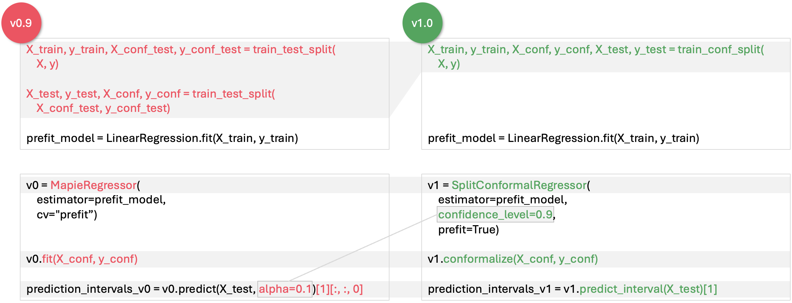

MAPIE v1 release notes
===========================================

.. contents:: Table of Contents
   :depth: 3
   :local:

.. note::

   These release notes are kept up to date with the latest version of MAPIE v1.

Introduction
--------------------------------------------------------------------------

MAPIE v1's primary goal is to make the library easier to use, especially for users unfamiliar with conformal predictions. This release consists of an API and documentation revamp, enhancing MAPIE's clarity and accessibility.
Moreover, the new API structure paves the way for efficient development and internal refactoring in the future.

These release notes will help you easily migrate your code to MAPIE v1 and enjoy upcoming new features!

API changes overview
---------------------

The classification and regression APIs have been thoroughly revamped (except for time series). Other API changes (calibration, multi-label classification, time series, etc.) consist mostly of renaming to bring overall consistency and clarity.

Below are the high-level, key changes introduced in MAPIE v1. For details and rationales behind these changes, see the section `"API changes in detail" <detail_API_changes_>`_.

- Regression and classification classes have been split into more specific classes:

.. list-table:: Mapie v0.x -> v1 high-level classes correspondence
   :header-rows: 1

   * - v0.x class
     - Corresponding v1 class(es)
   * - ``MapieRegressor``
     - ``SplitConformalRegressor``, ``CrossConformalRegressor``, ``JackknifeAfterBootstrapRegressor``
   * - ``MapieClassifier``
     - ``SplitConformalClassifier``, ``CrossConformalClassifier``
   * - ``MapieQuantileRegressor``
     - ``ConformalizedQuantileRegressor``
   * - ``MapieTimeSeriesRegressor``
     - ``TimeSeriesRegressor``
   * - ``MapieMultiLabelClassifier``
     - ``PrecisionRecallController``
   * - ``MapieCalibrator``
     - ``TopLabelCalibrator``

- For classification and regression, the v1 ``.fit`` method is not equivalent to the ``.fit`` method of previous MAPIE versions. It has been split into ``.fit`` and ``.conformalize`` for split conformal techniques, and replaced by ``.fit_conformalize`` for cross-conformal techniques.

- The ``alpha`` parameter has been replaced with ``confidence_level`` (``confidence_level`` is equivalent to ``1 - alpha``).

*Differences between MAPIE v0.9 and v1.0 on a regression example*

|

⚠️ MAPIE v1 comes with some functional regressions:

- The ``MondrianCP`` class is temporarily unavailable in MAPIE v1. Mondrian can still easily be implemented manually (tutorial provided).

- In regression settings, the naive method no longer exists for cross conformal techniques. It can still be done manually for split conformal techniques by performing the calibration step on the training set.

Python, scikit-learn and NumPy versions support
---------------------------------------------------

Requirements have been updated and clarified. We now support:

- Python >=3.9
- NumPy >=1.23
- scikit-learn >=1.4

We no longer officially support Python versions between 3.7 and 3.9, and NumPy versions between 1.21 and 1.23. Note that for now, MAPIE still runs using either:

- Python <3.9
- scikit-learn <1.4, provided SciPy <=1.10

.. _detail_API_changes:

API changes in detail
----------------------

Regression and classification API changes (excluding time series)
~~~~~~~~~~~~~~~~~~~~~~~~~~~~~~~~~~~~~~~~~~~~~~~~~~~~~~~~~~~~~~~~~~~~~~~~~~~~~~~~~~~~

Classes
^^^^^^^^^

MAPIE v1 breaks down the ``MapieRegressor`` and ``MapieClassifier`` classes into 5 classes, each dedicated to a particular conformal prediction technique. ``MapieQuantileRegressor`` has also been revamped, and renamed ``ConformalizedQuantileRegressor``.

The rationale behind this is that ``MapieRegressor`` and ``MapieClassifier`` managed several conformal techniques under a single interface, which led to parameter redundancy and ambiguity. In MAPIE v1, each class includes only the relevant parameters specific to its technique.

The ``cv`` parameter is key to understand what new class to use in the v1 API, in both regression and classification:

*Mapie v0.x -> v1 classes correspondence in regression*

+--------------------+--------------------------------------------------------------------------+-------------------------------------------+---------------------------+
| v0.x class         | ``cv`` parameter value                                                   | Corresponding v1 class                    | Conformal prediction type |
+====================+==========================================================================+===========================================+===========================+
| ``MapieRegressor`` | ``split``                                                                | ``SplitConformalRegressor(prefit=False)`` | Split                     |
|                    +--------------------------------------------------------------------------+-------------------------------------------+---------------------------+
|                    | ``prefit``                                                               | ``SplitConformalRegressor(prefit=True)``  | Split                     |
|                    +--------------------------------------------------------------------------+-------------------------------------------+---------------------------+
|                    | ``None``, integer, or any ``sklearn.model_selection.BaseCrossValidator`` | ``CrossConformalRegressor``               | Cross                     |
|                    +--------------------------------------------------------------------------+-------------------------------------------+---------------------------+
|                    | ``subsample.Subsample``                                                  | ``JackknifeAfterBootstrapRegressor``      | Cross                     |
+--------------------+--------------------------------------------------------------------------+-------------------------------------------+---------------------------+

*Mapie v0.x -> v1 classes correspondence in classification*

+---------------------+--------------------------------------------------------------------------+--------------------------------------------+---------------------------+
| v0.x class          | ``cv`` parameter value                                                   | Corresponding v1 class                     | Conformal prediction type |
+=====================+==========================================================================+============================================+===========================+
| ``MapieClassifier`` | ``split``                                                                | ``SplitConformalClassifier(prefit=False)`` | Split                     |
|                     +--------------------------------------------------------------------------+--------------------------------------------+---------------------------+
|                     | ``prefit``                                                               | ``SplitConformalClassifier(prefit=True)``  | Split                     |
|                     +--------------------------------------------------------------------------+--------------------------------------------+---------------------------+
|                     | ``None``, integer, or any ``sklearn.model_selection.BaseCrossValidator`` | ``CrossConformalClassifier``               | Cross                     |
+---------------------+--------------------------------------------------------------------------+--------------------------------------------+---------------------------+

For more details regarding the difference between split and cross conformal types, see :doc:`split_cross_conformal`.

Workflow and methods
^^^^^^^^^^^^^^^^^^^^^^^^^^^

The conformal prediction workflow has been changed, to clarify the process involved under-the-hood, and to allow a better control on data splitting.

In v0.x, the workflow was:

1. Data splitting, model training, and calibration, using the ``.fit`` method with ``(X, y)``.
2. Interval (or set) prediction, using the ``.predict`` method with ``(X_test, y_test)``.

In v1, the workflow is:

1. Data splitting, left to the user. We provide a new utility :func:`~mapie.utils.train_conformalize_test_split` to split data into train, conformalize, and test sets.
2. Model training, using the ``.fit`` method with ``(X_train, y_train)``.
3. Model calibration, using the ``.conformalize`` method with ``(X_conformalize, y_conformalize)``.
4. Interval (or set) prediction, using the ``.predict_interval``/``.predict_set`` methods with ``(X_test, y_test)``.

The *calibration* step has been named *conformalization*, to avoid confusion with probability calibration, and facilitate usage by users unfamiliar with conformal predictions.

For cross conformal techniques, steps 2 and 3 are performed simultaneously using the ``.fit_conformalize()`` method. Indeed, these techniques rely on fitting and conformalizing models in a cross-validation fashion, thus the steps are not distinct.

MAPIE v1 introduces two new methods for prediction: ``.predict_interval()`` for regression, and ``.predict_set()`` for classification. They return the model prediction `and` prediction intervals/sets. They thus behave the same way than the ``.predict(alpha=...)`` v0.x method (with some minor output shape changes to keep consistency across all conformal techniques).
The ``.predict()`` method now focuses solely on producing point predictions.

Parameters
^^^^^^^^^^^^^^^^^^

Shared between classification and regression
""""""""""""""""""""""""""""""""""""""""""""""""""""""""""""""""""""""""""""""""""""""""""""""""""""""""""""""""""""""""""

``alpha``
..................................................
Has been replaced with ``confidence_level``, as this is a more usual concept. ``confidence_level`` indicates the desired coverage rate, and is equivalent to ``1 - alpha``. It is now set at initialization, to improve consistency across all conformal techniques.

``cv``
..................................................
See the "Class restructuring" section of this guide for an overview of the breakdown of the ``cv`` parameter.

- **v0.x**: Used to indicate if the model is pretrained or not (``"split"`` or ``"prefit"``) in the vanilla split conformal technique, or to specify the cross-validation scheme in cross conformal techniques.
- **v1**:

  - The ``cv`` parameter is now only relevant to cross conformal techniques, and accepts different values depending on the specific technique used. See docstrings of the classes introduced in v1 for more details.
  - For split conformal techniques, the new ``prefit`` parameter is used to specify model pre-training. ``prefit`` is set by default to ``True`` for ``SplitConformalRegressor``, as we believe this is MAPIE nominal usage.

``conformity_score``
..................................................
- **v0.x**: Only allowed subclass instances of ``BaseRegressionScore`` or ``BaseClassificationScore``, like ``AbsoluteConformityScore()``
- **v1**: Now also accepts strings, like ``"absolute"``.

``method``
..................................................
- **v0.x**: Used in ``MapieRegressor``, this parameter was only relevant to cross conformal techniques. Its usage in classification (``MapieClassifier``) was deprecated.
- **v1**: Now only used in ``CrossConformalRegressor`` and ``JackknifeAfterBootstrapRegressor``, with the same possible values (``"base"``, ``"plus"``, or ``"minmax"``), except ``naive`` that has been removed because of its unlikeliness to be used in a real-world scenario.

``groups``
..................................................
- **v0.x**: Passed as a parameter to the ``fit`` method, it was effectively used only in cross techniques.
- **v1**: ``groups`` is used in ``CrossConformalRegressor`` and ``CrossConformalClassifier``. It is passed to the ``.conformalize()`` method.

``fit_params`` and ``sample_weight``
..................................................
- **v0.x**: ``sample_weight`` is a keyword argument of the ``fit`` method. Other fit parameters are passed in a dictionary through the ``fit_params`` argument.
- **v1**: The ``fit`` and ``fit_conformalize`` methods now take all fit parameters in the ``fit_params`` argument, including ``sample_weight``.

``predict_params``
..................................................
Note that because the conformalization step includes model inference, predict parameters are used both for conformalization and prediction steps.

- **v0.x**: Predict parameters are passed to the ``fit`` method in a dictionary through the ``predict_params`` argument. The exact same parameters must be passed at prediction time to the ``predict`` method.
- **v1**: Predict parameters are now passed only to the ``fit`` (or  ``fit_conformalize``) method, as a dictionary. The same parameters are reused at prediction time, without the need to pass them again.

``random_state``
..................................................
This parameter allowed to control the randomness of data splitting in MAPIE v0.x.
In v1, data splitting is now done manually for split conformal techniques, so the randomness control is left to the user.
This parameter is now specific to allows to data splitting randomness control for cross conformal techniques.

Future evolutions may introduce ``random_state`` as a general purpose randomness control parameter.

Regression-specific
"""""""""""""""""""""""""""""""""""

``agg_function`` and ``ensemble``
..................................................
- **v0.x**: Previously, the ``agg_function`` parameter had two usage: to aggregate predictions when setting ``ensemble=True`` in the ``predict`` method of ``MapieRegressor``, and to specify the aggregation used in ``JackknifeAfterBootstrapRegressor``.
- **v1**:

  - The ``agg_function`` parameter has been split into two distinct parameters: ``aggregate_predictions`` and ``aggregation_method``. ``aggregate_predictions`` is specific to ``CrossConformalRegressor``, and it specifies how predictions from multiple conformal regressors are aggregated when making point predictions. ``aggregation_method`` is specific to ``JackknifeAfterBootstrapRegressor``, and it specifies the aggregation technique for combining predictions across different bootstrap samples during conformalization.
  - Note that for both cross conformal regression techniques, predictions points are now computed by default using mean aggregation. This is to avoid prediction points outside of prediction intervals in the default setting.

``symmetry``
..................................................
- **v0.x**: This parameter of the `predict` method of ``MapieQuantileRegressor`` was set to True by default
- **v1**: This parameter is now named `symmetric_correction` and is set to False by default, because the resulting intervals are smaller. It is used in the `predict_interval` method of the ConformalizedQuantileRegressor.

``optimize_beta``
..................................................
It has been found during v1 development that this parameter (specific to regression) has never been working as expected (currently does nothing). At v1 release time, the bug hasn't been fixed yet. See the related GitHub issue.
Note that in v1, this parameter has been renamed ``minimize_interval_width`` for clarity.

Classification-specific
"""""""""""""""""""""""""""""""""""""""""

``include_last_label``
..................................................
Parameter specific to APS or RAPS conformity scores in classification.

- **v0.x**: This parameter is passed to the ``predict`` method of ``MapieClassifier``.
- **v1**: This parameter is now passed in a dictionary to the ``conformity_score_params`` of the ``predict_set`` method of classification techniques.

``size_raps``
..................................................
Parameter specific to the RAPS conformity score in classification.

- **v0.x**: Passing this parameter to the ``fit`` method of ``MapieClassifier`` is deprecated.
- **v1**: This parameter must now be passed to the ``conformity_score`` argument at initialization. Ex: ``SplitConformalClassifier(conformity_score=RAPSConformityScore(size_raps=0.3))``

None defaults
"""""""""""""""""""""""""""""
No more parameters with misleading ``None`` defaults.

- **v0.x**: Eg: ``estimator`` in ``MapieRegressor`` has a ``None`` default value, even though the actual default value is ``LinearRegression()``. This is the case for other parameters as well.
- **v1**: All parameters now have explicit defaults.

Other API changes
~~~~~~~~~~~~~~~~~~~~~~~~~~~~~~~~~~~~~~~~~~~~~~~~~~~~~~~~~~~~~~~~~~~~~~~~~~~~~~~~~~~~

Time series
^^^^^^^^^^^^^^

The ``MapieTimeSeriesRegressor`` class has been renamed ``TimeSeriesRegressor``.

The ``adapt_conformal_inference``, ``update``, ``predict`` and ``coverage_width_based`` functions of the class now take ``confidence_level`` as input, instead of ``alpha`` (``confidence_level`` is equivalent to ``1 - alpha``).

The already deprecated path to import the class (``from mapie.time_series_regression import TimeSeriesRegressor``) is now unsupported, use path `mapie.regression` instead.

Risk control
^^^^^^^^^^^^^^

The ``MapieMultiLabelClassifier`` class has been renamed ``PrecisionRecallController``.

Calibration
^^^^^^^^^^^^^

The ``MapieCalibrator`` class has been renamed ``TopLabelCalibrator``.

This class now being specific to top-label calibration, the ``method`` parameter, that was accepting only the value ``"top-label"``, has been removed.

Mondrian
^^^^^^^^^^^

The ``MondrianCP`` class is temporarily unavailable in v1. We want to rethink the way we integrate Mondrian to MAPIE, in a future-proof way.

In the mean time, the Mondrian technique can be easily implemented manually: a `tutorial <https://mapie.readthedocs.io/en/latest/examples_mondrian/1-quickstart/plot_main-tutorial-mondrian-regression.html>`_ for tabular regression with Mondrian is available in the documentation. This tutorial demonstrates how to implement Mondrian manually (i.e., without using the ``MondrianCP`` class) on a simple regression example, while shedding light on the benefits of this technique.

Metrics
^^^^^^^^^^^

In MAPIE v1, metrics are divided into three modules: ``calibration``, ``classification``, and ``regression``, which changes the import paths.

Below is an example of the import needed for the ``classification_coverage_score`` function:

- **v0.x**:

    .. code-block::

        from mapie.metrics import classification_coverage_score

- **v1**:

    .. code-block::

        from mapie.metrics.classification import classification_coverage_score

Additionally, a number of classification and regression functions have been updated from v0.x to v1:

``classification_coverage_score`` and ``classification_coverage_score_v2``
"""""""""""""""""""""""""""""""""""""""""""""""""""""""""""""""""""""""""""""

Now only one version exists (``classification_coverage_score``), that corresponds to v0.x ``classification_coverage_score_v2``.

``classification_mean_width``
"""""""""""""""""""""""""""""""""""""""""""""""""""""""""""""""""""""""""""""

- **v0.x**: Took the prediction sets in an array of shape (n_samples, n_class) for a given confidence level as input, and returned the effective mean width as a float.
- **v1**: Now takes the prediction sets in an array of shape (n_samples, n_class, n_confidence_level) as input, and returns the effective mean width for each confidence level as an array of shape (n_confidence_level,).

``regression_coverage_score`` and ``regression_coverage_score_v2``
"""""""""""""""""""""""""""""""""""""""""""""""""""""""""""""""""""""""""""""

Now only one version exists (``regression_coverage_score``), that corresponds to v0.x ``regression_coverage_score_v2``.

``regression_mean_width``
"""""""""""""""""""""""""""""""""""""""""""""""""""""""""""""""""""""""""""""

- **v0.x**: Took the lower and upper bounds of the prediction intervals in arrays of shape (n_samples,) for a given confidence level as input, and returned the effective mean width as a float.
- **v1**: Now takes a single array of shape (n_samples, 2, n_confidence_level) as input, and returns the effective mean width for each confidence level as an array of shape (n_confidence_level,).

``regression_mwi_score``
"""""""""""""""""""""""""""""""""""""""""""""""""""""""""""""""""""""""""""""

- **v0.x**: Took ``alpha`` as input.
- **v1**: Now takes ``confidence_level`` as input (``confidence_level`` is equivalent to ``1 - alpha``).

``coverage_width_based``
"""""""""""""""""""""""""""""""""""""""""""""""""""""""""""""""""""""""""""""

- **v0.x**: Took ``alpha`` as input.
- **v1**: Now takes ``confidence_level`` as input (``confidence_level`` is equivalent to ``1 - alpha``).

Conformity scores
^^^^^^^^^^^^^^^^^^^^

The import of ``AbsoluteConformityScore``, ``GammaConformityScore`` and ``ResidualNormalisedScore`` from ``mapie.conformity_scores.residual_conformity_scores`` was deprecated and is now unsupported.

You can now import those scores from ``mapie.conformity_scores.bounds`` or simply ``mapie.conformity_scores``.

The usage of ``ConformityScore`` was deprecated and is now unsupported. The new class to use is ``BaseRegressionScore``, that can be found in ``mapie.conformity_scores.regression``.

We may clarify the ``conformity_scores`` package structure in the future.