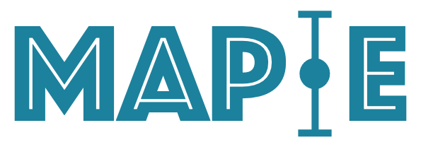
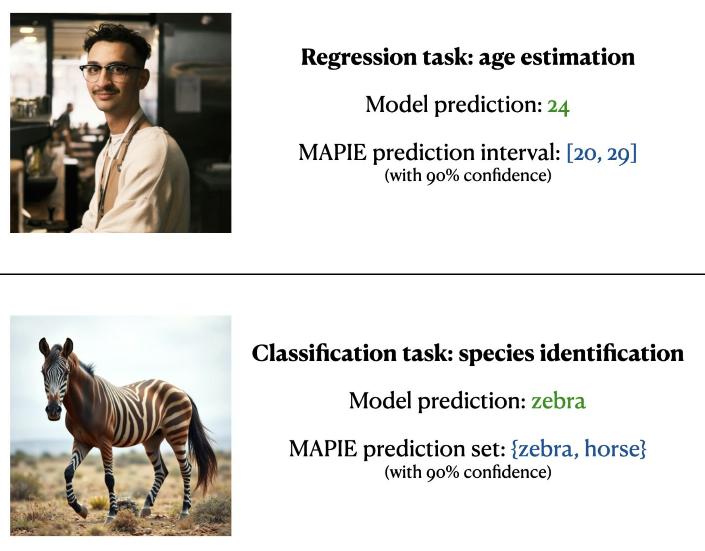

---
hide:
  - navigation
  - toc
---

<div class="hero" markdown>

{ width="400" }

# MAPIE — Model Agnostic Prediction Interval Estimator

**An open-source Python library for quantifying uncertainties and controlling the risks of machine learning models.**

[](https://github.com/scikit-learn-contrib/MAPIE/actions)
[](https://codecov.io/gh/scikit-learn-contrib/MAPIE)
[](https://github.com/scikit-learn-contrib/MAPIE/blob/master/LICENSE)
[](https://pypi.org/project/mapie/)
[](https://pypi.org/project/mapie/)
[](https://pypistats.org/packages/mapie)
[](https://anaconda.org/conda-forge/mapie)

[Get Started :material-rocket-launch:](getting-started/quick-start.md){ .md-button .md-button--primary }
[API Reference :material-book-open-variant:](api/index.md){ .md-button }

</div>

---

<div class="announcement" markdown>
:tada: **MAPIE v1 is live!** This new version introduces major changes to the API. Check out the [release notes](getting-started/v1-release-notes.md).

:rocket: **MAPIE Roadmap 2026** — New features are coming: **risk control** for LLM-as-Judge and image segmentation, **exchangeability tests**, and improved **adaptability** for conformal prediction methods. [Learn more](https://github.com/scikit-learn-contrib/MAPIE/discussions/822).
</div>

---

{ width="500", style="display: block; margin: 0 auto;" }

## What can MAPIE do?

<div class="grid" markdown>

<div class="card" markdown>

### :material-chart-bell-curve-cumulative: Prediction Intervals & Sets

Compute **prediction intervals** (regression, time series) or **prediction sets** (classification) using state-of-the-art conformal prediction methods.

[Learn more →](theory/regression.md)

</div>

<div class="card" markdown>

### :material-shield-check: Risk Control

**Control prediction errors** for complex tasks: multi-label classification, semantic segmentation, with probabilistic guarantees on precision and recall.

[Learn more →](theory/risk-control.md)

</div>

<div class="card" markdown>

### :material-puzzle: Model Agnostic

Use **any model** — scikit-learn, TensorFlow, PyTorch — thanks to scikit-learn-compatible wrappers. Part of the **scikit-learn-contrib** ecosystem.

[Get started →](getting-started/quick-start.md)

</div>

<div class="card" markdown>

### :material-school: Theoretically Grounded

Implements **peer-reviewed** algorithms with **theoretical guarantees** under minimal assumptions, based on Conformal Prediction and Distribution-Free Inference.

[Read the theory →](theory/regression.md)

</div>

</div>

---

## :zap: Quick Install

=== "pip"

    ```bash
    pip install mapie
    ```

=== "conda"

    ```bash
    conda install -c conda-forge mapie
    ```

=== "From source"

    ```bash
    pip install git+https://github.com/scikit-learn-contrib/MAPIE
    ```

**Requirements:** Python ≥3.9 · NumPy ≥1.23 · scikit-learn ≥1.4

---

## :books: References

1. Vovk, Vladimir, Alexander Gammerman, and Glenn Shafer. *Algorithmic Learning in a Random World.* Springer Nature, 2022.
2. Angelopoulos, Anastasios N., and Stephen Bates. "Conformal prediction: A gentle introduction." *Foundations and Trends® in Machine Learning* 16.4 (2023): 494-591.
3. Rina Foygel Barber, Emmanuel J. Candès, Aaditya Ramdas, and Ryan J. Tibshirani. "Predictive inference with the jackknife+." *Ann. Statist.*, 49(1):486–507, (2021).
4. Kim, Byol, Chen Xu, and Rina Barber. "Predictive inference is free with the jackknife+-after-bootstrap." *NeurIPS* 33 (2020).
5. Sadinle, Mauricio, Jing Lei, and Larry Wasserman. "Least ambiguous set-valued classifiers with bounded error levels." *JASA* 114.525 (2019).
6. Romano, Yaniv, Matteo Sesia, and Emmanuel Candes. "Classification with valid and adaptive coverage." *NeurIPS* 33 (2020).
7. Angelopoulos, Anastasios, et al. "Uncertainty sets for image classifiers using conformal prediction." *ICLR* (2021).
8. Romano, Yaniv, Evan Patterson, and Emmanuel Candes. "Conformalized quantile regression." *NeurIPS* 32 (2019).
9. Xu, Chen, and Yao Xie. "Conformal prediction interval for dynamic time-series." *ICML*. PMLR, (2021).
10. Bates, Stephen, et al. "Distribution-free, risk-controlling prediction sets." *JACM* 68.6 (2021).
11. Angelopoulos, et al. "Conformal Risk Control." (2022).
12. Angelopoulos, et al. "Learn Then Test: Calibrating Predictive Algorithms to Achieve Risk Control." (2022).

---

## :memo: Citation

If you use MAPIE in your research, please cite:

> Cordier, Thibault, et al. "Flexible and systematic uncertainty estimation with conformal prediction via the MAPIE library." *Conformal and Probabilistic Prediction with Applications.* PMLR, 2023.

```bibtex
@inproceedings{Cordier_Flexible_and_Systematic_2023,
    author = {Cordier, Thibault and Blot, Vincent and Lacombe, Louis and Morzadec, Thomas and Capitaine, Arnaud and Brunel, Nicolas},
    booktitle = {Conformal and Probabilistic Prediction with Applications},
    title = {{Flexible and Systematic Uncertainty Estimation with Conformal Prediction via the MAPIE library}},
    year = {2023}
}
```

---

## :handshake: Affiliations

MAPIE has been developed through a collaboration between Capgemini Invent, Inria, Michelin, ENS Paris-Saclay, and with the financial support from Région Ile de France and Confiance.ai.

<div class="affiliations" markdown>

[{ height="35px" }](https://www.capgemini.com/about-us/who-we-are/our-brands/capgemini-invent/)
[{ height="35px" }](https://www.inria.fr/)
[{ height="45px" }](https://p16.inria.fr/fr/)
[{ height="50px" }](https://www.michelin.com/en/)
[{ height="35px" }](https://ens-paris-saclay.fr/en)
[{ height="45px" }](https://www.confiance.ai/)
[{ height="35px" }](https://www.iledefrance.fr/)

</div>

---

<div style="text-align: center; color: var(--md-default-fg-color--light); font-size: 0.85rem; margin-top: 2rem;">
  Made with 💜 by the MAPIE team · BSD-3-Clause License
</div>
